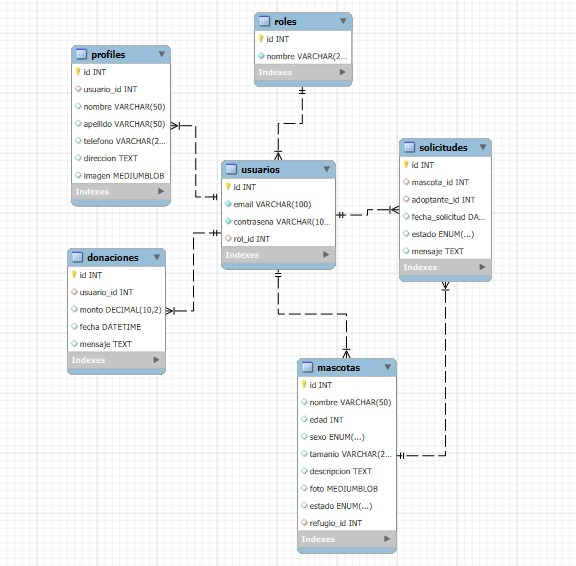

# DevsConClase

Product: Patita Solidaria 

# UNIVERSIDAD PERUANA DE CIENCIAS APLICADAS


## Ingeniería de Software

## 5to ciclo

## Desarrollo de Aplicaciones Open Source

### **Sección:** 1ASI0729

### **Profesor:** Rafael Oswaldo Castro Veramendi

### Informe de Trabajo Final

### "DevsConClase"

### "Patita Solidaria"

### **Integrantes:**

- Coca Lavado Carlos Andrés - u202313172
- Pedro Omar Lecca Villalobos - u202223293
- Arnold Gabriel Morales Sosa - u201822516
- Diego Alonso Rosado Iporre - u201620127
- Carlo Patricio Ramirez Escalante - u202210787
- Sebastian Aaron Anibal Carbajal Santivañez - u202111461

### Abril, 2025

**Url del proyecto**: https://github.com/DevsConClase-PatitaSolidaria

## Registro de Versiones del Informe
| Version | Fecha    | Autor        | Descripción                                                        |
|---------|----------|--------------|--------------------------------------------------------------------|
| TB1     | 09/04/25 | Diego Rosado | Creación organización y repositorios en GitHub para proyecto final |
| TB1     | 10/04/25 | Diego Rosado | Adición de la documentación en formato .md del informe final       |
| TB1     | 11/04/25 | Andrés Coca  | Desarrollo del Capitulo 1 del informe e implementación del diagrama de clases y el diccionario de clases| 
| TB1     | 12/04/25 | Pedro Lecca  | Desarrollo del Capítulo 2 del informe                              |
| TB1     | 14/04/25 | Arnold Morales | Desarrollo del Capitulo 4 del informe y del figma                | 

## Project Report Collaboration Insights

|  URL de la organización del proyecto  |             URL del repositorio del reporte          |
| :-----------------------------------: |:----------------------------------------------------:| 
| https://github.com/DevsConClase-PatitaSolidaria | https://github.com/DevsConClase-PatitaSolidaria/Report |

|          URL del repositorio de la landing page           |
|:---------------------------------------------------------:|
| https://github.com/DevsConClase-PatitaSolidaria/LandingPage |

TB1:<br>

|Integrante| Tarea Asignada                             |
|-|--------------------------------------------|
|Rosado Iporre, Diego Alonso| Creación de github y Documentación Inicial |
|Coca Lavado, Carlos Andrés|Desarrollo del Capitulo 1 del documento e implementación del diagrama de clases y el diccionario de clases|
|Lecca Villalobos, Pedro Omar | Desarrollo del Capitulo 2 del documento|
|Ramirez Escalante, Carlo Patricio | Desarrollo del Capitulo 3 del documento|
|Morales Sosa, Arnold Gabriel | Desarrollo del Capitulo 4 del documento, desarrollo del figma| 

## Contenido

## Tabla de contenidos

- [Registro de Versiones del Informe](#registro-de-versiones-del-informe)
- [Project Report Collaboration Insights](#project-report-collaboration-insights)
- [Student Outcome](#student-outcome)
- [Capítulo I: Introducción](#capítulo-i-introducción)
    - [1.1. Startup Profile](#11-startup-profile)
        - [1.1.1. Descripción de la Startup](#111-descripción-de-la-startup)
        - [1.1.2. Perfiles de integrantes del equipo](#112-perfiles-de-integrantes-del-equipo)
    - [1.2. Solution Profile](#12-solution-profile)
        - [1.2.1. Antecedentes y problemática](#121-antecedentes-y-problemática)
        - [1.2.2. Lean UX Process](#122-lean-ux-process)
        - [1.2.2.1. Lean UX Problem Statements](#1221-lean-ux-problem-statements)
        - [1.2.2.2. Lean UX Assumptions](#1222-lean-ux-assumptions)
        - [1.2.2.3. Lean UX Hypothesis Statements](#1223-lean-ux-hypothesis-statements)
        - [1.2.2.4. Lean UX Canvas](#1224-lean-ux-canvas)
    - [1.3. Segmentos objetivos](#13-segmentos-objetivo)
- [Capítulo II: Requirements Elicitation \& Analysis](#capítulo-ii-requirements-elicitation--analysis)
    - [2.1. Competidores](#21-competidores)
        - [2.1.1. Análisis competitivo](#211-análisis-competitivo)
        - [2.1.2. Estrategias y tácticas frente a competidores](#212-estrategias-y-tácticas-frente-a-competidores)
    - [2.2. Entrevistas](#22-entrevistas)
        - [2.2.1. Diseño de entrevistas](#221-diseño-de-entrevistas)
        - [2.2.2. Registro de entrevistas](#222-registro-de-entrevistas)
        - [2.2.3. Análisis de entrevistas](#223-análisis-de-entrevistas)
    - [2.3. Needfinding](#23-needfinding)
        - [2.3.1. User Personas](#231-user-personas)
        - [2.3.2. User Task Matrix](#232-user-task-matrix)
        - [2.3.3. User Journey Mapping](#233-user-journey-mapping)
        - [2.3.4. Empathy Mapping](#234-empathy-mapping)
        - [2.3.5. As-is Scenario Mapping](#235-as-is-scenario-mapping)
    - [2.4. Ubiquitous Language](#24-ubiquitous-language)
- [Capítulo III: Requirements Specification](#capítulo-iii-requirements-specification)
    - [3.1. To-Be Scenario Mapping](#31-to-be-scenario-mapping)
    - [3.2. User Stories](#32-user-stories)
    - [3.3. Impact Mapping](#33-impact-mapping)
    - [3.4. Product Backlog](#34-product-backlog)
- [Capítulo IV: Product Design](#capítulo-iv-product-design)
    - [4.1. Style Guidelines.](#41-style-guidelines)
        - [4.1.1. General Style Guidelines](#411-general-style-guidelines)
        - [4.1.2. Web Style Guidelines](#412-web-style-guidelines)
    - [4.2. Information Architecture](#42-information-architecture)
        - [4.2.1. Organization Systems](#421-organization-systems)
        - [4.2.2. Labeling Systems](#422-labeling-systems)
        - [4.2.3. SEO Tags and Meta Tags](#423-seo-tags-and-meta-tags)
        - [4.2.4. Searching Systems](#424-searching-systems)
        - [4.2.5. Navigation Systems](#425-navigation-systems)
    - [4.3. Landing Page UI Design](#43-landing-page-ui-design)
        - [4.3.1. Landing Page Wireframe](#431-landing-page-wireframe)
        - [4.3.2. Landing Page Mock-up](#432-landing-page-mock-up)
    - [4.4. Web Applications UX/UI Design](#44-web-applications-uxui-design)
        - [4.4.1. Web Applications Wireframes](#441-web-applications-wireframes)
        - [4.4.2. Web Applications Wireflow Diagrams](#442-web-applications-wireflow-diagrams)
        - [4.4.3. Web Applications Mock-ups](#443-web-applications-mock-ups)
        - [4.4.4. Web Applications User Flow Diagrams](#444-web-applications-user-flow-diagrams)
    - [4.5. Web Applications Prototyping](#45-web-applications-prototyping)
    - [4.6. Domain-Driven Software Architecture](#46-domain-driven-software-architecture)
        - [4.6.1. Software Architecture Context Diagram](#461-software-architecture-context-diagram)
        - [4.6.2. Software Architecture Container Diagrams](#462-software-architecture-container-diagrams)
        - [4.6.3. Software Architecture Components Diagrams](#463-software-architecture-components-diagrams)
    - [4.7. Software Object-Oriented Design](#47-software-object-oriented-design)
        - [4.7.1. Class Diagrams](#471-class-diagrams)
    - [4.8. Database Design](#48-database-design)
        - [4.8.1. Database Diagram](#481-database-diagram)
        - [4.8.2. Database Dictionary](#482-database-dictionary)
- [Capítulo V: Product Implementation, Validation \& Deployment](#capítulo-v-product-implementation-validation--deployment)
    - [5.1. Software Configuration Management](#51-software-configuration-management)
        - [5.1.1. Software Development Environment Configuration](#511-software-development-environment-configuration)
        - [5.1.2. Source Code Management](#512-source-code-management)
        - [5.1.3. Source Code Style Guide \& Conventions](#513-source-code-style-guide--conventions)
        - [5.1.4. Software Deployment Configuration](#514-software-deployment-configuration)
    - [5.2. Landing Page, Services \& Applications Implementation](#52-landing-page-services--applications-implementation)
        - [5.2.1. Sprint 1](#521-sprint-1)
            - [5.2.1.1. Sprint Planning 1](#5211-sprint-planning-1)
            - [5.2.1.2. Sprint Backlog 1](#5212-sprint-backlog-1)
            - [5.2.1.3. Development Evidence for Sprint Review](#5213-development-evidence-for-sprint-review)
            - [5.2.1.4. Testing Suite Evidence for Sprint Review](#5214-testing-suite-evidence-for-sprint-review)
            - [5.2.1.5. Execution Evidence for Sprint Review](#5215-execution-evidence-for-sprint-review)
            - [5.2.1.6. Services Documentation Evidence for Sprint Review](#5216-services-documentation-evidence-for-sprint-review)
            - [5.2.1.7. Software Deployment Evidence for Sprint Review](#5217-software-deployment-evidence-for-sprint-review)
            - [5.2.1.8. Team Collaboration Insights during Sprint](#5218-team-collaboration-insights-during-sprint)
- [Conclusiones](#conclusiones)
- [Bibliografía](#bibliografía)
- [Anexos](#anexos)

## Student Outcome

_ABET – EAC - Student Outcome 5_

**Criterio:**  Capacidad de comunicarse efectivamente con un rango de audiencias.

En el siguiente cuadro se describe las acciones realizadas y enunciados de
conclusiones por parte del grupo, que permiten sustentar el haber alcanzado el logro
del ABET – EAC - Student Outcome 3.

| Criterio especifico                                                    | Acciones Realizadas                                                                                                                                                                                                                                                                                                                                                                                                                                | Conclusiones                                                                                                                                                                                                                                                                                                                                                                                                                                                                                                                  |
|------------------------------------------------------------------------|----------------------------------------------------------------------------------------------------------------------------------------------------------------------------------------------------------------------------------------------------------------------------------------------------------------------------------------------------------------------------------------------------------------------------------------------------|-------------------------------------------------------------------------------------------------------------------------------------------------------------------------------------------------------------------------------------------------------------------------------------------------------------------------------------------------------------------------------------------------------------------------------------------------------------------------------------------------------------------------------|
| 1. Comunica oralmente con efectividad a diferentes rangos de audiencia. | **Diego Alonso Rosado Iporre**<br> TB1: Organización con mi equipo para organizarnos en un meet <br><br> *Carlos Andrés Coca Lavado*: <br> TB1: Con los puntos definidos para cada integrante del equipo, hemos buscado explicar el proyecto de forma clara y coherente en distintos contextos orales, tanto técnicos como sociales.                                                                                                               | **Diego Alonso Rosado Iporre**<br> TB1:<br> He creado un entorno <br><br> Carlos Andrés Coca Lavado <br>TB1:<br> Con el avance del presente proyecto como conclusión llegamos a que para una buena solución era fundamental el escuchar las necesidades de nuestros usuarios a quienes van dirigidos la presente solución                                                                                                                                                                                                     |
| 2. Comunica por escrito con efectividad a diferentes rangos de audiencia | **Carlos Andrés Coca Lavado**<br> TB1: <br> La documentación generada (informe Y repositorio en GitHub) refleja una comunicación escrita ordenada, comprensible y profesional, adaptada al tipo de lector. <br><br>**Pedro Omar Lecca Villalobos**<br> TB1: Elaboré el "Capítulo 2: *Requirements Elicitation & Analysis*", desarrollando entrevistas, análisis de segmentos, user personas y escenarios, con redacción clara y estructura adecuada. | **Carlos Andrés Coca Lavado**<br> TB1: <br> Se logró explicar desde los aspectos generales del problema social hasta la arquitectura técnica del sistema, facilitando que tanto evaluadores técnicos como públicos externos puedan entender el alcance y valor del proyecto. <br><br> **Pedro Omar Lecca Villalobos**<br> TB1: Mi participación permitió presentar la información técnica de manera clara, estructurada y coherente, contribuyendo al desarrollo de competencias comunicativas conforme al Student Outcome 5. |

## Capítulo I: Introducción

### 1.1. Startup Profile

#### 1.1.1. Descripción de la Startup

Patita Solidaria es una plataforma digital que conecta a adoptantes con refugios y rescatistas en el Perú, facilitando el proceso de adopción de mascotas de forma transparente, empática y accesible. Nos enfocamos en brindar información clara sobre cada mascota y en ofrecer herramientas simples para que refugios y rescatistas puedan publicar animales en adopción y gestionar sus procesos.

Buscamos promover una adopción responsable y con corazón, acercando a cada patita a su nuevo hogar.

**Misión:**

Digitalizar el camino hacia la adopción responsable en el Perú mediante una plataforma empática y accesible, que conecta a personas, refugios y rescatistas. Queremos que cada conexión hecha encuentre un hogar, cada historia compartida inspire confianza, y cada esfuerzo contribuya al bienestar animal.

**Visión:**

Ser la plataforma de referencia en adopción responsable en Perú y Latinoamérica al 2030, reconocidos por:

- Reducir a la mitad el tiempo de espera para mascotas con necesidades especiales.
- Triplicar la tasa de adopciones exitosas en Lima Metropolitana.
- Impulsar la estandarización del historial clínico de mascotas en procesos de adopción.

#### 1.1.2. Perfiles de integrantes del equipo

| <div align="center">Foto</div> | <div align="center">Descripción</div> |
|------|-------------|
| <p align="center"> </p> | Mi nombre es Diego Rosado, tengo 25 años. Mi interés en las base de datos y arquitectura de páginas web me impulsó a estudiar Ingeniería de Software. Tengo conocimiento de lenguajes como C#, C++, JavaScript, Python, base de datos como MySQL y me atrae el diseño de páginas web con HTML y CSS. Me considero una persona positiva, tolerante y creativa. Mi aporte al grupo es mi total compromiso, apoyo mutuo y el esfuerzo por asegurar que todos tengamos una visión compartida del proyecto a elaborar. Mis habilidades son resolución de problemas, adaptabilidad, trabajo en equipo y toma de decisiones. |
| <p align="center"></p> | Mi Nombre es Carlos Andrés Coca, tengo 19 años, actualmente me encuentro cursando el quinto ciclo de la carrera de Ingeniería de Software. Desde muy joven me ha interesado la ciberseguridad y el desarrollo de Software. Teniendo en cuenta el gran impacto que presentan a dia de hoy. |
| <p align="center"></p> | Mi nombre es Arnold Morales Sosa, tengo 24 años y soy estudiante de la carrera de Ingeniería de Software en la UPC, con estudios intermedios en Ensamblaje, Mantenimiento, Conectividad de equipos, desarrollo de software, programación y diseño. Innovador con deseos de aprender y apoyar en este proyecto donde pueda desarrollar mis conocimientos, apoyar a la mejora y logros de los objetivos estratégicos. Soy una persona con facilidad para trabajar en equipo, bajo presión, responsable, honesto, proactivo, creativo, ordenado, y dinámico. 
| <p align="center"></p>  | Mi nombre es Pedro Lecca y actualmente estudio la carrera de Ingeniería de Software en la Universidad UPC, sede San Miguel. Tengo 20 años y me considero una persona responsable, comprometida con el cumplimiento de mis deberes académicos. Además, valoro profundamente mantener una buena relación con mi equipo de trabajo, ya que estoy convencido de que un ambiente colaborativo y respetuoso permite alcanzar mejores resultados y potencia el desarrollo colectivo.                                                                                                                                         |
| <p align="center"></p>         | Mi Nombre es Carlo Ramirez, tengo 20 años y estoy estudiando la carrera de ingenieria de software. Tengo conocimiento en el lenguaje c++, mysql en base de datos y, css y html. Me considero una persona responsable y cooperativo. Mi aporte al grupo sera con total compromiso y esfuerzo para lograr los objetivos. 

### 1.2. Solution Profile

#### 1.2.1. Antecedentes y problemática

En Lima Metropolitana, los refugios de mascotas enfrentan serios desafíos para gestionar adopciones, especialmente de animales con necesidades médicas. La falta de un sistema digital que centralice historiales clínicos y procesos de adopción genera desconfianza en los potenciales adoptantes, particularmente hacia mascotas con condiciones tratables.

Además, la mayoría de refugios aún opera con métodos manuales o a través de redes sociales sin estandarización, lo que ralentiza y dificulta la adopción. Esta carencia de una plataforma especializada limita las oportunidades de vida para miles de animales abandonados en busca de un hogar.

**What?**

**¿Qué sucede exactamente?**<br>
El núcleo del problema radica en tres fallas críticas del sistema actual. Primero, la información médica de las mascotas está dispersa en formatos incompatibles — desde registros en papel hasta mensajes fragmentados en redes sociales. Segundo, no existe un puente digital eficiente que conecte a refugios, veterinarios y adoptantes. Tercero, el proceso de adopción carece de estandarización, generando experiencias frustrantes para todas las partes involucradas.

Para los refugios, esto dificulta mostrar el verdadero potencial de mascotas con necesidades especiales. Para los adoptantes, implica tomar decisiones importantes con información incompleta o poco confiable.

**¿Qué relación tiene el problema con el usuario?**<br>
Los refugios enfrentan barreras para visibilizar adecuadamente a sus animales y generar confianza en el proceso. Los adoptantes, por su parte, deben decidir sin acceso a datos médicos claros, lo que incrementa el riesgo de adopciones fallidas y desanima futuras intenciones de adoptar.

**Why?** 

**¿Por qué ocurre este problema?**<br>
La falta de información médica confiable genera desconfianza o temor en los posibles adoptantes. Los refugios, por su parte, no cuentan con herramientas adecuadas para registrar y compartir el estado de salud de cada mascota. Como resultado, los animales con tratamientos o necesidades especiales suelen ser ignorados, lo que prolonga su estadía en los refugios y reduce sus oportunidades de adopción.

**¿Por qué los refugios no han implementado soluciones digitales por su cuenta hasta ahora?**<br>
La mayoría de refugios opera con recursos muy limitados (el 82% tiene presupuestos menores a S/5,000 mensuales), priorizando gastos urgentes como alimentación y atención veterinaria básica por encima de la inversión tecnológica.

Además, muchos administradores son voluntarios mayores de 50 años (67%), con poca experiencia digital, lo que dificulta adoptar soluciones complejas sin apoyo técnico. A esto se suma que cada organización gestiona la información de forma aislada y con métodos distintos, creando una red fragmentada e ineficiente.

La verdadera barrera no es la necesidad —que todos reconocen—, sino la ausencia de un modelo accesible que combine tecnología simple con acompañamiento continuo para organizaciones sin expertise técnico.


**When?** 

**¿Cuándo ocurre el problema con mayor intensidad?**<br>
El problema se vuelve más crítico en tres momentos clave:

- Durante las temporadas posteriores a vacaciones (enero y julio), cuando el abandono de mascotas aumenta hasta en un 40%.

- Al diagnosticarse condiciones médicas complejas en animales rescatados, donde el 68% de los casos no logra documentarse adecuadamente.

- Durante el proceso de adopción, cuando el 72% de los interesados desiste al no encontrar información médica clara y actualizada.

**¿Cuándo se vuelve evidente la necesidad de una solución?**<br>
La urgencia se hace palpable cuando:

- Mascotas con enfermedades tratables permanecen más de 6 meses en refugios (35% de los casos).

- Adoptantes devuelven animales por desconocer sus necesidades especiales (25% de las adopciones fallidas).

- Refugios dedican más del 30% de su tiempo a gestiones administrativas repetitivas en lugar de atención directa.

Estos puntos de quiebre evidencian cómo el sistema actual no responde a necesidades básicas de transparencia, agilidad y bienestar animal.


**Where?**

**¿Dónde es más crítica esta problemática?**<br>
El problema alcanza su máxima gravedad en los distritos periféricos de Lima, como San Juan de Lurigancho, Villa El Salvador y Comas, donde opera el 65% de los refugios independientes con mayor sobrepoblación (15-20 animales en espacios diseñados para 10). Estas zonas concentran el 80% de los casos de mascotas con necesidades especiales que superan el año de permanencia en refugios.

**¿Dónde se manifiestan las mayores brechas del sistema actual?**<br>
Las principales fallas se hacen más evidentes en tres áreas clave:

- Los refugios pequeños, que carecen de personal capacitado para documentar historiales médicos (92% no tiene sistemas digitales).

- Las clínicas veterinarias de bajo costo, que atienden a estos refugios pero no comparten bases de datos.

- Las plataformas digitales actuales (principalmente redes sociales), donde el 78% de las publicaciones de adopción omiten información médica esencial o presentan datos desactualizados.

**Who?** 

**¿Quiénes son los más afectados por esta situación?**<br>
Los principales afectados son:

- Las mascotas con necesidades médicas especiales (35% de los animales en refugios), que permanecen tres veces más tiempo en adopción que las mascotas sanas.

- Los refugios independientes (72% del total), que destinan el 40% de sus recursos a gestiones manuales.

- Los adoptantes potenciales, donde el 68% abandona el proceso por falta de información confiable.

**¿Quiénes podrían ser los principales aliados para cambiar esta realidad?**<br>
Los actores clave para transformar el sistema incluyen:

- Veterinarios jóvenes digitalmente capacitados (25-35 años).

- Universidades con carreras de tecnología que podrían desarrollar soluciones.

- Empresas de software interesadas en responsabilidad social.

- Organizaciones animalistas con alcance mediático, que podrían promover estándares unificados de información médica para adopciones.

**How?** 

**¿Cómo afecta el problema actual a los procesos de adopción?**<br>
El sistema fragmentado actual crea un círculo vicioso: los refugios documentan información médica en formatos incompatibles (23% en papel, 61% en redes sociales), los veterinarios no pueden compartir datos eficientemente, y los adoptantes reciben información contradictoria en el 45% de los casos. Esto genera que:

- Las mascotas con necesidades especiales tengan un 83% menos probabilidades de adopción.

- Los refugios inviertan 15 horas semanales por animal en gestiones manuales.

- El 25% de las adopciones fracasen debido a expectativas médicas no alineadas.

**¿Cómo podría transformarse este sistema con una solución digital?**<br>
Una plataforma integrada cambiaría radicalmente el flujo mediante:

- Historiales médicos estandarizados y accesibles, reduciendo en un 70% el tiempo de gestión.

- Conexión directa entre refugios, veterinarios y adoptantes, disminuyendo un 60% los errores de información.

- Procesos de adopción digitalizados con seguimiento médico incorporado, aumentando un 40% las adopciones exitosas de mascotas con necesidades especiales.

Esto liberaría el 30% de los recursos de los refugios para atención directa en lugar de trámites administrativos.

**How much?** 

**¿Cuál es el costo real de mantener el sistema actual?**<br>
El modelo fragmentado genera pérdidas económicas y operativas significativas:

- Refugios: Invierten hasta S/3,500 mensuales por animal no adoptado, lo que representa un 40% más que las mascotas sanas.

- Clínicas veterinarias: Pierden un 30% de eficiencia en los seguimientos médicos debido a la falta de integración de datos.

- Sistema en su conjunto: Se estima que el sistema desperdicia aproximadamente 1.2 millones de horas anuales en gestión manual de información, según la Asociación de Protección Animal Peruana.


**¿Qué beneficios económicos podría generar una solución digital?**<br>
Una plataforma integrada podría:

- Reducir costos operativos de los refugios en hasta un 35%, lo que equivaldría a S/1.2 millones anuales en Lima.

- Disminuir en un 50% los gastos veterinarios debido a la falta de historiales médicos.

- Generar ahorros de S/800 anuales por adoptante al evitar adopciones fallidas.

Además, aumentaría un 28% la eficiencia en donaciones al transparentar el uso de recursos en cuidados médicos.

#### 1.2.2. Lean UX Process

##### 1.2.2.1. Lean UX Problem Statements

En Lima Metropolitana, el abandono de mascotas es un problema urgente. Cada día, cientos de animales rescatados permanecen en refugios, esperando una oportunidad de ser adoptados. Muchos de estos animales tienen necesidades médicas tratables o requieren atención continua, pero no logran ser adoptados debido a la falta de información confiable sobre su estado de salud y el proceso de adopción.

Patita Solidaria nace para abordar esta problemática. Nuestra plataforma se enfoca en mejorar la visibilidad y adopción de mascotas con necesidades especiales. Ofrecemos un sistema que centraliza la información disponible sobre cada animal, facilitando el contacto entre refugios y adoptantes. Aunque no contamos con acceso a clínicas veterinarias, recopilamos y compartimos la información disponible sobre el estado de salud de los animales, lo que ayuda a los adoptantes a tomar decisiones informadas.

Lo que nos distingue es la capacidad de transformar esta información en confianza, proporcionando detalles claros y comprensibles sobre las condiciones de cada animal. A diferencia de otras plataformas que solo muestran fotos y datos básicos, Patita Solidaria ofrece una experiencia integral para facilitar la adopción de animales con necesidades especiales.

Nuestra investigación revela que el 72% de los adoptantes potenciales (Encuesta PUCP 2023) desisten de adoptar animales con necesidades médicas por falta de información clara sobre su condición. Este hallazgo nos enfrenta al desafío de diseñar una experiencia que:

**¿Cómo podemos diseñar una plataforma que no solo brinde adopciones informadas, sino que también genere un compromiso activo de apoyo continuo, donde refugios y adoptantes colaboren para asegurar el bienestar de los animales con necesidades especiales, sin la necesidad de acceso a clínicas veterinarias?**

##### 1.2.2.2. Lean UX Assumptions

1. ¿Crees que incluir información médica clara en las fichas de adopción aumentará la confianza de los adoptantes?

Creemos que sí. Muchas personas desean adoptar pero temen enfrentar situaciones inesperadas relacionadas con enfermedades o tratamientos. La transparencia aumentará la confianza en el proceso y la tasa de adopción.

2. ¿Cómo podría ayudar esta plataforma a refugios pequeños que no tienen recursos tecnológicos?

Nuestra solución simplifica la gestión de mascotas y adopciones, permitiendo que refugios sin conocimientos técnicos puedan registrar información médica, coordinar solicitudes y dar seguimiento de forma ordenada.

3. ¿Cuál es el impacto de no conocer el historial médico de una mascota antes de adoptarla?

El impacto puede ser negativo tanto para el animal como para el adoptante. Puede generar abandono posterior, estrés en el nuevo hogar o tratamientos interrumpidos que afectan la salud del animal.

4. ¿Podría esta solución ayudar a reducir la sobrepoblación en refugios limeños?

Sí, al facilitar y agilizar las adopciones responsables, las organizaciones podrán tener mayor rotación y liberar espacio para nuevos rescates.

5. ¿Crees que un seguimiento post-adopción mejora la calidad de vida del animal?

Creemos que ofrecer información continua sobre el estado de salud de las mascotas antes de la adopción ayuda a los adoptantes a tomar decisiones más responsables, lo cual puede mejorar la calidad de vida del animal y fomentar un mejor cuidado a largo plazo.

6. ¿Podría esta plataforma ser una alternativa a las publicaciones desordenadas en redes sociales?

Sí. Brinda un entorno organizado, filtrado y seguro, tanto para refugios como para adoptantes, eliminando la informalidad e incertidumbre de los canales actuales.

7. ¿Las personas están dispuestas a adoptar mascotas con enfermedades tratables?

Sí, pero solo si cuentan con información clara, asesoría y un compromiso real del refugio en guiarlos. Esa es justamente la función central de nuestra solución.

8. ¿Crees que esta solución puede generar alianzas con veterinarios y clínicas en el futuro?

Definitivamente. Una plataforma que muestra tratamientos podría extenderse fácilmente para incluir clínicas aliadas, generar alertas de citas o incluso ofrecer servicios a bajo costo.

##### 1.2.2.3. Lean UX Hypothesis Statements

- Hipótesis 1:
Creemos que al permitir a los usuarios acceder a información detallada sobre el estado de salud de las mascotas antes de adoptar, aumentará la confianza y la tasa de adopciones exitosas, especialmente en mascotas con necesidades médicas especiales. Sabremos que hemos tenido éxito cuando observemos un incremento en la adopción de animales con condiciones médicas tratables.


- Hipótesis 2:
Creemos que los refugios podrán mejorar su eficiencia operativa al gestionar digitalmente los historiales médicos y las solicitudes de adopción a través de una plataforma centralizada, lo que permitirá una mayor coordinación y rapidez en el proceso. Sabremos que hemos tenido éxito cuando los refugios reporten una disminución en el tiempo de gestión y un aumento en la tasa de adopciones efectivas.


- Hipótesis 3:
Creemos que proporcionar información clara y accesible sobre el estado de salud de las mascotas antes de la adopción mejorará tanto la calidad de vida del animal como la satisfacción del adoptante. Sabremos que hemos tenido éxito cuando los adoptantes tomen decisiones informadas y muestren un compromiso activo con el bienestar de la mascota.


- Hipótesis 4:
Creemos que las personas estarán dispuestas a adoptar si tienen acceso a herramientas claras y confiables que les permitan tomar decisiones informadas sobre el estado de salud de las mascotas. Sabremos que hemos tenido éxito cuando se registre un aumento en el número de solicitudes de adopción realizadas por usuarios que han utilizado la plataforma.


- Hipótesis 5:
Creemos que al visibilizar historias de adopciones exitosas de mascotas con necesidades médicas, podremos inspirar a más personas a adoptar sin prejuicios, aumentando su confianza en el proceso. Sabremos que hemos tenido éxito cuando estas historias sean compartidas y comentadas en redes sociales, lo que a su vez impulse el tráfico y la interacción con el sitio web.

##### 1.2.2.4. Lean UX Canvas

<p align="center">

### 1.3. Segmentos objetivos

### Segmento Objetivo #1: Personal de Refugios y Rescatistas de Animales (Administradores, Cuidadores y Voluntarios)
Aspectos demográficos:

- Sexo: No hay preferencia por género

- Edades: Adultos entre 25 y 50 años (inclusive)

Aspectos geográficos:

- Nacionalidad: Peruana

- Zona geográfica: Principalmente en áreas urbanas y semiurbanas, donde se concentran los refugios más grandes y activos, con énfasis en Lima Metropolitana

Aspectos psicográficos:

- Personas comprometidas con el bienestar animal, muchas veces voluntarios o trabajadores con vocación social.

- Buscan herramientas que faciliten la gestión diaria del refugio o el rescate (registro de animales, control de adopciones, tratamiento, etc.).

- Están interesados en soluciones tecnológicas simples, efectivas y accesibles que mejoren la organización interna y aumenten la tasa de adopciones.

- Valoran la colaboración abierta y están dispuestos a compartir datos o sugerencias con otros refugios o grupos de rescate a través de una comunidad.

### Segmento Objetivo #2: Adoptantes Potenciales (Personas interesadas en adoptar animales)

Aspectos demográficos:

- Sexo: Masculino y femenino

- Edades: Jóvenes y adultos entre 20 y 45 años (inclusive)

Aspectos geográficos:

- Nacionalidad: Peruana

- Zona geográfica en la que vive: Urbana

- Departamento: Principalmente Lima Metropolitana, pero también ciudades intermedias como Arequipa, Chiclayo, Huancayo, Cusco

Aspectos psicográficos:

- Personas con afinidad por los animales y conciencia sobre la adopción responsable.

- Buscan una forma rápida, transparente y confiable de conocer animales en adopción.

- Desean ver historias, fotos y fichas médicas para tomar una decisión informada.

- Están motivados por el impacto positivo de adoptar y dar una segunda oportunidad a un animal rescatado.

## Capítulo II: Requirements Elicitation & Analysis

### 2.1. Competidores

#### 2.1.1. Análisis competitivo
El presente análisis competitivo permite identificar a los principales actores del ecosistema de adopción animal en Lima y evaluar cómo se posiciona la Start-Up **Patita Solidaria** frente a ellos.

|                                                    | **Patita Solidaria**                                                                                                                                                                                        | **WUF**                                                                                                                                                                      | **Wukta**                                                                                                                                                                                                            | **Voz Animal Perú**                                                                                                                                                                                                          |
|----------------------------------------------------|-----------------------------------------------------------------------------------------------------------------------------------------------------------------------------------------------------------|-----------------------------------------------------------------------------------------------------------------------------------------------------------------------------------------------------------------------|------------------------------------------------------------------------------------------------------------------------------------------------------------------------------------------------------------------------|------------------------------------------------------------------------------------------------------------------------------------------------------------------------------------------------------------------------------|
| **Nombre y Logo** <br>   | **Patita Solidaria** <br>                                                                                                                                              | **WUF** <br>*(ONG reconocida con respaldo corporativo)*                                                                                                                                                               | **Wukta** <br>*(Plataforma web para adopción)*                                                                                                                                                                           | **Voz Animal Perú** <br>*(ONG centrada en rescate y adopción)*                                                                                                                                                              |
| **Overview**                                       | Patita Solidaria es una plataforma digital que facilita la adopción responsable de animales rescatados, proporcionando información médica clara y confiable para ayudar a los adoptantes a tomar decisiones informadas.                                                  | ONG consolidada que promueve adopciones, campañas de esterilización y educación. Tiene respaldo corporativo.                                                                                                          | Plataforma web que conecta adoptantes con rescatistas y albergues a través de perfiles de mascotas.                                                                                                                      | ONG centrada en rescate, rehabilitación y adopción de animales abandonados, con fuerte presencia en redes sociales.                                                                                                          |
| **Ventaja competitiva**                            | Ofrecer información médica transparente y herramientas digitales sencillas para refugios, facilitando adopciones informadas y responsables.                                                                            | Confianza institucional y alianzas con empresas. Plataforma sencilla para adoptar y donar.                                                                                                                                                                                                         | Foco en digitalización y conexión entre partes. Interfaz simple y rápida.                                                                                                                                             | Compromiso con casos críticos, campañas de ayuda directa. Visibilidad de casos sensibles.                                                                                                                                     |
| **Mercado objetivo**                               | Limeños interesados en adopción responsable, y protectores independientes o de refugios.                                                                                                                  | Público general interesado en ayuda animal y adopción segura.                                                                                                                                                                                                   | Adoptantes y albergues (informales o formales).                                                                                                                                                                        | Público general sensible al bienestar animal: voluntarios, familias, activistas.                                                                                                                                             |
| **Estrategias de marketing**                       | Redes sociales, historias de adopciones exitosas y alianzas con influencers para aumentar la visibilidad y atraer adoptantes.                                                                                                                             | RRSS, medios de comunicación, eventos y merchandising.                                                                                                                                                                                                         | RRSS, blog, convenios con albergues.                                                                                                                                                                                   | Activismo en redes sociales, campañas virales, publicaciones emocionales.                                                                                                                                                    |
| **Productos & Servicios**                          | Plataforma digital para refugios, con adopciones, fichas informativas, guía de refugios para donaciones y promoción en redes sociales.                                                         | Adopción, apadrinamiento, donaciones, esterilización y campañas educativas.                                                                                                                                                                                   | Adopción directa mediante perfiles digitales, contacto vía web, registro básico.                                                                                                                                       | Rescate, rehabilitación, adopción, campañas de salud, denuncias y actividades comunitarias.                                                                                                                                   |
| **Precios & Costos**                               | Gratuito para adoptantes. Planes premium (futuros) para protectores/refugios.                                                                                                                             | Gratuito para adoptantes; se financia con donaciones y auspiciadores.                                                                                                                                                                                          | Gratuito; sostenibilidad mediante convenios con protectores/as y albergues.                                                                                                                                           | Gratuito; opera por voluntariado y donaciones puntuales.                                                                                                                                                                    |
| **Canales de distribución** <br> (Web y/o Móvil)   | Plataforma web adaptativa; en desarrollo app móvil.                                                                                                                                                       | Web optimizada + presencia activa en Instagram y Facebook.                                                                                                                                                                                                     | Web responsive; sin app móvil conocida.                                                                                                                                                                                | Página en redes sociales (Facebook, Instagram) y sitio web básico.                                                                                                                                                           |
| **Fortalezas**                                     | Transparencia y centralización de información. Enfoque en experiencia y confianza.                                                                                                                   | Reconocimiento de marca, red de aliados corporativos, confianza pública.                                                                                                                                                                                        | Simplicidad y rapidez en la adopción. Buen enfoque digital.                                                                                                                                                           | Activismo fuerte, sensibilidad del público, reputación positiva en redes.                                                                                                                                                   |
| **Debilidades**                                    | Nueva marca. Requiere posicionarse y generar confianza.                                                                                                                                                   | No involucra protectores como intermediarios; puede resultar impersonal.                                                                                                                                                                                         | Poca personalización, sin garantías post-adopción.                                                                                                                                                                     | Saturación de casos, poca trazabilidad en algunos rescates.                                                                                                                                                                |
| **Oportunidades**                                  | Creciente interés en adopción responsable, la digitalización del proceso y la posibilidad de formar alianzas con clínicas veterinarias, expandiendo nuestra presencia en nuevas ciudades y regiones.                                                                                                                           | Escalar a provincias, lanzar app, incluir más funcionalidades en línea.                                                                                                                                                                                          | Incluir seguimiento post-adopción. Alianzas con marcas afines.                                                                                                                                                         | Profesionalizar su modelo y estandarizar procesos. Potenciar su red.                                                                                                                                                        |
| **Amenazas**                                       | Baja confianza inicial, saturación del mercado de adopción informal.                                                                                                                                       | Aparición de plataformas más tecnológicas o descentralizadas.                                                                                                                                                                                                    | Bajo margen de ingresos. Alta competencia en el mercado.                                                                                                                                                               | Volatilidad en donaciones. Dependencia del trabajo voluntario.                                                                                                                                                             |

**Patita Solidaria** se distingue de sus competidores al integrar historial médico y contacto directo con refugios, lo que ofrece una experiencia más segura y responsable. Aunque aún está en proceso de posicionamiento, su propuesta innovadora representa una oportunidad clara para profesionalizar y digitalizar el proceso de adopción en Lima.

#### 2.1.2. Estrategias y tácticas frente a competidores
Para enfrentar a la competencia y posicionarse de manera sólida en el mercado limeño, **Patita Solidaria** implementará estrategias enfocadas en sus principales ventajas competitivas y en la explotación de oportunidades no cubiertas por otras organizaciones. Entre las principales tácticas preliminares destacan:

1. **Estrategia de diferenciación tecnológica**  
   A través del desarrollo de una plataforma web robusta y una futura aplicación móvil, se facilitará la interacción entre adoptantes y protectores, incorporando funcionalidades únicas como el historial de salud digital del animal y alertas de bienestar, lo que actualmente no ofrecen competidores como Voz Animal o Wukta.

2. **Alianzas estratégicas con clínicas veterinarias y refugios formales**  
   Para fortalecer la confianza de los usuarios y garantizar el estado de salud de los animales, se promoverán convenios con clínicas veterinarias que respalden la salud de cada mascota. Esto también permitirá acceder a precios preferenciales para servicios de salud y control.

3. **Campañas digitales con enfoque emocional y educativo**  
   Se impulsarán campañas en redes sociales orientadas a sensibilizar sobre la adopción responsable, destacando historias reales con seguimiento. A diferencia de campañas generalistas, se apostará por contenidos educativos y testimoniales que refuercen el vínculo entre usuarios y plataforma.

4. **Captación y fidelización de protectores como aliados clave**  
   Se diseñarán herramientas sencillas para que los protectores suban perfiles de animales y gestionen solicitudes desde la plataforma. Además, se ofrecerán incentivos como reconocimientos, visibilidad en la red o soporte logístico en campañas.

5. **Gestión de riesgos y amenazas**  
   Frente a la saturación de contenido en redes y la informalidad en adopciones, se promoverá un modelo de validación y seguimiento que genere confianza, evitando casos de abandono o maltrato posterior a la adopción.

Estas estrategias buscan posicionar a **Patita Solidaria** como una alternativa confiable, tecnológica y socialmente comprometida, capaz de cubrir vacíos que aún persisten en el ecosistema actual de adopción animal.

### 2.2. Entrevistas

#### 2.2.1. Diseño de entrevistas
Como parte del proceso de validación del modelo de negocio de **Patita Solidaria**, se realizaron preguntas semi estructuradas dirigidas a los dos segmentos objetivos: personas interesadas en adoptar mascotas y protectores/rescatistas que gestionan casos de animales en situación de abandono.

---

#### Diseño de entrevista - Segmento 1: Adoptantes

1. **Datos generales:**
   - Nombre.
   - Edad.
   - Distrito de residencia.
   - Ocupación.
   - ¿Vive solo/a o con familia?

2. **Motivaciones y comportamientos:**
   - ¿Qué te motivó a considerar la adopción de una mascota?
   - ¿Has adoptado antes? ¿Cómo fue tu experiencia?
   - ¿Qué tipo de mascota te gustaría adoptar (raza, edad, tamaño)?
   - ¿Qué medios utilizas para buscar mascotas en adopción?
   - ¿Qué aspectos valoras más antes de adoptar (salud, comportamiento, historia)?

3. **Miedos, expectativas y canales:**
   - ¿Qué dudas o miedos tienes respecto al proceso de adopción?
   - ¿Qué haría que confíes plenamente en una plataforma digital de adopción?
   - ¿Qué redes sociales o plataformas digitales usas con más frecuencia?
   - ¿Te gustaría recibir seguimiento post-adopción o apoyo luego de adoptar?

---

#### b) Diseño de entrevista - Segmento 2: Protectores

1. **Datos generales:**
   - Nombre.
   - Tiempo dedicado al rescate/protección animal.
   - ¿Trabajas de forma independiente o vinculado a un refugio?
   - Número promedio de animales rescatados por mes.

2. **Operaciones y herramientas:**
   - ¿Cómo gestionas actualmente los procesos de adopción?
   - ¿Qué medios utilizas para difundir los casos?
   - ¿Qué información sueles recopilar del animal antes de darlo en adopción?
   - ¿Qué dificultades enfrentas para encontrar adoptantes responsables?
   - ¿Has usado alguna plataforma web o app para este fin?

3. **Expectativas:**
   - ¿Qué funcionalidades digitales serían útiles para ti (seguimiento, historial, etc.)?
   - ¿Qué tipo de soporte o incentivo te motivaría a usar una nueva plataforma?
   - ¿Cuáles son tus principales frustraciones en el proceso de adopción?
   - ¿Qué esperas de los adoptantes para garantizar el bienestar del animal?

---

El presente diseño permitirá recopilar información clave sobre ambos segmentos, enfocándose en sus motivaciones, barreras, comportamientos y preferencias. Estos insumos serán esenciales para la validación del modelo y el diseño centrado en el usuario de la plataforma **Patita Solidaria**.

#### 2.2.2. Registro de entrevistas


#### 1. Entrevistas del Segmento N°1: Personal de Refugios de Animales (Administradores y Cuidadores)

| <p align="center"> |
|-------------------------------------------------------------------------------------------------|
| **Entrevistado(a):** Julia Mejía                                                                |
| **Género:** Femenino                                                                            |
| **Edad:** 21 años                                                                               |
| **Link de la entrevista (YouTube):** https://youtu.be/ulyokJORm-U?si=jMSwigdXtaAr4DfN           |
| Julia Mejía, una joven de 21 años que reside en San Isidro, trabaja de forma independiente en el rescate de animales, con un promedio de entre 4 y 6 casos mensuales. Aunque ocasionalmente colabora con refugios, su labor principal se basa en procesos digitalizados como formularios de Google, videollamadas y WhatsApp. Difunde los casos mediante redes sociales como Instagram, Facebook y Telegram. Antes de dar un animal en adopción, recopila información sobre edad, salud, vacunas y comportamiento. Julia expresa preocupación por adoptantes que mienten en formularios y el bajo compromiso, lo que a veces lleva al abandono. Le gustaría que las plataformas incluyan seguimiento, alertas, respaldo legal y atención médica. Desea que los adoptantes traten a los animales como parte de la familia.                                                                                                |

| <p align="center">                                                                                                                                                                                                                                                                                                                                                                                                                                                                                                                                                                                        |
|-----------------------------------------------------------------------------------------------------------------------------------------------------------------------------------------------------------------------------------------------------------------------------------------------------------------------------------------------------------------------------------------------------------------------------------------------------------------------------------------------------------------------------------------------------------------------------------------------------------------------------------------------------------------------------------------|
| **Entrevistado(a):** Briza Segura                                                                                                                                                                                                                                                                                                                                                                                                                                                                                                                                                                                                                                                       |
| **Género:** Femenino                                                                                                                                                                                                                                                                                                                                                                                                                                                                                                                                                                                                                                                                    |
| **Edad:** 25 años                                                                                                                                                                                                                                                                                                                                                                                                                                                                                                                                                                                                                                                                       |
| **Link de la entrevista (YouTube):** https://youtu.be/XUgSsGW4AyM?si=tJXBtEz_pfVtTN3F                                                                                                                                                                                                                                                                                                                                                                                                                                                                                                                                                                                                   |
| Briza Segura, de 25 años y residente en San Borja, trabaja vinculada a un refugio y rescata entre 5 y 20 animales al mes. Los procesos de adopción incluyen formularios, entrevistas y visitas domiciliarias. Difunde casos mediante Facebook, Instagram y ferias locales. Antes de la adopción, recopila datos sobre salud, comportamiento y preferencias del animal. Identifica como problema principal la falta de compromiso y adopciones impulsivas. Le gustaría contar con plataformas que incluyan seguimiento, recordatorios y evaluaciones de adoptantes, además de soporte técnico y certificación para su labor. Busca adoptantes comprometidos, informados y comunicativos. |

#### 2. Entrevistas del Segmento N°2: Adoptantes Potenciales (Personas interesadas en adoptar animales)

| <p align="center">                                                                                                                                                                                                                                                                                                                                                                                                                                                                                                                                               |
|--------------------------------------------------------------------------------------------------------------------------------------------------------------------------------------------------------------------------------------------------------------------------------------------------------------------------------------------------------------------------------------------------------------------------------------------------------------------------------------------------------------------------------------------------------------------------------------------------------------------------------------------------|
| **Entrevistado(a):** Cecilia Izaguirre                                                                                                                                                                                                                                                                                                                                                                                                                                                                                                                                                                                                          |
| **Género:** Femenino                                                                                                                                                                                                                                                                                                                                                                                                                                                                                                                                                                                                                             |
| **Edad:** 21 años                                                                                                                                                                                                                                                                                                                                                                                                                                                                                                                                                                                                                                |
| **Link de la entrevista (YouTube):** https://youtu.be/_iQEJVC_PQI?si=rYEKzjlUyvX7vsPA                                                                                                                                                                                                                                                                                                                                                                                                                                                                                                                                                            |
| Cecilia Izaguirre, una joven universitaria de 21 años de San Miguel, comparte su perspectiva sobre la adopción de mascotas. Menciona que le gustan mucho los animales y que la adopción es una forma bonita de brindarles una segunda oportunidad. Ya ha adoptado antes y valora más la necesidad del animal que factores como raza, edad o tamaño. Utiliza redes sociales como Facebook, Instagram y TikTok para buscar mascotas. Le interesa conocer la historia y salud de los animales antes de adoptar, y expresa preocupación por la falta de información transparente durante el proceso. También le gustaría recibir apoyo post-adopción. |


#### 2.2.3. Análisis de entrevistas
Según las entrevistas registradas y sus respectivos resúmenes, hemos realizado el siguiente análisis de entrevista según cada segmento, en donde se resaltan los puntos en común de los usuarios y algunas conclusiones.

#### 1. Segmento N°1: Personal de Refugios de Animales (Administradores y Cuidadores)

**Hallazgos:**

- **Jóvenes comprometidos:**
Ambas entrevistadas tienen entre 21 y 25 años y están activamente involucradas en el rescate animal de forma independiente o vinculadas a refugios.
- **Procesos estructurados de adopción:** Realizan entrevistas, visitas domiciliarias y uso de formularios para filtrar adoptantes responsables.
- **Difusión en redes y espacios físicos:** Utilizan principalmente Instagram y Facebook, y en algunos casos ferias locales o grupos como Telegram.
- **Evaluación exhaustiva del animal:** Ambas recopilan información sobre salud, comportamiento y antecedentes antes de darlo en adopción.
- **Falta de compromiso de los adoptantes:** Se identifica como principal dificultad la devolución de animales o su abandono por decisiones impulsivas.
- **Demandas tecnológicas específicas:** Consideran necesarias herramientas como bases de datos centralizadas, recordatorios automáticos de vacunas, seguimiento post-adopción y sistemas de evaluación.
- **Necesidad de respaldo institucional:** Se valora contar con certificaciones, soporte técnico y atención médica como incentivos para usar nuevas plataformas.

**Conclusiones:**

El segmento de protectores está compuesto por jóvenes altamente activos y organizados, con métodos claros para el proceso de adopción. La principal frustración se centra en la falta de responsabilidad de los adoptantes, lo que genera ciclos repetitivos de abandono. Además, valoran el soporte institucional y legal como un aspecto esencial para continuar y mejorar su labor. Las herramientas tecnológicas deben enfocarse en profesionalizar su trabajo, facilitar seguimiento y asegurar un entorno confiable para el bienestar de los animales.


#### 2. Segmento N°2: Adoptantes Potenciales (Personas interesadas en adoptar animales)

**Hallazgos:**

- **Motivación emocional clara:** La entrevistada muestra un fuerte vínculo emocional hacia los animales, considerando la adopción como una oportunidad para brindar amor y hogar a quienes lo necesitan.
- **Criterios flexibles de selección:** No prioriza raza, edad o tamaño del animal. Este patrón sugiere una tendencia a adoptar con enfoque solidario más que estético o funcional.
- **Uso de medios digitales:** Se identificó que la principal vía para buscar animales en adopción son redes sociales como Facebook e Instagram.
- **Preocupaciones en el proceso:** Existe un miedo a que se oculte información relevante sobre la salud del animal durante el proceso de adopción.
- **Interés en el seguimiento post-adopción:** La entrevistada estaría dispuesta a recibir orientación o acompañamiento después de adoptar, lo cual indica un deseo de asegurar el bienestar del animal.

**Conclusiones:**

El perfil del adoptante identificado responde a una persona joven, urbana y con alto compromiso emocional hacia los animales. Su disposición a adoptar se basa en principios de empatía y responsabilidad, más allá de criterios físicos del animal. Aunque utilizan herramientas digitales, muestran incertidumbre respecto a la transparencia del proceso. Por ello, es clave considerar soluciones tecnológicas que brinden seguridad informativa y seguimiento posterior a la adopción.


### 2.3. Needfinding

#### 2.3.1. User Personas

La creación de *User Personas* permite representar los perfiles típicos de los usuarios de la plataforma **Patita Solidaria**, facilitando un diseño centrado en sus necesidades reales.

---

### **User Persona #1: Mariana, Protectora Independiente**

- **Nombre:** Mariana Gutiérrez
- **Edad:** 24 años
- **Ocupación:** Estudiante de veterinaria / Rescatista independiente
- **Localización:** Lima, distrito de Jesús María
- **Estado civil:** Soltera

**Características:**
- Rescata entre 4 y 6 animales al mes.
- Gestiona adopciones con formularios de Google, videollamadas y seguimiento por WhatsApp.
- Difunde casos mediante Instagram, Facebook y Telegram.
- Recoge datos médicos, vacunación y comportamiento del animal.

**Objetivos:**
- Asegurar hogares responsables para animales rescatados.
- Contar con herramientas de seguimiento post-adopción.
- Recibir respaldo institucional en su labor voluntaria.

**Frustraciones:**
- Adoptantes que no cumplen compromisos o brindan información falsa.
- Procesos desorganizados y dependencia total de redes sociales.
- Ausencia de una plataforma integral para gestionar adopciones.

**Necesidades:**
- Plataforma accesible y organizada para registro y control.
- Alertas automáticas y funcionalidades de seguimiento.
- Validación de perfiles de adoptantes.
- Opciones de soporte técnico y respaldo legal.

---

### **User Persona #2: Lucía, Adoptante Potencial**

- **Nombre:** Lucía Fernández
- **Edad:** 22 años
- **Ocupación:** Estudiante universitaria
- **Localización:** Lima, distrito de Pueblo Libre
- **Estado civil:** Soltera

**Características:**
- Usa Instagram, TikTok y Facebook para buscar mascotas en adopción.
- Ha adoptado previamente a través de redes sociales o conocidos.
- Valora la transparencia sobre salud y cuidado del animal.

**Objetivos:**
- Brindar un hogar seguro a una mascota que lo necesite.
- Tener acceso claro a información médica antes de adoptar.
- Poder consultar o recibir orientación luego de la adopción.

**Frustraciones:**
- Falta de claridad o veracidad en publicaciones de adopción.
- Miedo a enfermedades ocultas o problemas inesperados.
- Ausencia de apoyo post-adopción.

**Necesidades:**
- Plataforma confiable con fichas médicas y datos completos.
- Contacto directo con protectores y refugios.
- Experiencias reales y referencias de otros adoptantes.
- Acompañamiento durante el proceso de adaptación.

#### 2.3.2. User Task Matrix

En esta sección se presenta la *User Task Matrix*, que concentra las tareas que los *User Personas* realizan para cumplir sus objetivos.

| **Tarea (Task)**                                  | **Mariana (Frecuencia)** | **Mariana (Importancia)** | **Lucía (Frecuencia)** | **Lucía (Importancia)** |
|--------------------------------------------------|---------------------------|----------------------------|-------------------------|--------------------------|
| Buscar información sobre animales disponibles     | 5                         | 5                          | 5                       | 5                        |
| Consultar historial médico disponible             | 5                         | 5                          | 3                       | 4                        |
| Difundir casos de animales rescatados             | 5                         | 5                          | 0                       | 0                        |
| Publicar perfil de animales en adopción	             | 5                         | 5                          | 0                       | 0                        |
| Adoptar un animal                                 | 1                         | 2                          | 5                       | 5                        |
| Responder consultas de interesados               | 4                         | 5                          | 2                       | 3                        |
| Participar a campañas o ferias de adopción           | 3                         | 4                          | 1                       | 2                        |
| Registrar al animal en una base de datos          | 5                         | 5                          | 0                       | 0                        |
| Ubicar refugios o centros de donación             | 3                         | 4                          | 3                       | 4                        |

---

### Conclusiones:

- **Mariana** se enfoca en tareas operativas como la publicación de animales, gestión de información médica y atención a interesados. Necesita herramientas que simplifiquen y profesionalicen su labor.
- **Lucía** prioriza conocer al animal, adoptar de forma responsable y contar con información clara y confiable durante el proceso.
- Ambas coinciden en la **alta importancia del historial médico** y la **comunicación directa**, lo que valida que estas funcionalidades sean el núcleo de valor de la plataforma **Patita Solidaria**.

#### 2.3.3. User Journey Mapping

### User Journey: Mariana, Protectora Independiente

| **Etapa**                 | **Acción**                                                                 | **Herramientas/Canales**                        | **Emoción**        | **Punto de Dolor**                                            |
|--------------------------|-----------------------------------------------------------------------------|-------------------------------------------------|--------------------|----------------------------------------------------------------|
| Rescate                  | Encuentra un animal abandonado en mal estado                               | Calle, red de voluntarios                       | Preocupada       | No tiene apoyo logístico ni médico inmediato                   |
| Evaluación del animal    | Lleva al veterinario o intenta atender con recursos propios                 | Veterinaria local, WhatsApp                     | Estresada         | Costos altos, sin historial previo, manejo informal            |
| Difusión para adopción   | Publica fotos y datos en redes sociales                                     | Instagram, Facebook, Telegram                   | Esperanzada        | Poco alcance, respuestas poco serias o trolls                  |
| Filtrado de adoptantes   | Recibe mensajes y aplica filtros mediante formularios y entrevistas         | Google Forms, llamadas, WhatsApp                | Ansiosa            | Dificultad para validar información de los adoptantes          |
| Adopción final           | Coordina entrega en punto neutro y hace seguimiento por chat                | WhatsApp                                        | Satisfecha (a veces) | Algunos adoptantes desaparecen o no cumplen compromisos        |
| Contacto posterior | Intenta mantenerse en contacto, aunque sin medios formales                       | Mensajes directos, recordatorios manuales       | Frustrada          | Falta de continuidad, pérdida de contacto, abandono reincidente|

---

### User Journey: Lucía, Adoptante Potencial

| **Etapa**               | **Acción**                                                                | **Herramientas/Canales**         | **Emoción**    | **Punto de Dolor**                                               |
|------------------------|----------------------------------------------------------------------------|----------------------------------|----------------|-------------------------------------------------------------------|
| Motivación inicial     | Decide adoptar una mascota por amor y compromiso social                   | Conversaciones, redes sociales   | Emocionada     | No sabe dónde empezar ni a quién acudir                          |
| Búsqueda               | Revisa perfiles de animales en redes sociales                             | Instagram, TikTok, Facebook      | Interesada     | Información dispersa, poca claridad médica o de antecedentes     |
| Contacto con protectores| Envía mensaje privado o llena formulario                                  | DM, WhatsApp, Google Forms       | Insegura       | No sabe si la plataforma es confiable, recibe respuestas tardías |
| Toma de decisión       | Evalúa qué mascota adoptar con base en fotos y breves descripciones        | Redes sociales, mensajes         | Dudosa         | Falta de orientación profesional o acompañamiento                |
| Adopción               | Acorde lugar de encuentro, recibe mascota                                  | WhatsApp                         | Emocionada     | No siempre hay contrato ni garantía de salud del animal          |
| Etapa posterior         | Busca consejos o apoyo en caso de complicaciones                          | Chats, grupos, redes             | Agobiada       | No recibe respuesta o soporte por parte del protector            |

#### 2.3.4. Empathy Mapping

### Empathy Map: Mariana (Protectora Independiente)

<p align="center">

### Empathy Map: Lucía (Adoptante Potencial)

<p align="center">

#### 2.3.5. As-is Scenario Mapping

### Mariana – Protectora Independiente

| **Phase**         | **Doing**                                                                 | **Thinking**                                               | **Feeling**    |
|------------------|----------------------------------------------------------------------------|------------------------------------------------------------|----------------|
| Registro inicial  | Se registra como protectora validada, sube información de su refugio      | “Por fin una plataforma que nos toma en serio”             | Aliviada       |
| Publicación       | Sube perfil de cada animal con fotos y ficha médica digital               | “Todo queda guardado y ordenado”                           | Segura         |
| Evaluación        | Revisa postulaciones desde la plataforma con filtros automáticos          | “Puedo identificar adoptantes responsables fácilmente”     | Confiada       |
| Adopción          | Agenda una entrega oficial con contrato digital                           | “Hay trazabilidad, todo queda registrado”                  | Profesionalizada |
| Etapa posterior	       | Guarda datos básicos del adoptante y deja abierta la opción de contacto	     | “Al menos sé con quién quedó el animal”             | Tranquila   |

**Áreas positivas:** Organización, trazabilidad, respaldo legal.  
**Mejoras observadas:** Mayor compromiso en las adopciones, menor abandono.
**Oportunidades:** Agregar módulo de donaciones y espacio para comunidad.

---

### Lucía – Adoptante Potencial

| **Phase**         | **Doing**                                                               | **Thinking**                                                | **Feeling** |
|------------------|--------------------------------------------------------------------------|-------------------------------------------------------------|------------|
| Exploración       | Navega la plataforma, filtra por tipo de mascota, tamaño, salud          | “Todo está claro, puedo decidir mejor”                      | Interesada |
| Evaluación        | Lee fichas médicas y compara historias de vida                          | “Esta perrita necesita una oportunidad”                     | Conmovida  |
| Postulación       | Completa formulario digital validado y carga su DNI                     | “Es un proceso serio pero accesible”                        | Tranquila  |
| Adopción          | Agenda entrega con instructivo y contrato digital                       | “Todo fue fácil y ordenado”                                 | Satisfecha |
| Seguimiento       | Recibe alertas de vacunas, contacto directo con protectora              | “No estoy sola, puedo resolver dudas rápido”                | Acompañada |

**Áreas positivas:** Información médica clara, filtros útiles, experiencia guiada.  
**Mejoras observadas:** Aumento en adopciones responsables y duraderas.  
**Oportunidades:** Agregar testimonios en video o módulo de recomendaciones.

### 2.4. Ubiquitous Language

El siguiente glosario recoge términos comunes y recurrentes dentro del dominio de negocio de Patita Solidaria. Su uso uniforme busca facilitar la comunicación entre el equipo de desarrollo, usuarios y demás stakeholders, evitando ambigüedades y garantizando alineamiento conceptual durante todo el desarrollo del proyecto.

| **Término (Inglés)**     | **Término (Español)**          | **Definición (Español)**                                                                                                                                          |
|--------------------------|--------------------------------|------------------------------------------------------------------------------------------------------------------------------------------------------------------|
| Shelter                  | Refugio                        | Espacio físico temporal donde se acoge a animales abandonados hasta encontrarles un hogar definitivo.                                                           |
| Adopter                  | Adoptante                      | Persona interesada en brindar un hogar responsable y permanente a un animal rescatado.                                                                          |
| Medical History          | Historial Médico               | Registro actualizado del estado de salud del animal, vacunas, tratamientos y condiciones especiales.                                                            |
| Responsible Adoption     | Adopción Responsable           | Proceso mediante el cual un adoptante asume el compromiso ético y práctico del cuidado integral de una mascota.                                                 |
| Animal Welfare           | Bienestar Animal               | Estado físico y emocional de los animales, garantizado por una correcta alimentación, salud, ambiente y trato respetuoso.                                      |
| Protector                | Protector / Rescatista         | Persona u organización que se dedica al rescate, cuidado temporal y búsqueda de hogar para animales en situación de abandono.                                  |
| Post-Adoption Follow-up  | Seguimiento Post-Adopción      | Etapa posterior a la entrega de la mascota, en la que se verifica su adaptación, salud y cumplimiento de los compromisos asumidos por el adoptante.            |
| Adoption Request         | Solicitud de Adopción          | Formulario digital o físico que un adoptante llena para iniciar el proceso de evaluación antes de recibir a una mascota.                                       |
| Adoption Agreement       | Contrato de Adopción           | Documento firmado entre adoptante y protector, donde se formalizan las condiciones y compromisos de la adopción.                                                |
| Digital Profile          | Perfil Digital                 | Ficha pública del animal que incluye nombre, características, fotos y datos de salud, visible en la plataforma para postulantes.                               |
| Foster Home              | Casa Temporal                  | Hogar voluntario que acoge animales de forma temporal mientras se concreta su adopción definitiva.                                                              |
| Alert System             | Sistema de Alertas             | Mecanismo digital que permite recordar citas médicas, vacunas o seguimientos a realizar durante y después del proceso de adopción.                            |
| Community of Practice    | Comunidad de Práctica          | Red de protectores, veterinarios y adoptantes que comparten buenas prácticas, experiencias y herramientas a través de la plataforma.                          |

## Capítulo III: Requirements Specification

### 3.1. To-Be Scenario Mapping

En este punto se busca mostrar cómo los actores principales (refugios y adoptantes) interactúan con la plataforma de forma ideal para lograr adopciones responsables y eficientes.

To Be Scenario Segmento Objetivo #1: Personal de Refugios de Animales (Administradores y Cuidadores):
<p align="center">

To Be Scenario Segmento Objetivo #2: Adoptantes Potenciales (Personas interesadas en adoptar animales):
<p align="center">

### 3.2. User Stories

| Storie ID | Título                           | Descripción                                                                 | Acceptance Criteria                                                                                                                                                                                                                                                    | Epic |
|-----------|----------------------------------|-----------------------------------------------------------------------------|-------------------------------------------------------------------------------------------------------------------------------------------------------------------------------------------------------------------------------------------------------------------------|------|
| 01        | Registro de cuenta               | Como usuario, quiero crear una cuenta para ingresar a la aplicación.       | **Escenario 1: Registro correcto** <br> **Given** el usuario ha ingresado datos válidos. <br> **When** presiona "Registrarse". <br> **Then** la cuenta debe ser creada exitosamente y el usuario redirigido a la página principal. <br><br> **Escenario 2: Registro incorrecto** <br> **Given** que el usuario no ha ingresado todos los datos obligatorios. <br> **When** presiona "Registrarse". <br> **Then** el sistema muestra un mensaje de error indicando los campos faltantes.          | 1    |
| 02        | Iniciar sesión                   | Como usuario, quiero iniciar sesión para acceder a mis funciones.          | **Escenario 1: Login exitoso** <br> **Given** el usuario ha ingresado un correo y contraseña válidos. <br> **When** presiona "Iniciar sesión". <br> **Then** el usuario accede a su perfil. <br><br> **Escenario 2: Login fallido** <br> **Given** que el usuario ingresa un correo o contraseña incorrectos. <br> **When** presiona "Iniciar sesión". <br> **Then** el sistema muestra un mensaje de error indicando los datos incorrectos.                                                       | 1    |
| 03        | Recuperar contraseña             | Como usuario, quiero recuperar mi contraseña en caso de olvidarla.         | **Escenario 1: Solicitud de recuperación exitosa** <br> **Given** que el usuario ha olvidado su contraseña. <br> **When** presiona "¿Olvidaste tu contraseña?". <br> **Then** se envía un correo con las instrucciones para recuperar la contraseña. <br><br>  **Escenario 2: Correo no registrado** <br> **Given** que el correo proporcionado no está registrado. <br> **When** presiona "¿Olvidaste tu contraseña?". <br> **Then** el sistema muestra un mensaje indicando que el correo no está asociado a una cuenta.                                  | 1    |
| 04        | Buscar mascotas                  | Como adoptante, quiero buscar mascotas por filtros para encontrar una adecuada. | **Escenario 1: Filtro de búsqueda exitoso** <br> **Given** que el usuario accede a la sección de búsqueda. <br> **When** aplica los filtros. <br> **Then** se muestran mascotas que cumplen con los criterios seleccionados. <br> <br> **Escenario 2: No se encuentran resultados** <br> **Given** que el usuario aplica filtros muy específicos. <br> **When** presiona "Buscar". <br> **Then** el sistema muestra un mensaje indicando que no se encontraron resultados.                                                | 2    |
| 05        | Ver perfil de mascota            | Como adoptante, quiero ver información detallada de una mascota.           | **Escenario 1: Visualización de perfil** <br> **Given** que el usuario selecciona una mascota. <br> **When** accede al perfil de la mascota. <br> **Then** el perfil muestra información detallada como edad, raza, comportamiento e historial médico.                                               | 2    |
| 06        | Guardar mascota favorita         | Como adoptante, quiero guardar mascotas favoritas para revisarlas luego.   | **Escenario 1: Agregar a favoritos** <br> **Given** que el usuario visualiza una mascota. <br> **When** presiona "Favorito". <br> **Then** la mascota se guarda en su lista de favoritos. <br><br> **Escenario 2: Mascota ya en favoritos** <br> **Given** que la mascota ya está en la lista de favoritos. <br> **When** presiona "Favorito" nuevamente. <br> **Then** el sistema muestra un mensaje indicando que ya está en la lista de favoritos.                                                                                           | 3    |
| 07        | Solicitar adopción               | Como adoptante, quiero enviar una solicitud para adoptar una mascota.      | **Escenario 1: Solicitud enviada exitosamente** <br> **Given** que el usuario ha completado el formulario de solicitud. <br> **When** presiona "Enviar solicitud". <br> **Then** la solicitud es enviada al refugio con los datos del adoptante. <br><br> **Escenario 2: Solicitud incompleta** <br> **Given** que el usuario no ha completado todos los campos obligatorios del formulario. <br> **When** presiona "Enviar solicitud". <br> **Then** el sistema muestra un mensaje de error solicitando completar los campos faltantes.                                                              | 3    |
| 08        | Editar perfil del adoptante      | Como usuario, quiero editar mis datos personales.                          | **Escenario 1: Edición exitosa** <br> **Given** que el usuario está autenticado. <br> **When** modifica su información. <br> **When** presiona "Guardar cambios". <br> **Then** los cambios se guardan correctamente y se muestra un mensaje de confirmación. <br><br> **Escenario 2: Edición fallida** <br> **Given** que el usuario ha intentado ingresar datos inválidos. <br> **When** presiona "Guardar cambios". <br> **Then** el sistema muestra un mensaje de error indicando los datos incorrectos.                                                                | 1    |
| 09        | Registrarse como refugio         | Como refugio, quiero registrarme para publicar mascotas.                   | **Escenario 1: Registro exitoso** <br> **Given** que el usuario ha ingresado los datos del refugio. <br> **When** presiona "Registrarse". <br> **Then** se crea su cuenta con el rol de refugio y es redirigido a su panel. <br><br>  **Escenario 2: Registro fallido** <br> **Given** que el usuario no ha ingresado todos los datos obligatorios. <br> **When** presiona "Registrarse". <br> **Then** el sistema muestra un mensaje de error indicando los campos faltantes.                                                                  | 4    |
| 10        | Publicar mascota en adopción     | Como refugio, quiero registrar mascotas disponibles para adopción.         | **Escenario 1: Publicación exitosa** <br> **Given** que el refugio está autenticado. <br> **When** completa el formulario de nueva mascota. <br> **When** presiona "Publicar". <br> **Then** la mascota aparece publicada en la plataforma. <br><br> **Escenario 2: Publicación fallida** <br> **Given** que el refugio ha dejado campos obligatorios vacíos. <br> **When** presiona "Publicar". <br> **Then** el sistema muestra un mensaje de error solicitando completar los campos faltantes.                                                           | 4    |
| 11        | Editar información de mascota    | Como refugio, quiero editar los datos de una mascota publicada.            | **Escenario 1: Edición exitosa** <br> **Given** que el refugio accede a su panel. <br> **When** modifica los datos de una mascota. <br> **Then** los cambios se guardan correctamente y se muestra un mensaje de confirmación.                                                                     | 4    |
| 12        | Ver solicitudes de adopción      | Como refugio, quiero ver solicitudes de adopción recibidas.                | **Escenario 1: Visualizar solicitudes** <br> **Given** que el refugio tiene mascotas publicadas. <br> **When** accede a su panel de solicitudes. <br> **Then** ve la lista de interesados con su información.                                                      | 5    |
| 13        | Responder solicitud de adopción  | Como refugio, quiero aceptar o rechazar solicitudes recibidas.             | **Escenario 1: Aceptar solicitud** <br> **Given**  que el refugio ha revisado una solicitud de adopción. <br> **When** presiona "Aceptar". <br> **Then** el adoptante es notificado y la solicitud cambia de estado a "Aceptada". <br><br> **Escenario 2: Rechazar solicitud** <br> **Given**  que el refugio ha revisado una solicitud de adopción. <br> **When** presiona "Rechazar". <br> **Then** el adoptante es notificado y la solicitud cambia de estado a "Rechazada".                                                              | 5    |
| 14        | Ver historial médico de mascota  | Como adoptante, quiero ver el historial médico de una mascota.             | **Escenario 1: Acceso al historial** <br> **Given** que el usuario accede al perfil de la mascota. <br> **When** navega a la sección de salud. <br> **Then** se muestra el historial médico disponible.                                                            | 2    |
| 15        | Ver mascotas adoptadas           | Como refugio, quiero ver un historial de mascotas adoptadas.               | **Escenario 1: Historial de adopciones** <br> **Given** que el refugio ha aprobado adopciones. <br> **When** accede a su historial. <br> **Then** ve una lista de mascotas adoptadas con fecha y adoptante.                                                         | 5    |
| 16        | Gestionar usuarios (admin)       | Como administrador, quiero gestionar cuentas de usuarios.                  | **Escenario 1: Acceso a gestión** <br> **Given** que el administrador ha iniciado sesión. <br> **When** entra al módulo de gestión. <br> **Then** puede ver, editar o eliminar cuentas según su rol.                                                              | 6    |
| 17        | Ver recomendaciones de adopción  | Como adoptante, quiero recibir recomendaciones de mascotas según mi perfil.| **Escenario 1: Recomendación automática** <br> **Given** que el usuario ha completado su perfil. <br> **When** accede a la página de inicio. <br> **Then** se muestran recomendaciones personalizadas basadas en sus preferencias y búsquedas.                                 | 2    |


### 3.3. Impact Mapping

<p align="center">

### 3.4. Product Backlog

| **ID** | **User Story**                                                                                                                                     | **Prioridad** | **Epic (N°)** | **Estimación (pts)** | **Sprint Sugerido** |
|--------|----------------------------------------------------------------------------------------------------------------------------------------------------|---------------|---------------|------------------------|---------------------|
| 01     | Como adoptante, quiero crear una cuenta para ingresar a la aplicación.                                                                            | Alta          | 1             | 3                      | Sprint 1            |
| 02     | Como adoptante, quiero iniciar sesión con mi usuario y contraseña.                                                                                | Alta          | 1             | 2                      | Sprint 1            |
| 03     | Como adoptante, quiero buscar mascotas según mis preferencias, para encontrar una que se adapte a mi estilo de vida.                             | Alta          | 2             | 5                      | Sprint 2            |
| 04     | Como adoptante, quiero ver el historial médico de una mascota, para sentirme seguro de su estado de salud.                                       | Alta          | 3             | 3                      | Sprint 2            |
| 05     | Como adoptante, quiero conocer el comportamiento de la mascota, para saber si es compatible con mi hogar.                                        | Media         | 3             | 2                      | Sprint 3            |
| 06     | Como adoptante, quiero contactar rápidamente con el refugio, para resolver dudas antes de tomar una decisión.                                     | Alta          | 4             | 2                      | Sprint 3            |
| 07     | Como adoptante, quiero completar la solicitud desde la plataforma, para no tener que hacerlo presencialmente.                                     | Alta          | 5             | 3                      | Sprint 3            |
| 08     | Como refugio, quiero registrar nuevas mascotas con sus datos y fotos, para que estén visibles en la plataforma.                                  | Alta          | 6             | 5                      | Sprint 2            |
| 09     | Como refugio, quiero actualizar la información de una mascota, para mantener datos precisos.                                                     | Media         | 6             | 3                      | Sprint 3            |
| 10     | Como refugio, quiero marcar una mascota como adoptada, para mantener actualizada la disponibilidad.                                               | Alta          | 6             | 2                      | Sprint 3            |
| 11     | Como refugio, quiero recibir notificaciones cuando alguien envíe una solicitud de adopción.                                                      | Media         | 7             | 2                      | Sprint 4            |
| 12     | Como administrador, quiero ver estadísticas sobre adopciones realizadas, para evaluar el impacto de la plataforma.                               | Baja          | 8             | 5                      | Sprint 5            |
| 13     | Como adoptante, quiero recibir confirmación por correo al registrar una solicitud, para estar seguro de que fue enviada correctamente.           | Media         | 7             | 2                      | Sprint 4            |
| 14     | Como refugio, quiero recibir alertas sobre solicitudes pendientes, para atenderlas a tiempo.                                                     | Media         | 7             | 2                      | Sprint 4            |
| 15     | Como administrador, quiero gestionar usuarios y roles (refugio/adoptante), para mantener el control del sistema.                                 | Alta          | 9             | 5                      | Sprint 5            |


## Capítulo IV: Product Design

### 4.1. Style Guidelines.
Con base en los principios de diseño de DevsConClase, las "guías de estilo" describen los procedimientos para redactar, diseñar o presentar documentos, contenido web, software u otros trabajos creativos, describiendo parámetros esenciales como la identidad de marca, la paleta de colores, la tipografía. 

#### 4.1.1. General Style Guidelines
**Branding:**

Patita Solidaria representa el compromiso, la empatía y la transformación social en el ámbito de la adopción responsable de mascotas. Nuestra plataforma está diseñada para conectar refugios, adoptantes y protectores, facilitando la creación de hogares amorosos para cada animal. Con servicios de gestión transparentes y una tecnología open source, buscamos potenciar la labor de quienes trabajan en favor del bienestar animal y brindar a cada mascota la oportunidad de encontrar un hogar seguro.

**Logotipo:**

El logotipo de Patita Solidaria se ha creado para comunicar de manera clara la misión y los valores fundamentales de la plataforma, fusionando elementos visuales que simbolizan el amor, la esperanza y la conexión con los animales:

**Integración del Corazón:**

La incorporación de un corazón entrelazado a los dos animales, enfatiza la empatía y el cariño que impulsa nuestra labor. Este detalle visual comunica que detrás de cada adopción está la pasión y el compromiso de ofrecer un hogar lleno de amor.

**Integración del perro y gato:**

Para enfatizar la dedicación de la plataforma a la diversidad animal, el logotipo incorpora las imágenes de un perro y un gato juntos. Esta integración simboliza la unión y la inclusividad en la búsqueda de hogares amorosos, dejando claro que Patita Solidaria apoya tanto a perros como a gatos.

**Colores y Estética:**

Los colores predominantes en el logotipo se extraen de nuestra paleta: tonos cálidos y naturales que evocan calidez, esperanza y solidez. El uso de verdes, naranjas y tonos claros refuerza la conexión con la naturaleza y la empatía, consolidando la imagen de Patita Solidaria como una plataforma confiable, humanizada y comprometida con el bienestar animal.

<p align="center">  </p>

**Tipografías:**

Para garantizar una apariencia moderna, amigable y legible, hemos seleccionado la tipografía Open Sans para todos los textos, tanto en títulos como en cuerpo de contenido. Esta elección refuerza la identidad visual de Patita Solidaria, ofreciendo claridad y coherencia en cada interacción.

<p align="center">  </p>


**Paleta de Colores:**

La selección de la paleta de colores de Patita Solidaria se fundamenta en principios estratégicos que refuerzan la identidad visual y la funcionalidad de la plataforma:

-Verde Oliva Suave (#A3B18A):
Transmite esperanza y la conexión con la naturaleza, evocando la vitalidad y el cuidado.

-Tierra Clara / Beige Arena (#EDE6DB):
Aporta calidez y naturalidad, creando una atmósfera acogedora y serena.

-Naranja Suave (#F4A261):
Ideal para botones y llamados a la acción, este tono genera un efecto visual amigable y enérgico sin resultar agresivo.

-Verde Bosque (#588157):
Se utiliza para encabezados y acentos, ofreciendo un matiz serio y confiable en la comunicación visual.

-Terracota (#D5896F):
Representa la calidez y la empatía, reforzando el compromiso emocional hacia cada mascota.

-Marrón Claro / Toffee (#DDB892):
Funciona como fondo de secciones, proporcionando estabilidad y una sensación de orden.

<p align="center">  </p>


**Tonos de Comunicación:**

El estilo de comunicación en Patita Solidaria es esencial para crear una conexión genuina con los usuarios. Se establecen los siguientes lineamientos:


-Cercano y Empático:

Adoptamos un tono amistoso y compasivo, que demuestre comprensión ante las necesidades y preocupaciones tanto de adoptantes como de refugios y protectores.


-Confianza y Profesionalismo:

Si bien la comunicación es cercana, se mantiene un nivel de seriedad que transmita profesionalismo y seguridad en los procesos de adopción.


-Memorable y Reconocible:

La identidad de marca debe ser única y fácil de recordar, permitiendo que Patita Solidaria se distinga en el mercado y sea recordada con cariño por los usuarios.


-Claro y Directo:

El lenguaje empleado es simple, conciso y orientado a la acción, facilitando la comprensión y promoviendo la usabilidad de la plataforma.


**Lenguaje Aplicado:**

El lenguaje en nuestros textos es claro, accesible y directo, con el propósito de facilitar la interacción de usuarios de todas las edades y niveles de conocimiento tecnológico. Se evita la jerga excesivamente técnica y se prioriza un tono conversacional que invite a la acción y a la participación.


**Marca:**

El nombre Patita Solidaria evoca la esencia misma de la misión: brindar un hogar amoroso y seguro para cada patita. Es un juego de palabras que fusiona la ternura y la solidaridad, reflejando la idea de unión entre la tecnología, la comunidad y el bienestar animal.


**Spacing:**

El espaciado entre elementos es uniforme y equilibrado para generar una sensación de orden y armonía en la interfaz. Se recomienda:

Espacios entre 0 y 16 px en los elementos del logotipo, garantizando legibilidad y consistencia.

Márgenes de 20 px entre secciones principales y 10 px entre componentes individuales en todas las páginas.


Esta actualización de las General Style Guidelines consolida la identidad visual y comunicacional de Patita Solidaria, asegurando que cada elemento – desde el logotipo hasta el uso de colores y tipografías – trabaje en conjunto para transmitir confianza, empatía y profesionalismo en el proceso de adopción de mascotas.

## 4.1.2. Web Style Guidelines

**Patita Solidaria** se compromete a ofrecer una interfaz web que no solo sea atractiva, sino que también responda de manera impecable en distintos dispositivos, priorizando la usabilidad, la accesibilidad y la coherencia visual. A continuación, se detallan los lineamientos para garantizar una experiencia unificada y eficiente:

### 1. Responsive Typography

- **Tipografía principal:** Open Sans en todos los idiomas y dispositivos. Esta fuente sin serif ofrece un equilibrio perfecto entre profesionalismo y calidez, alineándose con nuestra identidad amigable.
- **Escalado fluido de tamaños:** Utilizamos la técnica de "modular scale" para definir proporciones tipográficas armoniosas:

  - Móvil (<480px): H1 = 2.5rem, H2 = 2rem, H3 = 1.75rem, cuerpo = 1rem.  
  - Tablet (481–768px): H1 = 3rem, H2 = 2.5rem, H3 = 2rem, cuerpo = 1.125rem.  
  - Desktop (>768px): H1 = 3.5rem, H2 = 3rem, H3 = 2.5rem, cuerpo = 1.25rem.

- **Line-height y espaciado de letra:** 1.6 y letter-spacing de 0.5px para asegurar legibilidad.
- **Adaptación contextual:** Títulos en pantallas pequeñas pueden truncarse con puntos suspensivos si exceden 2 líneas.

### 2. Color Usage

- **Primarios:** Verde Oliva Suave (#A3B18A), Naranja Suave (#F4A261).
- **Secundarios:** Tierra Clara (#EDE6DB), Marrón Claro (#DDB892).
- **Acentos:** Verde Bosque (#588157), Terracota (#D5896F).
- **Contraste y accesibilidad:** Ratio mínimo de 4.5:1 entre texto y fondo.
- **Estados de componentes:**
  - Hover: Opacidad al 90% o desaturación de 10%.
  - Active: Sombra interior sutil.
  - Disabled: Grises suaves (#CCCCCC), cursor de espera.

### 3. Spacing y Layout

- **Sistema de grilla:** 12 columnas (desktop), 6 (tablet), 4 (móvil).
- **Padding y márgenes:** Escalas modulares: 0.5rem, 1rem, 2rem, 4rem.
- **Contenedores:** Máximo de 1200px, centrado.
- **Stacking patterns:** Componentes apilados verticalmente en móviles.

### 4. Componentes e Interactions

- **Botones:** Border-radius de 8px, padding 0.75rem x 1.5rem.
  - Primary: #F4A261 con texto #FFFFFF.
  - Secondary: borde #588157.
- **Forms & Inputs:** Borde 1px #A3B18A, border-radius 6px, placeholder #888888, focus #F4A261.
- **Cards y Tiles:** Sombras suaves, border-radius 12px, hover con sombra elevada.
- **Iconografía:** Íconos lineales en #588157, versión filled (#A3B18A).
- **Micro-interactions:** Icono de "Favorito" con animación pulse, "Solicitud enviada" con toast notification (200ms).

### 5. Accesibilidad

- Navegación con teclado (TAB), outline visible.
- ARIA labels y roles correctos.
- Alt text descriptivo en imágenes.
- Modo alto contraste (`prefers-contrast: more`).

---

## 4.2. Information Architecture

La arquitectura de información (IA) en **Patita Solidaria** busca reducir la carga cognitiva, facilitar el descubrimiento de funcionalidades y guiar al usuario en su journey de adopción o gestión de refugio. Se articula en cinco pilares:

### 4.2.1. Organization Systems

- **Estructura basada en roles:** Adoptante, Refugio y Administrador con vistas diferenciadas.
- **Mapas de sitio (Sitemap):**  
  `Home → Search → Profile → Dashboard → Admin`
- **Content Chunking:** Secciones temáticas: Hero, Benefits, How It Works, Testimonials, Donations.
- **Progressive Disclosure:** Funciones avanzadas ocultas tras botón “More Filters”.

### 4.2.2. Labeling Systems

- **Taxonomía clara:**  
  Ej. "Adopt Now", "Search Pets", "My Favorites", "Donation Plan".
- **UX Writing:** Lenguaje claro, orientado a la acción, sin jerga técnica.
- **Icon + Label Combo:** Íconos + texto en todos los elementos de menú y botones.

### 4.2.3. SEO Tags and Meta Tags

- **Title tags:** Adaptados por sección (Ej. “Search Dogs in Lima - Patita Solidaria”).
- **Meta descriptions:** Hasta 155 caracteres con palabras clave:  
  Ej. “adoptar perro Perú, refuge mascotas”.
- **Open Graph & Twitter Cards:**  
  Imágenes de vista previa 1200×630 px con logo y lema.
- **Structured Data (JSON-LD):**  
  `schema.org` para `adoptableAnimal` y `Organization`.

### 4.2.4. Searching Systems

- **Búsqueda por facets:** Sidebar con filtros dinámicos y contadores en tiempo real.
- **Search-as-you-type:** Sugerencias inmediatas de razas y refugios.
- **Relevancia personalizada:** Algoritmo por historial del usuario y popularidad.
- **Lazy Loading:** Carga progresiva con placeholders animados.

### 4.2.5. Navigation Systems

- **Landing Page Navigation:** Navbar fija con anclajes y scroll suave; menú hamburger en móvil.
- **Web App Navigation:**  
  - Sidebar colapsable en desktop.  
  - Bottom navigation en móvil con ítems clave: Search, Favorites, Requests, Profile.
- **Breadcrumbs:** Rastros en vistas profundas (ej. Home > Search > Pet Profile).
- **Contextual Menus & Shortcuts:**  
  Refugios pueden crear publicaciones desde cualquier vista.
- **Help & Support:**  
  Ícono de chat en vivo y sección FAQ accesible desde la navbar.


### 4.3. Landing Page UI Design

#### 4.3.1. Landing Page Wireframe
Encabezado con logo, menú y botón de llamada a la acción.
Sección "¿Quiénes somos?" con imagen y descripción.
Beneficios de adoptar con la plataforma.
Testimonios de adoptantes y refugios.
CTA final: "Únete como adoptante" / "Registra tu refugio".


#### 4.3.2. Landing Page Mock-up
Diseño visual con colores cálidos, imágenes reales de mascotas y testimonios con marco gráfico.
Botones destacados y secciones bien diferenciadas visualmente.


### 4.4. Web Applications UX/UI Design

#### 4.4.1. Web Applications Wireframes
Estructura de páginas clave: búsqueda de mascotas, perfil de mascota, formulario de solicitud, panel de refugio, administración de usuarios.

#### 4.4.2. Web Applications Wireflow Diagrams
Flujo desde el registro hasta la adopción:
Usuario se registra → busca mascota → guarda favoritas → solicita adopción → recibe notificación.
Refugio publica mascota → recibe solicitud → acepta/rechaza → se actualiza estado.

#### 4.4.3. Web Applications Mock-ups
Pantallas diseñadas con la identidad visual definida.
Uso de cards para mostrar mascotas, formularios intuitivos, paneles organizados.

#### 4.4.4. Web Applications User Flow Diagrams
Diagramas de flujo centrados en tareas:
Flujo del adoptante: búsqueda → favoritos → solicitud.
Flujo del refugio: publicación → gestión de mascotas → respuesta a solicitudes.
Flujo del administrador: gestión de usuarios → vista de estadísticas.

### 4.5. Web Applications Prototyping
Prototipo funcional desarrollado con herramientas como Figma.
Simulación de interacciones clave: registro, búsqueda, solicitud y administración.
Pruebas de usabilidad realizadas para validar navegación e intuitividad.

### 4.6. Domain-Driven Software Architecture

#### 4.6.1. Software Architecture Context Diagram

#### 4.6.2. Software Architecture Container Diagrams

#### 4.6.3. Software Architecture Components Diagrams

### 4.7. Software Object-Oriented Design

#### 4.7.1. Class Diagrams

<p align="center"> </p>

#### 4.7.2. Class Dictionary

|Clase|Descripción|Atributos|Metodos|
|-----|-----------|---------|-------|
|Usuario (Interface)|Interface base para todos los usuarios.|No presenta atributos|autenticar(), completarPerfil()|
|UsuarioBase (Abstracta)|Clase base para Adoptante, Refugio y Rescatista.|id: string, correo: string, contrasena: string|Hereda los metodos de la clase Usuario|
|Adoptante|Usuario que desea adoptar una mascota.|Hereda de UsuarioBase|completarFormulario(), verEstadoSolicitud()|
|Refugio|Institución que aloja y da en adopción mascotas.|ruc: string (además de atributos heredados)|registrarMascota(), validarCertificado()|
|Rescatista|Usuario que rescata y registra mascotas.|Hereda de UsuarioBase|registrarMascota()|
|UsuarioFactory|Crea instancias de usuarios.|No presenta atributos|crearUsuario(tipo: string): UsuarioBase|
|Mascota|Representa una mascota del sistema.|id: string, nombre: string, descripcionEmocional: string, necesidadesEspeciales: bool, disponible: bool, fotos: List<string>, historial: List<HistorialMedico>|agregarFoto(), actualizarEstado(), agregarHistorial()|
|HistorialMedico|Guarda registros médicos de una mascota.|fecha: string, detalle: string, veterinario: string|No presenta metodos|
|FormularioAdopcion|Cuestionario respondido por el adoptante.|idAdoptante: string, idMascota: string, respuestas: List<string>, estado: string|evaluar(), notificar()|
|SolicitudAdopcion|Solicitud formal de adopción, con lógica de estado.|estado: EstadoSolicitud, adoptante: Adoptante, mascota: Mascota|aprobar(), rechazar(), cambiarEstado()|
|EstadoSolicitud (Interface)|Representa los estados de la solicitud de adopción.|no presenta atributos|manejar()|
|EstadoEnRevision|Estado inicial donde se revisa la solicitud.|No presenta atributos|manejar()|
|EstadoAprobada|Estado cuando se aprueba la solicitud.|no presenta atributos|manejar()|
|EstadoRechazada|Estado cuando se rechaza la solicitud.|no presenta atributos|manejar()|
|Observador (Interface)|Observador que reacciona a eventos.|No presenta atributos|actualizar()|
|Notificador|Publicador que notifica a todos los observadores.|observadores: List<Observador>|agregarObservador(), notificarTodos()|
|NotificacionEstado|Observador concreto que reacciona a cambios de estado.|No presenta atributos|actualizar()|
|EstrategiaVerificacion (Interface)|Estrategia general para verificar documentos.|no presenta atributos|verificar()|
|VerificadorDNI|Verifica usando DNI.|no presenta atributos|verificar()|
|VerificadorAPIOnfido|Verifica usando API externa Onfido.|No presenta atributos|verificar()|
|VerificadorAPIValidarID|Verifica usando otra API externa.|no presenta atributos|verificar()|
|SistemaVerificacion|Utiliza una estrategia de verificación que puede cambiar dinámicamente.|estrategia: EstrategiaVerificacion|setEstrategia(e), verificar()|

### 4.8. Database Design

#### 4.8.1. Database Diagram
<p align="center">

#### 4.8.2. Database Dictionary

##  Tabla: `roles`

| Campo  | Tipo        | Clave | Nulo | Descripción                             |
|--------|-------------|-------|------|-----------------------------------------|
| id     | INT         | PK    | No   | Identificador único del rol             |
| nombre | VARCHAR(20) |       | No   | Nombre del rol (adoptante, refugio, etc.) |

---

##  Tabla: `usuarios`

| Campo      | Tipo          | Clave   | Nulo | Descripción                            |
|------------|---------------|---------|------|----------------------------------------|
| id         | INT           | PK      | No   | Identificador único del usuario        |
| email      | VARCHAR(100)  | ÚNICO   | No   | Correo electrónico                     |
| contrasena | VARCHAR(100)  |         | No   | Contraseña encriptada                  |
| rol_id     | INT           | FK      | Sí   | Relación al rol que cumple el usuario  |

---

##  Tabla: `profiles`

| Campo      | Tipo         | Clave      | Nulo | Descripción                           |
|------------|--------------|------------|------|---------------------------------------|
| id         | INT          | PK         | No   | Identificador único del perfil        |
| usuario_id | INT          | FK, ÚNICO  | No   | Relación 1:1 con la tabla `usuarios`  |
| nombre     | VARCHAR(50)  |            | Sí   | Nombre del usuario                    |
| apellido   | VARCHAR(50)  |            | Sí   | Apellido del usuario                  |
| telefono   | VARCHAR(20)  |            | Sí   | Número de contacto                    |
| direccion  | TEXT         |            | Sí   | Dirección del usuario                 |
| imagen     | MEDIUMBLOB   |            | Sí   | Foto de perfil                        |

---

##  Tabla: `mascotas`

| Campo       | Tipo         | Clave | Nulo | Descripción                           |
|-------------|--------------|-------|------|---------------------------------------|
| id          | INT          | PK    | No   | Identificador único de la mascota     |
| nombre      | VARCHAR(50)  |       | Sí   | Nombre de la mascota                  |
| edad        | INT          |       | Sí   | Edad de la mascota en años            |
| sexo        | ENUM         |       | Sí   | Sexo: Macho o Hembra                  |
| tamanio     | VARCHAR(20)  |       | Sí   | Tamaño: pequeño, mediano, grande      |
| descripcion | TEXT         |       | Sí   | Descripción general                   |
| foto        | MEDIUMBLOB   |       | Sí   | Imagen de la mascota                  |
| estado      | ENUM         |       | No   | Estado de adopción                    |
| refugio_id  | INT          | FK    | Sí   | Relación con el refugio responsable   |

---

##  Tabla: `solicitudes`

| Campo           | Tipo        | Clave | Nulo | Descripción                            |
|------------------|-------------|-------|------|----------------------------------------|
| id               | INT         | PK    | No   | Identificador único de solicitud       |
| mascota_id       | INT         | FK    | No   | Mascota solicitada                     |
| adoptante_id     | INT         | FK    | No   | Usuario que desea adoptar              |
| fecha_solicitud  | DATE        |       | No   | Fecha de envío de la solicitud         |
| estado           | ENUM        |       | No   | Estado: Pendiente, Aprobado, Rechazado |
| mensaje          | TEXT        |       | Sí   | Mensaje adicional del adoptante        |

---

##  Tabla: `donaciones`

| Campo      | Tipo          | Clave | Nulo | Descripción                          |
|------------|---------------|-------|------|--------------------------------------|
| id         | INT           | PK    | No   | Identificador único de la donación   |
| usuario_id | INT           | FK    | No   | Usuario que realiza la donación      |
| monto      | DECIMAL(10,2) |       | No   | Monto donado                         |
| fecha      | DATETIME      |       | No   | Fecha y hora de la donación          |
| mensaje    | TEXT          |       | Sí   | Comentario opcional del donante      |


## Capítulo V: Product Implementation, Validation & Deployment

### 5.1. Software Configuration Management
La gestión de la configuración del software es fundamental para nuestro trabajo, ya que nos ayuda a controlar de manera exacta los componentes de nuestro proyecto, como el código fuente, los documentos de diseño y los recursos digitales. De esta manera, aseguramos que todos los miembros del equipo utilicen la misma versión de los archivos, lo que facilita la cooperación entre desarrolladores, diseñadores y otros profesionales involucrados.

#### 5.1.1. Software Development Environment Configuration

- Project Management 

     - Meet 

     Una herramienta de videoconferencias que posibilita la comunicación en tiempo real del grupo para reuniones de coordinación.

     Imagen de evidencia de uso: 

- Requirements Management 

    - Structurizr

    Se trata de una suite de herramientas que posibilita la creación colaborativa de modelos C4 para representar de forma gráfica nuestros productos.

    Imagen de evidencia de uso

- Product UX/UI Design

    - Figma 

    Herramienta visual que facilita la creación de wireframes y mockups.

    Imagen de evidencia de uso

    - Lucidchart

    Una herramienta colaborativa que posibilita la creación conjunta de wireframes flow y mockups flow.

    Imagen de evidencia de uso

- Software Development 

    - HTML5

    Lenguaje de etiquetado orientado a crear páginas web.

    Imagen de evidencia de uso

    - CSS 

    Lenguaje de diseño gráfico utilizado para dar formato al código escrito en HTML.

    Imagen de evidencia de uso

    - JavaScript

    Lenguaje de programación orientado a objetos dinámico que utilizamos para implementar funcionalidades en un documento HTML.

    Imagen de evidencia de uso

- Software Documentation

    - Github

    Plataforma utilizada para el alojamiento de versiones del código fuente de un proyecto. Es una herramienta ampliamente popular en el trabajo colaborativo de programadores.

- Software Documentation

    - Github Pages

    Una plataforma que posibilita la realización de despliegues simples directamente desde un repositorio de GitHub.

#### 5.1.2. Source Code Management

- Gitflow Implementation:

Implementamos el flujo de trabajo gitflow para el control de versiones con branches(ramas) para trabajar paralelamente.

<p align="center">

**Main branch**

La rama principal de desarrollo del proyecto es la Master branch. En esta rama reside el código que actualmente se encuentra en producción.

Notación: main

**Conventional Commits**

"Conventional Commits" es una convención para estructurar los mensajes de confirmación (commits) en un formato estándar y semántico. Este formato ayuda a comunicar claramente los cambios realizados en el código y facilita la generación de registros de cambios automáticos. Los "Conventional Commits" suelen seguir un formato que incluye un encabezado, un cuerpo opcional y un pie de página opcional, y se utilizan para describir de manera sucinta y clara los cambios realizados en el código, lo que facilita su seguimiento y comprensión por parte de los desarrolladores y otros miembros del equipo.
La estructura de un commit debe seguir las siguientes pautas:

```
git commit -m "<type>[optional scope]: <title>" -m "<description>"
```

**Tipos De Conventional Commits**

```
1. feat: Used to describe a new feature or functionality added to the code.
2. fix: Indicates a bug fix or solution to a problem.
3. docs: Employed for changes or improvements in code documentation.
4. style: Describes changes related to the code's formatting, such as whitespace, indentation, etc., that do not affect its functionality.
5. refactor: Used for modifications to the code that do not fix bugs or add new features, but rather improve its structure or readability.
6. test: Indicates the addition or modification of unit tests or functional tests.
7. chore: Used for changes in the build process or maintenance tasks that are not directly related to the code itself.
8. perf: Describes performance improvements in the code.
```

#### 5.1.3. Source Code Style Guide & Conventions

- HTML

    - Use Lowercase Element Names: 

    Es recomendable utilizar minúsculas o lowercase para los nombres de los elementos HTML.

    - Close All HTML Elements:
    
    Es recomendable cerrar todos los elementos HTML correctamente.

    - Use Lowercase Attribute Names:

    Es recomendable utilizar minúsculas para los nombres de los atributos HTML.

    - Always Specify alt, width, and height for Images:

    Es recomendable seguir estas convenciones en caso de que la imagen no se pueda mostrar, lo que ayuda a mejorar la accesibilidad del contenido.

    - Spaces and Equal Signs:

    Se recomienda no utilizar espacios en blanco entre las entidades para mejorar la legibilidad.

- CSS

    - ID and Class Naming

    Es recomendable utilizar nombres de clases e id's significativos que expresen claramente el propósito del elemento.

    - ID and Class Name Style

    Se recomienda utilizar nombres cortos para nombrar ids o clases, pero lo suficientemente descriptivos para entender su propósito.

    - Shorthand Properties

    Se recomienda utilizar propiedades CSS de forma abreviada siempre que sea posible para hacer el código más eficiente y comprensible.

    - 0 and Units

    Es recomendable evitar especificar la unidad después del valor 0 en propiedades que lo permitan, ya que esto ayuda a reducir el tamaño del código y mejora su legibilidad.

    - Declaration Order

    Se recomienda ordenar las declaraciones en orden alfabético para facilitar el mantenimiento y la recordación del código.

- JAVASCRIPT

    - Use expanded syntax

    Cada línea de JavaScript debería estar en una nueva línea, con la llave de apertura en la misma línea de su declaración y la llave de cierre en una nueva línea al final.

    - Variable naming

    Para la declaración de variables, es recomendable utilizar las palabras reservadas let y const en lugar de var.

    - Function naming

    Para el nombre de las funciones, se recomienda utilizar lowerCamelCase.

#### 5.1.4. Software Deployment Configuration

- Creación Landing Page: 

    1. Se crea un repositorio remoto en GitHub:

    <p align="center">

    2. Colocamos nombre y elegimos la opción public para que sea visible y seleccionamos "Create repository" y listo.

    <p align="center">


### 5.2. Landing Page, Services & Applications Implementation

#### 5.2.1. Sprint 1

##### 5.2.1.1. Sprint Planning 1

##### 5.2.1.2. Sprint Backlog 1

##### 5.2.1.3. Development Evidence for Sprint Review

##### 5.2.1.4. Testing Suite Evidence for Sprint Review

##### 5.2.1.5. Execution Evidence for Sprint Review

##### 5.2.1.6. Services Documentation Evidence for Sprint Review

##### 5.2.1.7. Software Deployment Evidence for Sprint Review

##### 5.2.1.8. Team Collaboration Insights during Sprint

## Conclusiones

## Bibliografía

## Anexos
