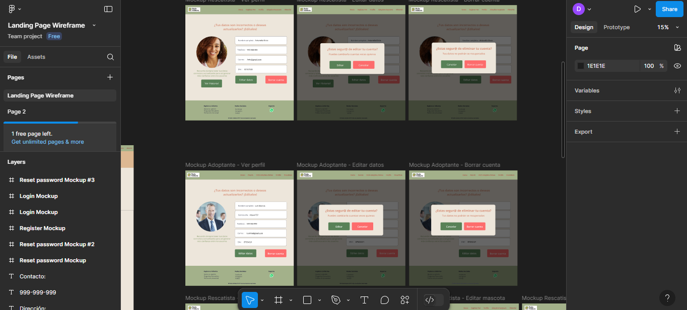
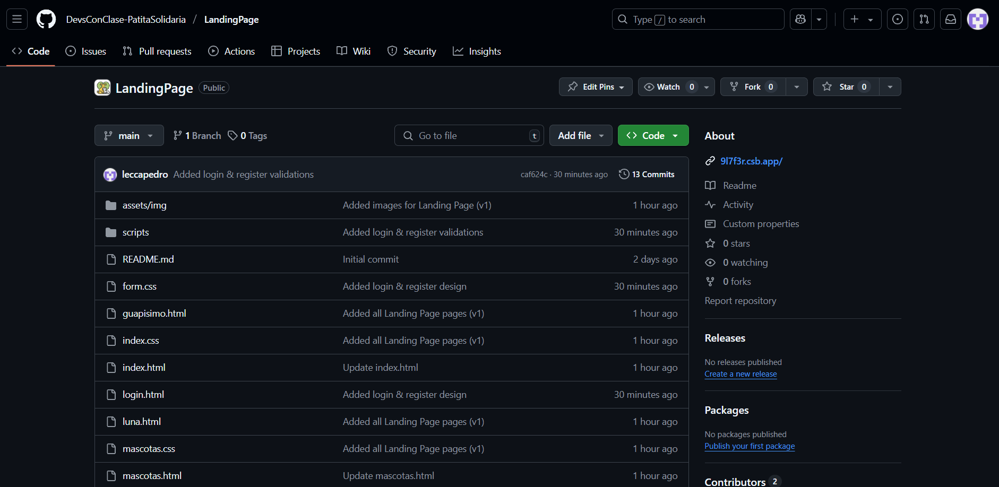
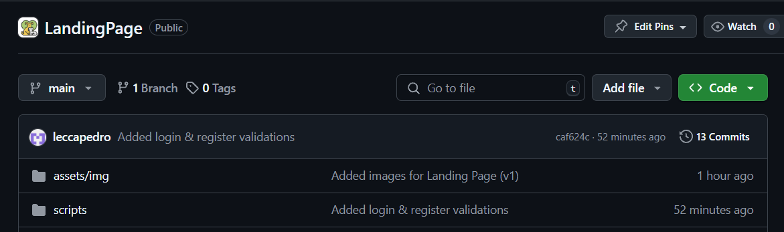
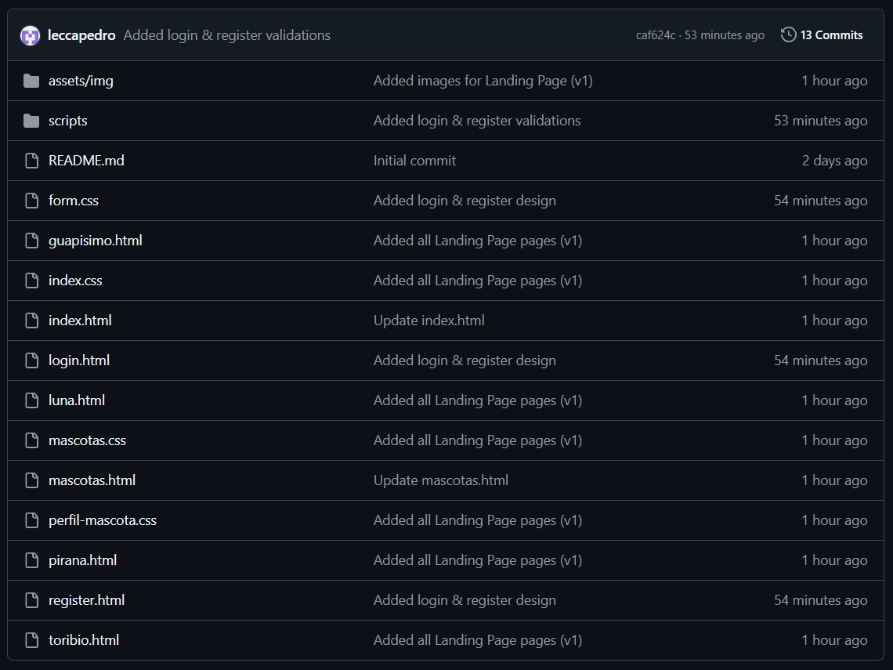

# DevsConClase

Product: Patita Solidaria 

# UNIVERSIDAD PERUANA DE CIENCIAS APLICADAS


## Ingeniería de Software

## 5to ciclo

## Desarrollo de Aplicaciones Open Source

### **Sección:** 1ASI0729

### **Profesor:** Rafael Oswaldo Castro Veramendi

### Informe de Trabajo Final

### "DevsConClase"

### "Patita Solidaria"

### **Integrantes:**

- Coca Lavado Carlos Andrés - u202313172
- Pedro Omar Lecca Villalobos - u202223293
- Arnold Gabriel Morales Sosa - u201822516
- Diego Alonso Rosado Iporre - u201620127
- Carlo Patricio Ramirez Escalante - u202210787
- Sebastian Aaron Anibal Carbajal Santivañez - u202111461

### Abril, 2025

**Url del proyecto**: https://github.com/DevsConClase-PatitaSolidaria

## Registro de Versiones del Informe
| Version | Fecha    | Autor          | Descripción                                                                                                                                                                                                                               |
|---------|----------|----------------|-------------------------------------------------------------------------------------------------------------------------------------------------------------------------------------------------------------------------------------------|
| TB1     | 09/04/25 | Diego Rosado   | Creación organización y repositorios en GitHub para proyecto final                                                                                                                                                                        |
| TB1     | 10/04/25 | Diego Rosado   | Adición de la documentación en formato .md del informe final                                                                                                                                                                              |
| TB1     | 11/04/25 | Andrés Coca    | Desarrollo del Capitulo 1 del informe                                                                                                                                                                                                     | 
| TB1     | 12/04/25 | Pedro Lecca    | Desarrollo del Capítulo 2 del informe                                                                                                                                                                                                     |
| TB1     | 20/04/25 | Pedro Lecca    | Documentación completa (5.2.1 -  5.2.1.8)                                                                                                                                                                                                 |
| TB1     | 14/04/25 | Arnold Morales | Desarrollo del Capitulo 4 del informe y del figma                                                                                                                                                                                         | 
| TB1     | 14/04/25 | Carlo Ramirez        | Desarrollo del Capitulo 3 del informe 4.8                                                                                                                                                                                                 | 
| TB1     | 24/04/25 | Diego Rosado   | Correción de capitulo 1 y 2, Descripción de la Startup, Antecedentes y problemática, Lean UX Process, Segmentos objetivo, Competidores, As-is Scenario Mapping, Ubiquitous Language, To-Be Scenario Mapping, User Stories, Impact Mapping, seccion 4.4.4 |
| TP1     | 14/05/2025 | Pedro Lecca | Agregar Sprint 2. |

## Project Report Collaboration Insights

|  URL de la organización del proyecto  |             URL del repositorio del reporte          |
| :-----------------------------------: |:----------------------------------------------------:| 
| https://github.com/DevsConClase-PatitaSolidaria | https://github.com/DevsConClase-PatitaSolidaria/Report |

|          URL del repositorio de la landing page           |
|:---------------------------------------------------------:|
| https://github.com/DevsConClase-PatitaSolidaria/LandingPage |

TB1:<br>

|Integrante| Tarea Asignada                             |
|-|--------------------------------------------|
|Rosado Iporre, Diego Alonso| Creación de github y Documentación Inicial |
|Coca Lavado, Carlos Andrés|Desarrollo del Capitulo 1 del documento e implementación del diagrama de clases y el diccionario de clases|
|Lecca Villalobos, Pedro Omar | Desarrollo del Capitulo 2 del documento, desarrollo de todo el punto 5.2.1 y sus subpuntos|
|Ramirez Escalante, Carlo Patricio | Desarrollo del Capitulo 3 del documento|
|Morales Sosa, Arnold Gabriel | Desarrollo del Capitulo 4 del documento, desarrollo del figma|
|Anibal Carbajal Santivañez, Sebastian Aaron| Desarrollo de los diagramas de contexto, contenedores y ComponentesAPI| 

TP1:<br>
| Integrante | Tarea Asignada |
|------------|----------------|
| Lecca Villalobos, Pedro Omar | Documentación de la Sprint 2 |

*Pull requests evidence*:


*Commits evidence*:


## Contenido

## Tabla de contenidos

- [Registro de Versiones del Informe](#registro-de-versiones-del-informe)
- [Project Report Collaboration Insights](#project-report-collaboration-insights)
- [Student Outcome](#student-outcome)
- [Capítulo I: Introducción](#capítulo-i-introducción)
    - [1.1. Startup Profile](#11-startup-profile)
        - [1.1.1. Descripción de la Startup](#111-descripción-de-la-startup)
        - [1.1.2. Perfiles de integrantes del equipo](#112-perfiles-de-integrantes-del-equipo)
    - [1.2. Solution Profile](#12-solution-profile)
        - [1.2.1. Antecedentes y problemática](#121-antecedentes-y-problemática)
        - [1.2.2. Lean UX Process](#122-lean-ux-process)
        - [1.2.2.1. Lean UX Problem Statements](#1221-lean-ux-problem-statements)
        - [1.2.2.2. Lean UX Assumptions](#1222-lean-ux-assumptions)
        - [1.2.2.3. Lean UX Hypothesis Statements](#1223-lean-ux-hypothesis-statements)
        - [1.2.2.4. Lean UX Canvas](#1224-lean-ux-canvas)
    - [1.3. Segmentos objetivos](#13-segmentos-objetivo)
- [Capítulo II: Requirements Elicitation \& Analysis](#capítulo-ii-requirements-elicitation--analysis)
    - [2.1. Competidores](#21-competidores)
        - [2.1.1. Análisis competitivo](#211-análisis-competitivo)
        - [2.1.2. Estrategias y tácticas frente a competidores](#212-estrategias-y-tácticas-frente-a-competidores)
    - [2.2. Entrevistas](#22-entrevistas)
        - [2.2.1. Diseño de entrevistas](#221-diseño-de-entrevistas)
        - [2.2.2. Registro de entrevistas](#222-registro-de-entrevistas)
        - [2.2.3. Análisis de entrevistas](#223-análisis-de-entrevistas)
    - [2.3. Needfinding](#23-needfinding)
        - [2.3.1. User Personas](#231-user-personas)
        - [2.3.2. User Task Matrix](#232-user-task-matrix)
        - [2.3.3. User Journey Mapping](#233-user-journey-mapping)
        - [2.3.4. Empathy Mapping](#234-empathy-mapping)
        - [2.3.5. As-is Scenario Mapping](#235-as-is-scenario-mapping)
    - [2.4. Ubiquitous Language](#24-ubiquitous-language)
- [Capítulo III: Requirements Specification](#capítulo-iii-requirements-specification)
    - [3.1. To-Be Scenario Mapping](#31-to-be-scenario-mapping)
    - [3.2. User Stories](#32-user-stories)
    - [3.3. Impact Mapping](#33-impact-mapping)
    - [3.4. Product Backlog](#34-product-backlog)
- [Capítulo IV: Product Design](#capítulo-iv-product-design)
    - [4.1. Style Guidelines.](#41-style-guidelines)
        - [4.1.1. General Style Guidelines](#411-general-style-guidelines)
        - [4.1.2. Web Style Guidelines](#412-web-style-guidelines)
    - [4.2. Information Architecture](#42-information-architecture)
        - [4.2.1. Organization Systems](#421-organization-systems)
        - [4.2.2. Labeling Systems](#422-labeling-systems)
        - [4.2.3. SEO Tags and Meta Tags](#423-seo-tags-and-meta-tags)
        - [4.2.4. Searching Systems](#424-searching-systems)
        - [4.2.5. Navigation Systems](#425-navigation-systems)
    - [4.3. Landing Page UI Design](#43-landing-page-ui-design)
        - [4.3.1. Landing Page Wireframe](#431-landing-page-wireframe)
        - [4.3.2. Landing Page Mock-up](#432-landing-page-mock-up)
    - [4.4. Web Applications UX/UI Design](#44-web-applications-uxui-design)
        - [4.4.1. Web Applications Wireframes](#441-web-applications-wireframes)
        - [4.4.2. Web Applications Wireflow Diagrams](#442-web-applications-wireflow-diagrams)
        - [4.4.3. Web Applications Mock-ups](#443-web-applications-mock-ups)
        - [4.4.4. Web Applications User Flow Diagrams](#444-web-applications-user-flow-diagrams)
    - [4.5. Web Applications Prototyping](#45-web-applications-prototyping)
    - [4.6. Domain-Driven Software Architecture](#46-domain-driven-software-architecture)
        - [4.6.1. Software Architecture Context Diagram](#461-software-architecture-context-diagram)
        - [4.6.2. Software Architecture Container Diagrams](#462-software-architecture-container-diagrams)
        - [4.6.3. Software Architecture Components Diagrams](#463-software-architecture-components-diagrams)
    - [4.7. Software Object-Oriented Design](#47-software-object-oriented-design)
        - [4.7.1. Class Diagrams](#471-class-diagrams)
    - [4.8. Database Design](#48-database-design)
        - [4.8.1. Database Diagram](#481-database-diagram)
        - [4.8.2. Database Dictionary](#482-database-dictionary)
- [Capítulo V: Product Implementation, Validation \& Deployment](#capítulo-v-product-implementation-validation--deployment)
    - [5.1. Software Configuration Management](#51-software-configuration-management)
        - [5.1.1. Software Development Environment Configuration](#511-software-development-environment-configuration)
        - [5.1.2. Source Code Management](#512-source-code-management)
        - [5.1.3. Source Code Style Guide \& Conventions](#513-source-code-style-guide--conventions)
        - [5.1.4. Software Deployment Configuration](#514-software-deployment-configuration)
    - [5.2. Landing Page, Services \& Applications Implementation](#52-landing-page-services--applications-implementation)
        - [5.2.1. Sprint 1](#521-sprint-1)
            - [5.2.1.1. Sprint Planning 1](#5211-sprint-planning-1)
            - [5.2.1.2. Sprint Backlog 1](#5212-sprint-backlog-1)
            - [5.2.1.3. Development Evidence for Sprint Review](#5213-development-evidence-for-sprint-review)
            - [5.2.1.4. Testing Suite Evidence for Sprint Review](#5214-testing-suite-evidence-for-sprint-review)
            - [5.2.1.5. Execution Evidence for Sprint Review](#5215-execution-evidence-for-sprint-review)
            - [5.2.1.6. Services Documentation Evidence for Sprint Review](#5216-services-documentation-evidence-for-sprint-review)
            - [5.2.1.7. Software Deployment Evidence for Sprint Review](#5217-software-deployment-evidence-for-sprint-review)
            - [5.2.1.8. Team Collaboration Insights during Sprint](#5218-team-collaboration-insights-during-sprint)
- [Conclusiones](#conclusiones)
- [Bibliografía](#bibliografía)
- [Anexos](#anexos)

## Student Outcome

_ABET – EAC - Student Outcome 5_

**Criterio:**  Capacidad de comunicarse efectivamente con un rango de audiencias.


En el siguiente cuadro se describe las acciones realizadas y enunciados de
conclusiones por parte del grupo, que permiten sustentar el haber alcanzado el logro
del ABET – EAC - Student Outcome 3.


| Criterio especifico                                                    | Acciones Realizadas                                                                                                                                                                                                                                                                                                                                                                                                                                | Conclusiones                                                                                                                                                                                                                                                                                                                                                                                                                                                                                                                  |
|------------------------------------------------------------------------|----------------------------------------------------------------------------------------------------------------------------------------------------------------------------------------------------------------------------------------------------------------------------------------------------------------------------------------------------------------------------------------------------------------------------------------------------|-------------------------------------------------------------------------------------------------------------------------------------------------------------------------------------------------------------------------------------------------------------------------------------------------------------------------------------------------------------------------------------------------------------------------------------------------------------------------------------------------------------------------------|
| 1. Comunica oralmente con efectividad a diferentes rangos de audiencia. | **Diego Alonso Rosado Iporre**<br> TB1: A través de una planificación estructurada de la exposición y la asignación clara de roles, el equipo ha desarrollado la capacidad de comunicar el proyecto 'Patita Solidaria' con efectividad. <br><br> **Carlos Andrés Coca Lavado** <br> TB1: Con los puntos definidos para cada integrante del equipo, hemos buscado explicar el proyecto de forma clara y coherente en distintos contextos orales, tanto técnicos como sociales. <br><br> **Sebastian Aaron Anibal Carbajal Santivañez** <br> TB1:Cuando todo el equipo designo sus puntos a realizar, yo tuve que realizar un analisis para posteriormente realizar diagramas del contexto en el que se iba a basar nuestra solución, luego encontrar todo tipo de componentes necesarios para llevarla a cabo de forma correcta.  <br><br> **Carlo Patricio Ramirez Escalante** <br> TB1: Durante el desarrollo del informe buscamos explicar de forma clara y concisa los entregables. <br><br> **Pedro Omar Lecca Villalobos** <br> TB1:  Durante el desarrollo del informe y las evidencias del Sprint 1, he estructurado técnicamente los entregables de manera clara y coherente para facilitar su presentación oral.  <br><br> **Arnold Gabriel Morales Sosa** <br> TB1: Repartimos el trabajo para cada integrante del equipo para que nos sea más factible acabar con el trabajo y ayudar al intregrante que tenga problemas. Se explicó el proyecto de forma intuitiva y coherente dentro del contexto de la aplicación y de los usos que los segmentos objetivos harán con respecto a los user goals puestos en las user stories. A raiz de esto se diseñó la Landing Page y Front-end en wireframes y después en mockups en figma con colores que nos representen como amadores de animales, una fuente que sea "amigable" de ver, e imágenes que acompañen lo que el usuario hará en cada goal. Diseñando así también los wireflows desde LucidChart.                                                                                                          | **Diego Alonso Rosado Iporre**<br> TB1:<br> Hemos logrado comunicar Patita Solidaria de forma clara y efectiva, adaptando nuestro mensaje según la audiencia, ya sea en contextos técnicos o sociales. <br><br> **Carlos Andrés Coca Lavado** <br>TB1:<br> Con el avance del presente proyecto como conclusión llegamos a que para una buena solución era fundamental el escuchar las necesidades de nuestros usuarios a quienes van dirigidos la presente solución <br><br> **Sebastian Aaron Anibal Carbajal Santivañez** <br>TB1:<br> Con el avance del presente proyecto como conclusión llegamos a que es importante realizar un analisis previo del contexto que abarca un determinado problema, todos sus actores y encontrar los tipos de relación que tendran con el sistema a tener en cuenta para nuestra solución. <br><br> **Carlo Patricio Ramirez Escalante** <br>TB1:<br> Luego de desarrollar los puntos del informe permitimos transmitir con claridad los objetivos del sistema, facilitando la comprensión del proyecto ante audiencias técnicas y no técnicas. <br><br>  **Pedro Omar Lecca Villalobos** <br>TB1:<br> La forma en que desarrolle los puntos del informe permite una comunicación efectiva del avance del proyecto ante distintos tipos de audiencia, desde tutores hasta usuarios.  <br><br>  **Arnold Gabriel Morales Sosa** <br>TB1:<br> Con el avance del proyecto concluimos que los usuarios necesitan una app que sea rápida, eficaz e intuitiva para que no se pierdan por tantas opciones en pantalla, sea simple, pero a la vez compleja en características y que el usuario no se entere gracias a la interfaz u diseño amigable.                                                                                                                                                                                                       |
| 2. Comunica por escrito con efectividad a diferentes rangos de audiencia | **Diego Alonso Rosado Iporre**<br> TB1: <br> Redacción del informe por completo, etiquetas de navegación y descripción de anexos tanto para usuarios técnicos como no técnicos. <br><br> **Carlos Andrés Coca Lavado**<br> TB1: <br> La documentación generada (informe Y repositorio en GitHub) refleja una comunicación escrita ordenada, comprensible y profesional, adaptada al tipo de lector. <br><br>**Pedro Omar Lecca Villalobos**<br> TB1: Elaboré el "Capítulo 2: *Requirements Elicitation & Analysis*", desarrollando entrevistas, análisis de segmentos, user personas y escenarios, con redacción clara y estructura adecuada. <br><br> **Sebastian Aaron Anibal Carbajal Santivañez**: <br> TB1:Durante el desarrollo de los respectivos diagramas busque que fuese lo mas claro posible para los usuarios puedan tener esa facilidad de entendimiento. <br><br>**Carlo Patricio Ramirez Escalante**<br> TB1: Elaboré el Capítulo 3: Requirements Specification, desarrollando el To-Be Scenario Mapping, las User Stories, el Impact Mapping y el Product Backlog y el punto 4.8 Database Design. <br><br>**Arnold Gabriel Morales Sosa**<br> TB1: Usando herramientas de comunicación escrita nos apoyamos mutuamente y completamos lo necesario para la TB1. Gracias a GitHub se pudo ver el avance de cada integrante y ver en que aspectos se podría mejorar y apoyar moralmente a los que hicieron un buen trabajo. En el caso de los usuarios objetivos se sacaron conclusiones a raiz de las etrevistas y ejemplos de manera de gráficos y resumenes para poder proseguir con las necesidades del público objetivo. | **Diego Alonso Rosado Iporre**<br> TB1: <br> La documentación escrita fue elaborada con un enfoque inclusivo y preciso, facilitando la comprensión del proyecto tanto a especialistas como a usuarios generales. <br><br>  **Carlos Andrés Coca Lavado**<br> TB1: <br> Se comunicó de manera clara y accesible el propósito y funcionamiento de Patita Solidaria, ajustando el lenguaje según la audiencia para garantizar comprensión y efectividad. <br><br>  **Pedro Omar Lecca Villalobos**<br> TB1: Mi participación permitió presentar la información técnica de manera clara, estructurada y coherente, contribuyendo al desarrollo de competencias comunicativas conforme al Student Outcome 5. <br><br> **Sebastian Aaron Anibal Carbajal Santivañez**: <br> TB1:Durante mi participación en el trabajo, comprendí la importancia de la elaboración correcta de los diagramas de contexto,contenedores y los componentes API,cuando definí cada componente de forma coherente y bien estructurado <br><br>**Carlos Andrés Coca Lavado**<br> TB1: <br> Se logró explicar desde los aspectos generales del problema social hasta la arquitectura técnica del sistema, facilitando que tanto evaluadores técnicos como públicos externos puedan entender el alcance y valor del proyecto. <br><br> **Arnold Gabriel Morales Sosa**<br> TB1: <br> Con el avance del proyecto concluimos que es esencial el haber usado GitHub para la monitorización constante y feedback interno entre todos los integrantes del proyecto. Además, vimos que existen varias similitudes en lo que desean los usuarios de la aplicación al juntar sus ideas y plasmarlas en gráficos y cuadros relacionales. Así, pudimos proseguir con el proyecto satisfactoriamente, al tener una visión más concisa y clara. |

## Capítulo I: Introducción

### 1.1. Startup Profile

#### 1.1.1. Descripción de la Startup

Patita Solidaria es una plataforma digital que conecta a adoptantes con refugios y rescatistas en el Perú, facilitando el proceso de adopción de mascotas de forma transparente, empática y accesible. Nos enfocamos en brindar información clara sobre cada mascota y en ofrecer herramientas simples para que refugios y rescatistas puedan publicar animales en adopción y gestionar sus procesos.

Buscamos promover una adopción responsable y con corazón, acercando a cada patita a su nuevo hogar.

**Misión:**

Digitalizar el camino hacia la adopción responsable en el Perú mediante una plataforma empática y accesible, que conecta a personas, refugios y rescatistas. Queremos que cada conexión hecha encuentre un hogar, cada historia compartida inspire confianza, y cada esfuerzo contribuya al bienestar animal.

**Visión:**

Ser la plataforma de referencia en adopción responsable en Perú y Latinoamérica al 2030, reconocidos por:

- Reducir a la mitad el tiempo de espera para mascotas con necesidades especiales.
- Triplicar la tasa de adopciones exitosas en Lima Metropolitana.
- Impulsar la estandarización del historial clínico de mascotas en procesos de adopción.

#### 1.1.2. Perfiles de integrantes del equipo

| <div align="center">Foto</div> | <div align="center">Descripción</div> |
|------|-------------|
| <p align="center"> </p> | Mi nombre es Diego Rosado, tengo 25 años. Mi interés en las base de datos y arquitectura de páginas web me impulsó a estudiar Ingeniería de Software. Tengo conocimiento de lenguajes como C#, C++, JavaScript, Python, base de datos como MySQL y me atrae el diseño de páginas web con HTML y CSS. Me considero una persona positiva, tolerante y creativa. Mi aporte al grupo es mi total compromiso, apoyo mutuo y el esfuerzo por asegurar que todos tengamos una visión compartida del proyecto a elaborar. Mis habilidades son resolución de problemas, adaptabilidad, trabajo en equipo y toma de decisiones. |
| <p align="center"></p> | Mi Nombre es Carlos Andrés Coca, tengo 19 años, actualmente me encuentro cursando el quinto ciclo de la carrera de Ingeniería de Software. Desde muy joven me ha interesado la ciberseguridad y el desarrollo de Software. Teniendo en cuenta el gran impacto que presentan a dia de hoy. |
| <p align="center"></p> | Mi nombre es Arnold Morales Sosa, tengo 24 años y soy estudiante de la carrera de Ingeniería de Software en la UPC, con estudios intermedios en Ensamblaje, Mantenimiento, Conectividad de equipos, desarrollo de software, programación y diseño. Innovador con deseos de aprender y apoyar en este proyecto donde pueda desarrollar mis conocimientos, apoyar a la mejora y logros de los objetivos estratégicos. Soy una persona con facilidad para trabajar en equipo, bajo presión, responsable, honesto, proactivo, creativo, ordenado, y dinámico. 
| <p align="center"></p>  | Mi nombre es Pedro Lecca y actualmente estudio la carrera de Ingeniería de Software en la Universidad UPC, sede San Miguel. Tengo 20 años y me considero una persona responsable, comprometida con el cumplimiento de mis deberes académicos. Además, valoro profundamente mantener una buena relación con mi equipo de trabajo, ya que estoy convencido de que un ambiente colaborativo y respetuoso permite alcanzar mejores resultados y potencia el desarrollo colectivo.                                                                                                                                         |
| <p align="center"></p>         | Mi Nombre es Carlo Ramirez, tengo 20 años y estoy estudiando la carrera de ingenieria de software. Tengo conocimiento en el lenguaje c++, mysql en base de datos y, css y html. Me considero una persona responsable y cooperativo. Mi aporte al grupo sera con total compromiso y esfuerzo para lograr los objetivos.
|<p align="center"></p>|Mi nombre es Sebastián Carbajal Santivañez, tengo 21 años y actualmente estoy cursando el octavo ciclo de la carrera de Ingeniería de Software. Desde mis primeros años universitarios, he desarrollado un fuerte interés por la innovación tecnológica, especialmente en el desarrollo de software y la optimización de procesos digitales.|

### 1.2. Solution Profile

#### 1.2.1. Antecedentes y problemática

En Lima Metropolitana, los refugios de mascotas enfrentan serios desafíos para gestionar adopciones, especialmente de animales con necesidades médicas. La falta de un sistema digital que centralice historiales clínicos y procesos de adopción genera desconfianza en los potenciales adoptantes, particularmente hacia mascotas con condiciones tratables.

Además, la mayoría de refugios aún opera con métodos manuales o a través de redes sociales sin estandarización, lo que ralentiza y dificulta la adopción. Esta carencia de una plataforma especializada limita las oportunidades de vida para miles de animales abandonados en busca de un hogar.

**What?**

- *¿Qué sucede exactamente?*<br>

    El núcleo del problema radica en tres fallas críticas del sistema actual. Primero, la información médica de las mascotas está dispersa en formatos incompatibles — desde registros en papel hasta mensajes fragmentados en redes sociales. Segundo, no existe un puente digital eficiente que conecte a refugios, veterinarios y adoptantes. Tercero, el proceso de adopción carece de estandarización, generando experiencias frustrantes para todas las partes involucradas.

    Para los refugios, esto dificulta mostrar el verdadero potencial de mascotas con necesidades especiales. Para los adoptantes, implica tomar decisiones importantes con información incompleta o poco confiable.

- *¿Qué relación tiene el problema con el usuario?*<br>

    Los refugios enfrentan barreras para visibilizar adecuadamente a sus animales y generar confianza en el proceso. Los adoptantes, por su parte, deben decidir sin acceso a datos médicos claros, lo que incrementa el riesgo de adopciones fallidas y desanima futuras intenciones de adoptar.

**Why?** 

- *¿Por qué ocurre este problema?*<br>

    La falta de información médica confiable genera desconfianza o temor en los posibles adoptantes. Los refugios, por su parte, no cuentan con herramientas adecuadas para registrar y compartir el estado de salud de cada mascota. Como resultado, los animales con tratamientos o necesidades especiales suelen ser ignorados, lo que prolonga su estadía en los refugios y reduce sus oportunidades de adopción.

- *¿Por qué los refugios no han implementado soluciones digitales por su cuenta hasta ahora?*<br>

    La mayoría de refugios opera con recursos muy limitados (el 82% tiene presupuestos menores a S/5,000 mensuales), priorizando gastos urgentes como alimentación y atención veterinaria básica por encima de la inversión tecnológica.

    Además, muchos administradores son voluntarios mayores de 50 años (67%), con poca experiencia digital, lo que dificulta adoptar soluciones complejas sin apoyo técnico. A esto se suma que cada organización gestiona la información de forma aislada y con métodos distintos, creando una red fragmentada e ineficiente.

    La verdadera barrera no es la necesidad —que todos reconocen—, sino la ausencia de un modelo accesible que combine tecnología simple con acompañamiento continuo para organizaciones sin expertise técnico.


**When?** 

- *¿Cuándo ocurre el problema con mayor intensidad?*<br>

    El problema se vuelve más crítico en tres momentos clave:

    - Durante las temporadas posteriores a vacaciones (enero y julio), cuando el abandono de mascotas aumenta hasta en un 40%.

    - Al diagnosticarse condiciones médicas complejas en animales rescatados, donde el 68% de los casos no logra documentarse adecuadamente.

    - Durante el proceso de adopción, cuando el 72% de los interesados desiste al no encontrar información médica clara y actualizada.

- *¿Cuándo se vuelve evidente la necesidad de una solución?*<br>

    La urgencia se hace palpable cuando:

    - Mascotas con enfermedades tratables permanecen más de 6 meses en refugios (35% de los casos).

    - Adoptantes devuelven animales por desconocer sus necesidades especiales (25% de las adopciones fallidas).

    - Refugios dedican más del 30% de su tiempo a gestiones administrativas repetitivas en lugar de atención directa.

    Estos puntos de quiebre evidencian cómo el sistema actual no responde a necesidades básicas de transparencia, agilidad y bienestar animal.


**Where?**

- *¿Dónde es más crítica esta problemática?*<br>

    El problema alcanza su máxima gravedad en los distritos periféricos de Lima, como San Juan de Lurigancho, Villa El Salvador y Comas, donde opera el 65% de los refugios independientes con mayor sobrepoblación (15-20 animales en espacios diseñados para 10). Estas zonas concentran el 80% de los casos de mascotas con necesidades especiales que superan el año de permanencia en refugios.

- *¿Dónde se manifiestan las mayores brechas del sistema actual?*<br>

    Las principales fallas se hacen más evidentes en tres áreas clave:

    - Los refugios pequeños, que carecen de personal capacitado para documentar historiales médicos (92% no tiene sistemas digitales).

    - Las clínicas veterinarias de bajo costo, que atienden a estos refugios pero no comparten bases de datos.

    - Las plataformas digitales actuales (principalmente redes sociales), donde el 78% de las publicaciones de adopción omiten información médica esencial o presentan datos desactualizados.

**Who?** 

- *¿Quiénes son los más afectados por esta situación?*<br>

    Los principales afectados son:

    - Las mascotas con necesidades médicas especiales (35% de los animales en refugios), que permanecen tres veces más tiempo en adopción que las mascotas sanas.

    - Los refugios independientes (72% del total), que destinan el 40% de sus recursos a gestiones manuales.

    - Los adoptantes potenciales, donde el 68% abandona el proceso por falta de información confiable.

- *¿Quiénes podrían ser los principales aliados para cambiar esta realidad?*<br>

    Los actores clave para transformar el sistema incluyen:

    - Veterinarios jóvenes digitalmente capacitados (25-35 años).

    - Universidades con carreras de tecnología que podrían desarrollar soluciones.

    - Empresas de software interesadas en responsabilidad social.

    - Organizaciones animalistas con alcance mediático, que podrían promover estándares unificados de información médica para adopciones.

**How?** 

- *¿Cómo afecta el problema actual a los procesos de adopción?*<br>

    El sistema fragmentado actual crea un círculo vicioso: los refugios documentan información médica en formatos incompatibles (23% en papel, 61% en redes sociales), los veterinarios no pueden compartir datos eficientemente, y los adoptantes reciben información contradictoria en el 45% de los casos. Esto genera que:

    - Las mascotas con necesidades especiales tengan un 83% menos probabilidades de adopción.

    - Los refugios inviertan 15 horas semanales por animal en gestiones manuales.

    - El 25% de las adopciones fracasen debido a expectativas médicas no alineadas.

- *¿Cómo podría transformarse este sistema con una solución digital?*<br>

    Una plataforma integrada cambiaría radicalmente el flujo mediante:

    - Historiales médicos estandarizados y accesibles, reduciendo en un 70% el tiempo de gestión.

    - Conexión directa entre refugios, veterinarios y adoptantes, disminuyendo un 60% los errores de información.

    - Procesos de adopción digitalizados con seguimiento médico incorporado, aumentando un 40% las adopciones exitosas de mascotas con necesidades especiales.

    Esto liberaría el 30% de los recursos de los refugios para atención directa en lugar de trámites administrativos.

**How much?** 

- *¿Cuál es el costo real de mantener el sistema actual?*<br>

    El modelo fragmentado genera pérdidas económicas y operativas significativas:

    - Refugios: Invierten hasta S/3,500 mensuales por animal no adoptado, lo que representa un 40% más que las mascotas sanas.

    - Clínicas veterinarias: Pierden un 30% de eficiencia en los seguimientos médicos debido a la falta de integración de datos.

    - Sistema en su conjunto: Se estima que el sistema desperdicia aproximadamente 1.2 millones de horas anuales en gestión manual de información, según la Asociación de Protección Animal Peruana.


- *¿Qué beneficios económicos podría generar una solución digital?*<br>

    Una plataforma integrada podría:

    - Reducir costos operativos de los refugios en hasta un 35%, lo que equivaldría a S/1.2 millones anuales en Lima.

    - Disminuir en un 50% los gastos veterinarios debido a la falta de historiales médicos.

    - Generar ahorros de S/800 anuales por adoptante al evitar adopciones fallidas.

    Además, aumentaría un 28% la eficiencia en donaciones al transparentar el uso de recursos en cuidados médicos.

#### 1.2.2. Lean UX Process

El proceso Lean UX se adapta especialmente bien a startups como SSVR que buscan crear soluciones innovadoras y efectivas en el mercado. Este enfoque se caracteriza por su agilidad y centrado en el usuario, lo que significa que estamos constantemente buscando validar nuestras ideas y prototipos con los usuarios para garantizar que estamos abordando sus necesidades de manera adecuada.

##### 1.2.2.1. Lean UX Problem Statements

En Lima Metropolitana, el abandono de mascotas es un problema urgente. Cada día, cientos de animales rescatados permanecen en refugios, esperando una oportunidad de ser adoptados. Muchos de estos animales tienen necesidades médicas tratables o requieren atención continua, pero no logran ser adoptados debido a la falta de información confiable sobre su estado de salud y el proceso de adopción.

Patita Solidaria nace para abordar esta problemática. Nuestra plataforma se enfoca en mejorar la visibilidad y adopción de mascotas con necesidades especiales. Ofrecemos un sistema que centraliza la información disponible sobre cada animal, facilitando el contacto entre refugios y adoptantes. Aunque no contamos con acceso a clínicas veterinarias, recopilamos y compartimos la información disponible sobre el estado de salud de los animales, lo que ayuda a los adoptantes a tomar decisiones informadas.

Lo que nos distingue es la capacidad de transformar esta información en confianza, proporcionando detalles claros y comprensibles sobre las condiciones de cada animal. A diferencia de otras plataformas que solo muestran fotos y datos básicos, Patita Solidaria ofrece una experiencia integral para facilitar la adopción de animales con necesidades especiales.

Nuestra investigación revela que el 72% de los adoptantes potenciales (Encuesta PUCP 2023) desisten de adoptar animales con necesidades médicas por falta de información clara sobre su condición. Este hallazgo nos enfrenta al desafío de diseñar una experiencia que:

**¿Cómo podemos diseñar una plataforma que no solo brinde adopciones informadas, sino que también genere un compromiso activo de apoyo continuo, donde refugios y adoptantes colaboren para asegurar el bienestar de los animales?**

##### 1.2.2.2. Lean UX Assumptions

**Assumptions para "Patita Solidaria"**

**Assumptions**:

1. Creemos que adoptar una mascota debería ser un proceso más humano, seguro y accesible.

2. Las personas quieren adoptar con confianza, conociendo bien a la mascota y a quienes la cuidan.

3. Los refugios y rescatistas necesitan herramientas simples para gestionar publicaciones, solicitudes y validar a posibles adoptantes.

4. La confianza se construye desde la transparencia: datos claros de mascotas, validación de identidad y comunicación directa.

5. Nuestra plataforma cubrirá tres contextos fundamentales: gestión de mascotas, procesos de adopción y autenticación de usuarios.

6. El mayor desafío será la adopción tecnológica por parte de los rescatistas/refugios, y que los adoptantes confíen en el proceso.

7. Vamos a resolver esto con diseño centrado en el usuario, educación, soporte y validación de perfiles.

8. Nuestra competencia principal será redes sociales no especializadas y páginas web de adopción que no están optimizadas para la gestión ni el seguimiento.

9. Los superaremos ofreciendo una experiencia centrada en la empatía, la claridad de información y herramientas que realmente facilitan el proceso tanto para adoptantes como para rescatistas.

**Assumptions (supuestos)**

1. ¿Quién es el usuario?

    -  Personas interesadas en adoptar una mascota (parejas, familias, jóvenes independientes).

    - Refugios de animales y rescatistas independientes que buscan dar en adopción a animales de forma segura.

2. ¿Dónde encaja nuestro producto en su vida?

    - Para adoptantes: en el momento en que deciden integrar una mascota a su vida y quieren hacerlo con responsabilidad y confianza.

    - Para refugios/rescatistas: publican mascotas, gestionan formularios, validan identidad de adoptantes y programan visitas.

3. ¿Qué problemas tiene nuestro producto y cómo se pueden resolver?

    - **Problema 1:** Publicaciones de mascotas poco claras o sin historia emocional. <br>
    **Solución:** Fomentar descripciones empáticas, fotos cuidadas y campos obligatorios como necesidades especiales y salud.

    - **Problema 2:** Proceso de adopción no estandarizado y sin filtros. <br>
    **Solución:** Formulario detallado de adopción con validación automática de campos clave (hogar, rutina, experiencia previa).

    - **Problema 3:** Identidades falsas o usuarios malintencionados. <br>
    **Solución:** Uso de APIs de validación como Onfido, ValidarID, y moderadores internos para verificar cada perfil.

4. ¿Cuándo y cómo es usado nuestro producto?

    - Adoptantes navegan diariamente, completan formularios, y reciben notificaciones sobre su solicitud.

    - Refugios gestionan publicaciones, validan adoptantes y programan visitas.

5. ¿Qué características son importantes?

    - Filtros útiles por tipo de mascota, necesidades, tamaño, edad, ubicación.

    - Formulario de adopción claro y detallado.

    - Perfil completo de cada mascota (historial médico, descripción emocional, fotos).

    - Validación de identidad y revisión manual por parte del equipo.

    - Seguimiento de estado de solicitud y comunicación fluida.

6. ¿Cómo debe verse nuestro producto y cómo debe comportarse?

    - Cálido, empático y confiable. Diseño simple, accesible y sensible al contexto emocional de la adopción.

    - Debe guiar al usuario sin fricciones, ofreciendo claridad en cada paso.

    - Toda interacción debe fomentar la conexión entre personas y animales.

**Business Outcomes:**

- Alcanzar 100 refugios/rescatistas verificados en 6 meses.

- Facilitar al menos 500 solicitudes de adopción en el primer año.

- Validar la identidad del 90% de los adoptantes registrados en la plataforma.

- Lograr que el 80% de las mascotas publicadas cuenten con historial médico y descripción emocional.

- Incrementar el ratio de adopciones exitosas (con seguimiento post-adopción) en un 40% en 12 meses.

**User Outcomes:**

- Adoptantes encuentran mascotas compatibles con su estilo de vida y completan procesos más confiables.

- Refugios y rescatistas publican fácilmente y reducen la carga operativa en gestión de adopciones.

- Los usuarios ganan confianza gracias a la validación de perfiles y claridad del proceso.

- Se generan vínculos emocionales genuinos a través de historias, fotos y seguimiento del proceso de adopción.

- Se reduce el abandono post-adopción gracias a un sistema responsable y empático.

##### 1.2.2.3. Lean UX Hypothesis Statements

1. Creemos que permitir a los rescatistas y refugios publicar mascotas con fotos, historia emocional y necesidades especiales visiblemente destacadas aumentará el interés de los adoptantes.
Sabremos que esto es cierto cuando veamos un aumento del 25% en la tasa de visualización de perfiles completos de mascotas durante el primer mes.

2. Creemos que incluir una sección con historial médico claro y validado en cada perfil de mascota generará más confianza en los adoptantes.
Sabremos que hemos tenido éxito cuando el 60% de los formularios enviados correspondan a mascotas con historial médico publicado.

3. Creemos que implementar un formulario de adopción más completo (hogar, rutina, espacio, vínculo emocional) reducirá los abandonos post-adopción.
Sabremos que esto es cierto cuando veamos un 30% de aumento en adopciones exitosas con seguimiento positivo en los 3 meses posteriores.

4. Creemos que permitir agendar visitas directamente desde la app facilitará la coordinación y acelerará el proceso de adopción.
Sabremos que esto es cierto cuando al menos el 40% de los usuarios con formulario aprobado agenden una visita dentro de la primera semana.

5. Creemos que notificar a los usuarios sobre el estado de sus solicitudes de adopción aumentará su confianza en la plataforma.
Sabremos que esto es cierto cuando el 70% de los usuarios revisen el estado de su solicitud al menos una vez en los primeros 3 días tras enviarla.

6. Creemos que validar la identidad de adoptantes, rescatistas y refugios usando APIs como Onfido o ValidarID reducirá los perfiles fraudulentos.
Sabremos que esto es cierto cuando el porcentaje de cuentas rechazadas por datos falsos disminuya en un 40% tras los primeros 2 meses de uso.

7. Creemos que permitir a los usuarios registrarse como adoptantes, rescatistas o refugios con requisitos personalizados (DNI, RUC, fotos, certificados) mejorará la calidad de perfiles en la plataforma.
Sabremos que esto es cierto cuando el 90% de los nuevos registros completos sean verificados sin necesidad de contacto adicional del soporte.

8. Creemos que ofrecer filtros según tamaño, tipo, edad y necesidades especiales facilitará encontrar mascotas compatibles.
Sabremos que esto es cierto cuando el tiempo promedio de búsqueda antes de abrir un perfil disminuya en un 20%.

##### 1.2.2.4. Lean UX Canvas

| **Sección** | **Contenido** |
|-------------|---------------|
| **Business Problem** | Muchas mascotas rescatadas no encuentran un hogar debido a la falta de una plataforma confiable que conecte adoptantes comprometidos con refugios y rescatistas. A la vez, los refugios y rescatistas enfrentan dificultades para validar a los adoptantes y gestionar sus publicaciones de manera organizada. Existe una desconexión entre quienes desean adoptar responsablemente y quienes ofrecen mascotas en adopción. |
| **Business Outcomes** | - Incrementar en un 40% las solicitudes de adopción procesadas mensualmente.<br> - Aumentar en un 25% el número de adopciones exitosas verificadas dentro de los primeros 3 meses.<br> - Reducir en un 30% los perfiles de usuarios rechazados por falta de validación o información incompleta.<br> - Lograr que al menos el 70% de las mascotas publicadas cuenten con historial médico y fotos. |
| **Users and Customers** | **Primarios:**<br> - Adoptantes: Personas con intención de brindar un hogar seguro y amoroso a una mascota.<br> - Rescatistas y Refugios: Individuos o instituciones que salvan y cuidan mascotas y buscan familias adoptivas responsables.<br>**Secundarios:**<br> - Encargados de verificación: Personas que revisan y aprueban perfiles de rescatistas y refugios. |
| **User Benefits** | **Adoptantes:**<br> - *Outcomes:* Adoptar con confianza gracias a procesos estructurados y verificación de identidad.<br> - *Benefits:* Menor incertidumbre, mayor transparencia, experiencia más segura y ágil.<br>**Rescatistas y Refugios:**<br> - *Outcomes:* Publicar mascotas fácilmente, validar adoptantes y facilitar adopciones responsables.<br> - *Benefits:* Mayor tasa de adopciones exitosas, reducción en el tiempo de gestión, menor tasa de devoluciones. |
| **Solutions Ideas** | - Fichas de publicación detalladas: historia emocional, fotos, historial médico.<br> - Flujo de adopción estructurado: formulario completo, visitas, seguimiento.<br> - Registro y verificación de identidad por tipo de usuario.<br> - Notificaciones automáticas y seguimiento post-adopción. |
| **Hypotheses** | - Ejemplo 1: Creemos que mostrar fichas completas con historia emocional y fotos aumentará las visualizaciones y formularios enviados. Sabremos que esto es cierto cuando suba en 25% la tasa de interacción con perfiles.<br> - Ejemplo 2: Creemos que validar la identidad de los adoptantes reducirá adopciones fallidas. Sabremos que esto es cierto cuando las devoluciones bajen en un 30%.<br> - Ejemplo 3: Creemos que permitir agendar visitas dentro de la plataforma agilizará el proceso. Sabremos que esto es cierto cuando 40% de los adoptantes agenden una visita dentro de los primeros 7 días. |
| **What's the most important thing we need to learn first?** | ¿Los usuarios están dispuestos a adoptar una mascota bajo un proceso más riguroso pero estructurado? Esto nos permitirá conocer su compromiso real y disposición a seguir los pasos del proceso. |
| **What's the least amount of work we need to do to learn the next most important thing?** | **MVP:** Plataforma funcional limitada a una zona geográfica, con publicaciones verificadas, formulario básico y sistema de agendamiento de visitas. Validar si los usuarios completan el proceso y muestran disposición real. |

### 1.3. Segmentos objetivos

### Segmento Objetivo #1: Personal de Refugios y Rescatistas de Animales (Administradores, Cuidadores y Voluntarios)

Aspectos demográficos:

- Sexo: No hay preferencia por género

- Edades: Adultos entre 25 y 50 años (inclusive)

Aspectos geográficos:

- Nacionalidad: Peruana

- Zona geográfica: Principalmente en áreas urbanas y semiurbanas, donde se concentran los refugios más grandes y activos, con énfasis en Lima Metropolitana

Aspectos psicográficos:

- Personas comprometidas con el bienestar animal, muchas veces voluntarios o trabajadores con vocación social.

- Buscan herramientas que faciliten la gestión diaria del refugio o el rescate (registro de animales, control de adopciones, tratamiento, etc.).

- Están interesados en soluciones tecnológicas simples, efectivas y accesibles que mejoren la organización interna y aumenten la tasa de adopciones.

- Valoran la colaboración abierta y están dispuestos a compartir datos o sugerencias con otros refugios o grupos de rescate a través de una comunidad.

### Segmento Objetivo #2: Adoptantes Potenciales (Personas interesadas en adoptar animales)

Aspectos demográficos:

- Sexo: Masculino y femenino

- Edades: Jóvenes y adultos entre 20 y 45 años (inclusive)

Aspectos geográficos:

- Nacionalidad: Peruana

- Zona geográfica en la que vive: Urbana

- Departamento: Principalmente Lima Metropolitana, pero también ciudades intermedias como Arequipa, Chiclayo, Huancayo, Cusco

Aspectos psicográficos:

- Personas con afinidad por los animales y conciencia sobre la adopción responsable.

- Buscan una forma rápida, transparente y confiable de conocer animales en adopción.

- Desean ver historias, fotos y fichas médicas para tomar una decisión informada.

- Están motivados por el impacto positivo de adoptar y dar una segunda oportunidad a un animal rescatado.

## Capítulo II: Requirements Elicitation & Analysis

### 2.1. Competidores

En esta sección, se presenta un análisis de los principales competidores de nuestra startup, centrado en aquellos que operan con modelos de negocio digitales similares o que, aunque no sean idénticos, ofrecen productos o servicios que se superponen parcialmente con los de Patita Solidaria. Evaluamos tanto competidores directos, que se enfocan en la gestión de adopciones de mascotas, como competidores indirectos, que abordan áreas relacionadas como el rescate animal, la concientización sobre tenencia responsable y plataformas de clasificados generales.

Este análisis nos permitirá comprender mejor el entorno competitivo y cómo podemos diferenciar nuestra propuesta para destacar en el ecosistema de adopciones responsables y cuidado animal.

Los competidores relevantes para nuestra startup son:

- **WUF (Adopción y bienestar animal, Perú)**

WUF es una organización sin fines de lucro peruana que promueve la adopción responsable de perros en situación de abandono. A través de su plataforma digital, conecta a personas interesadas en adoptar con albergues que tienen perros disponibles.

Características principales:

- Plataforma de adopción digital: Presenta perfiles detallados de perros en adopción.

- Proceso de adopción estructurado: Incluye formularios, entrevistas y seguimiento post-adopción.

- Alianzas con marcas y clínicas veterinarias: Ofrece beneficios para adoptantes.

- Campañas de concientización: Promueve la tenencia responsable y el bienestar animal mediante contenido educativo y redes sociales.

- **Wukha (Adopción y comunidad pet-friendly, Perú)**

Wukha es una plataforma digital que conecta a personas que desean adoptar mascotas con refugios y rescatistas. Además, busca crear una comunidad pet-friendly con contenido educativo y recursos para el cuidado de animales.

Características principales:

- Marketplace de adopciones: Permite buscar mascotas por tipo, tamaño, edad, etc.

- Registro de rescatistas: Cualquiera puede subir un animal rescatado para buscarle hogar.

- Blog educativo: Contenido sobre salud, nutrición y cuidados.

- Enfoque comunitario: Busca generar una red colaborativa para ayudar a más animales.

- **Voz Animal Perú (Rescate y adopción de animales, Perú)**

Voz Animal es una asociación civil sin fines de lucro que rescata animales en situación de abandono, promueve su recuperación y los pone en adopción. Su presencia es fuerte tanto en redes sociales como en campañas en terreno.

Características principales:

- Rescate activo: Intervención directa en casos de maltrato o abandono.

- Campañas de esterilización: Organiza jornadas para prevenir la sobrepoblación.

- Adopciones con seguimiento: Filtro riguroso de adoptantes y seguimiento post-adopción.

- Educación y sensibilización: Promueve el respeto por la vida animal desde la niñez.


#### 2.1.1. Análisis competitivo

Para hacer el análisis competitivo, decidimos centrarnos en el modelo de trabajo de:

**WUF**: Enfocado en la adopción responsable y el bienestar animal. Compararnos con WUF nos permite evaluar cómo estructuran su proceso de adopción, el seguimiento que brindan y su trabajo de concientización a través de campañas digitales y alianzas.

**Wukha**: Se centra en la adopción de mascotas y en formar una comunidad pet-friendly. Esta plataforma nos da referencias sobre cómo fomentar una red colaborativa, promover contenido educativo y facilitar la conexión entre rescatistas y adoptantes.

**Voz Animal Perú**: Su enfoque en el rescate activo, las campañas de esterilización y la educación animal nos brinda ideas sobre cómo involucrar a la sociedad en la protección animal de forma más directa y con impacto social.

Estas comparaciones nos permitirán entender mejor cómo otras organizaciones gestionan sus procesos, construyen comunidad y promueven la adopción responsable. Esta información será clave para fortalecer nuestra propuesta y marcar una diferencia con Patita Solidaria.


|                                                    | **Patita Solidaria**                                                                                                                                                                                        | **WUF**                                                                                                                                                                      | **Wukta**                                                                                                                                                                                                            | **Voz Animal Perú**                                                                                                                                                                                                          |
|----------------------------------------------------|-----------------------------------------------------------------------------------------------------------------------------------------------------------------------------------------------------------|-----------------------------------------------------------------------------------------------------------------------------------------------------------------------------------------------------------------------|------------------------------------------------------------------------------------------------------------------------------------------------------------------------------------------------------------------------|------------------------------------------------------------------------------------------------------------------------------------------------------------------------------------------------------------------------------|
| **Nombre y Logo** <br>   | **Patita Solidaria** <br>                                                                                                                                              | **WUF** <br>*(ONG reconocida con respaldo corporativo)*                                                                                                                                                               | **Wukta** <br>*(Plataforma web para adopción)*                                                                                                                                                                           | **Voz Animal Perú** <br>*(ONG centrada en rescate y adopción)*                                                                                                                                                              |
| **Overview**                                       | Patita Solidaria es una plataforma digital que facilita la adopción responsable de animales rescatados, proporcionando información médica clara y confiable para ayudar a los adoptantes a tomar decisiones informadas.                                                  | ONG consolidada que promueve adopciones, campañas de esterilización y educación. Tiene respaldo corporativo.                                                                                                          | Plataforma web que conecta adoptantes con rescatistas y albergues a través de perfiles de mascotas.                                                                                                                      | ONG centrada en rescate, rehabilitación y adopción de animales abandonados, con fuerte presencia en redes sociales.                                                                                                          |
| **Ventaja competitiva**                            | Ofrecer información médica transparente y herramientas digitales sencillas para refugios, facilitando adopciones informadas y responsables.                                                                            | Confianza institucional y alianzas con empresas. Plataforma sencilla para adoptar y donar.                                                                                                                                                                                                         | Foco en digitalización y conexión entre partes. Interfaz simple y rápida.                                                                                                                                             | Compromiso con casos críticos, campañas de ayuda directa. Visibilidad de casos sensibles.                                                                                                                                     |
| **Mercado objetivo**                               | Limeños interesados en adopción responsable, y protectores independientes o de refugios.                                                                                                                  | Público general interesado en ayuda animal y adopción segura.                                                                                                                                                                                                   | Adoptantes y albergues (informales o formales).                                                                                                                                                                        | Público general sensible al bienestar animal: voluntarios, familias, activistas.                                                                                                                                             |
| **Estrategias de marketing**                       | Redes sociales, historias de adopciones exitosas y alianzas con influencers para aumentar la visibilidad y atraer adoptantes.                                                                                                                             | RRSS, medios de comunicación, eventos y merchandising.                                                                                                                                                                                                         | RRSS, blog, convenios con albergues.                                                                                                                                                                                   | Activismo en redes sociales, campañas virales, publicaciones emocionales.                                                                                                                                                    |
| **Productos & Servicios**                          | Plataforma digital para refugios, con adopciones, fichas informativas, guía de refugios para donaciones y promoción en redes sociales.                                                         | Adopción, apadrinamiento, donaciones, esterilización y campañas educativas.                                                                                                                                                                                   | Adopción directa mediante perfiles digitales, contacto vía web, registro básico.                                                                                                                                       | Rescate, rehabilitación, adopción, campañas de salud, denuncias y actividades comunitarias.                                                                                                                                   |
| **Precios & Costos**                               | Gratuito para adoptantes. Planes premium (futuros) para protectores/refugios.                                                                                                                             | Gratuito para adoptantes; se financia con donaciones y auspiciadores.                                                                                                                                                                                          | Gratuito; sostenibilidad mediante convenios con protectores/as y albergues.                                                                                                                                           | Gratuito; opera por voluntariado y donaciones puntuales.                                                                                                                                                                    |
| **Canales de distribución** <br> (Web y/o Móvil)   | Plataforma web adaptativa; en desarrollo app móvil.                                                                                                                                                       | Web optimizada + presencia activa en Instagram y Facebook.                                                                                                                                                                                                     | Web responsive; sin app móvil conocida.                                                                                                                                                                                | Página en redes sociales (Facebook, Instagram) y sitio web básico.                                                                                                                                                           |
| **Fortalezas**                                     | Transparencia y centralización de información. Enfoque en experiencia y confianza.                                                                                                                   | Reconocimiento de marca, red de aliados corporativos, confianza pública.                                                                                                                                                                                        | Simplicidad y rapidez en la adopción. Buen enfoque digital.                                                                                                                                                           | Activismo fuerte, sensibilidad del público, reputación positiva en redes.                                                                                                                                                   |
| **Debilidades**                                    | Nueva marca. Requiere posicionarse y generar confianza.                                                                                                                                                   | No involucra protectores como intermediarios; puede resultar impersonal.                                                                                                                                                                                         | Poca personalización, sin garantías post-adopción.                                                                                                                                                                     | Saturación de casos, poca trazabilidad en algunos rescates.                                                                                                                                                                |
| **Oportunidades**                                  | Creciente interés en adopción responsable, la digitalización del proceso y la posibilidad de formar alianzas con clínicas veterinarias, expandiendo nuestra presencia en nuevas ciudades y regiones.                                                                                                                           | Escalar a provincias, lanzar app, incluir más funcionalidades en línea.                                                                                                                                                                                          | Incluir seguimiento post-adopción. Alianzas con marcas afines.                                                                                                                                                         | Profesionalizar su modelo y estandarizar procesos. Potenciar su red.                                                                                                                                                        |
| **Amenazas**                                       | Baja confianza inicial, saturación del mercado de adopción informal.                                                                                                                                       | Aparición de plataformas más tecnológicas o descentralizadas.                                                                                                                                                                                                    | Bajo margen de ingresos. Alta competencia en el mercado.                                                                                                                                                               | Volatilidad en donaciones. Dependencia del trabajo voluntario.                                                                                                                                                             |

**Patita Solidaria** se distingue de sus competidores al integrar historial médico y contacto directo con refugios, lo que ofrece una experiencia más segura y responsable. Aunque aún está en proceso de posicionamiento, su propuesta innovadora representa una oportunidad clara para profesionalizar y digitalizar el proceso de adopción en Lima.

#### 2.1.2. Estrategias y tácticas frente a competidores
Para enfrentar a la competencia y posicionarse de manera sólida en el mercado limeño, **Patita Solidaria** implementará estrategias enfocadas en sus principales ventajas competitivas y en la explotación de oportunidades no cubiertas por otras organizaciones. Entre las principales tácticas preliminares destacan:

1. **Estrategia de diferenciación tecnológica**  
   Nuestra plataforma web facilitará la interacción entre adoptantes y protectores mediante funcionalidades enfocadas en la transparencia y el bienestar animal. Se contempla, por ejemplo, el desarrollo progresivo de herramientas como el historial de salud digital y alertas de seguimiento, diferenciándonos de iniciativas como Voz Animal o Wukta.

2. **Alianzas estratégicas (en planes de planificación)**  
   A futuro, planeamos establecer convenios con clínicas veterinarias y refugios formales, con el fin de fortalecer la confianza en los perfiles de adopción y acceder a servicios de salud con tarifas preferenciales. Estas alianzas se integrarán en fases posteriores de la plataforma.

3. **Campañas digitales con enfoque emocional y educativo**  
   Las campañas en redes sociales serán clave para sensibilizar sobre la adopción responsable. Se priorizarán contenidos educativos, testimonios de adopciones exitosas y materiales visuales que refuercen el vínculo entre usuarios y animales, complementando la experiencia de la plataforma.

4. **Captación y fidelización de protectores** 
   La plataforma incluye herramientas que permiten a los protectores subir perfiles de animales y gestionar solicitudes de adopción. Se prevé también la implementación de incentivos no monetarios, como reconocimientos digitales o apoyo en la difusión de sus campañas.

5. **Gestión de riesgos y validación de adopciones**  
   Frente a los riesgos de informalidad y saturación de contenido en redes, aplicaremos un modelo de validación y seguimiento para cada adopción, fortaleciendo la confianza en la comunidad y previniendo situaciones de abandono o maltrato.

Estas estrategias buscan posicionar a **Patita Solidaria** como una alternativa confiable, tecnológica y socialmente comprometida, con un enfoque centrado en la transparencia, la colaboración comunitaria y el bienestar de los animales.

### 2.2. Entrevistas

En esta sección del informe se realizará el diseño, registro y análisis de las entrevistas de nuestros segmentos objetivos

#### 2.2.1. Diseño de entrevistas
Como parte del proceso de validación del modelo de negocio de **Patita Solidaria**, se realizaron preguntas semi estructuradas dirigidas a los dos segmentos objetivos: personas interesadas en adoptar mascotas y protectores/rescatistas que gestionan casos de animales en situación de abandono.

---

#### Diseño de entrevista - Segmento 1: Adoptantes

1. **Datos generales:**
   - Nombre.
   - Edad.
   - Distrito de residencia.
   - Ocupación.
   - ¿Vive solo/a o con familia?

2. **Motivaciones y comportamientos:**
   - ¿Qué te motivó a considerar la adopción de una mascota?
   - ¿Has adoptado antes? ¿Cómo fue tu experiencia?
   - ¿Qué tipo de mascota te gustaría adoptar (raza, edad, tamaño)?
   - ¿Qué medios utilizas para buscar mascotas en adopción?
   - ¿Qué aspectos valoras más antes de adoptar (salud, comportamiento, historia)?

3. **Miedos, expectativas y canales:**
   - ¿Qué dudas o miedos tienes respecto al proceso de adopción?
   - ¿Qué haría que confíes plenamente en una plataforma digital de adopción?
   - ¿Qué redes sociales o plataformas digitales usas con más frecuencia?
   - ¿Te gustaría recibir seguimiento post-adopción o apoyo luego de adoptar?

---

#### b) Diseño de entrevista - Segmento 2: Protectores

1. **Datos generales:**
   - Nombre.
   - Tiempo dedicado al rescate/protección animal.
   - ¿Trabajas de forma independiente o vinculado a un refugio?
   - Número promedio de animales rescatados por mes.

2. **Operaciones y herramientas:**
   - ¿Cómo gestionas actualmente los procesos de adopción?
   - ¿Qué medios utilizas para difundir los casos?
   - ¿Qué información sueles recopilar del animal antes de darlo en adopción?
   - ¿Qué dificultades enfrentas para encontrar adoptantes responsables?
   - ¿Has usado alguna plataforma web o app para este fin?

3. **Expectativas:**
   - ¿Qué funcionalidades digitales serían útiles para ti (seguimiento, historial, etc.)?
   - ¿Qué tipo de soporte o incentivo te motivaría a usar una nueva plataforma?
   - ¿Cuáles son tus principales frustraciones en el proceso de adopción?
   - ¿Qué esperas de los adoptantes para garantizar el bienestar del animal?

---

El presente diseño permitirá recopilar información clave sobre ambos segmentos, enfocándose en sus motivaciones, barreras, comportamientos y preferencias. Estos insumos serán esenciales para la validación del modelo y el diseño centrado en el usuario de la plataforma **Patita Solidaria**.

#### 2.2.2. Registro de entrevistas


#### 1. Entrevistas del Segmento N°1: Personal de Refugios de Animales (Administradores y Cuidadores)

| <p align="center"> |
|-------------------------------------------------------------------------------------------------|
| **Entrevistado(a):** Julia Mejía                                                                |
| **Género:** Femenino                                                                            |
| **Edad:** 21 años                                                                               |
| **Link de la entrevista (YouTube):** https://youtu.be/ulyokJORm-U?si=jMSwigdXtaAr4DfN           |
| Julia Mejía, una joven de 21 años que reside en San Isidro, trabaja de forma independiente en el rescate de animales, con un promedio de entre 4 y 6 casos mensuales. Aunque ocasionalmente colabora con refugios, su labor principal se basa en procesos digitalizados como formularios de Google, videollamadas y WhatsApp. Difunde los casos mediante redes sociales como Instagram, Facebook y Telegram. Antes de dar un animal en adopción, recopila información sobre edad, salud, vacunas y comportamiento. Julia expresa preocupación por adoptantes que mienten en formularios y el bajo compromiso, lo que a veces lleva al abandono. Le gustaría que las plataformas incluyan seguimiento, alertas, respaldo legal y atención médica. Desea que los adoptantes traten a los animales como parte de la familia.                                                                                                |

| <p align="center">                                                                                                                                                                                                                                                                                                                                                                                                                                                                                                                                                                                        |
|-----------------------------------------------------------------------------------------------------------------------------------------------------------------------------------------------------------------------------------------------------------------------------------------------------------------------------------------------------------------------------------------------------------------------------------------------------------------------------------------------------------------------------------------------------------------------------------------------------------------------------------------------------------------------------------------|
| **Entrevistado(a):** Briza Segura                                                                                                                                                                                                                                                                                                                                                                                                                                                                                                                                                                                                                                                       |
| **Género:** Femenino                                                                                                                                                                                                                                                                                                                                                                                                                                                                                                                                                                                                                                                                    |
| **Edad:** 25 años                                                                                                                                                                                                                                                                                                                                                                                                                                                                                                                                                                                                                                                                       |
| **Link de la entrevista (YouTube):** https://youtu.be/XUgSsGW4AyM?si=tJXBtEz_pfVtTN3F                                                                                                                                                                                                                                                                                                                                                                                                                                                                                                                                                                                                   |
| Briza Segura, de 25 años y residente en San Borja, trabaja vinculada a un refugio y rescata entre 5 y 20 animales al mes. Los procesos de adopción incluyen formularios, entrevistas y visitas domiciliarias. Difunde casos mediante Facebook, Instagram y ferias locales. Antes de la adopción, recopila datos sobre salud, comportamiento y preferencias del animal. Identifica como problema principal la falta de compromiso y adopciones impulsivas. Le gustaría contar con plataformas que incluyan seguimiento, recordatorios y evaluaciones de adoptantes, además de soporte técnico y certificación para su labor. Busca adoptantes comprometidos, informados y comunicativos. |


| <p align="center">                                                                                                                                                                                                                                                                                                                                                                                                                                                                                                                                                                                        |
|-----------------------------------------------------------------------------------------------------------------------------------------------------------------------------------------------------------------------------------------------------------------------------------------------------------------------------------------------------------------------------------------------------------------------------------------------------------------------------------------------------------------------------------------------------------------------------------------------------------------------------------------------------------------------------------------|
| **Entrevistado(a):** Juan Perez                                                                                                                                                                                                                                                                                                                                                                                                                                                                                                                                                                                                                                                       |
| **Género:** Masculino                                                                                                                                                                                                                                                                                                                                                                                                                                                                                                                                                                                                                                                                    |
| **Edad:** 24 años                                                                                                                                                                                                                                                                                                                                                                                                                                                                                                                                                                                                                                                                       |
| **Link de la entrevista (YouTube):** https://youtu.be/1onoVPD79i8                                                                                                                                                                                                                                                                                                                                                                                                                                                                                                                                                                                                   |
| Juan Pérez, de 24 años, dedica aproximadamente 20 a 25 horas semanales al rescate y protección animal. Durante la conversación, Juan explicó que gestiona los procesos de adopción manteniendo registros manuales en hojas de cálculo, realizando entrevistas telefónicas y visitas domiciliarias cuando es posible. Además, mencionó que utiliza plataformas como Facebook, Instagram y WhatsApp para difundir los casos de animales en adopción. Aunque ha probado aplicaciones como Adopta.pe y Animalia Perú, las considera limitadas debido a su alcance reducido y herramientas básicas. En cuanto a las dificultades, destacó la falta de compromiso de algunos adoptantes, la escasez de recursos para visitas domiciliarias y la falta de visibilidad para casos urgentes. Para mejorar el proceso, Juan expresó interés en funcionalidades digitales como seguimientos posadopción, historiales completos de los animales, perfiles verificados de adoptantes con sistemas de calificación, y asesorías veterinarias o descuentos para incentivar el uso de nuevas plataformas. Finalmente, enfatizó la importancia de que los adoptantes mantengan un compromiso firme, realicen visitas domiciliarias, cumplan con la esterilización y revisión veterinaria periódica, y compartan reportes fotográficos o videos de los animales adoptados. |


=======
| <p align="center">                                                                                                                                                                                                                                                                                                                                                                                                                                                                                                                                                                                                                                                                                                                                                                                                                                                                                                                                                                                                           |
|---------------------------------------------------------------------------------------------------------------------------------------------------------------------------------------------------------------------------------------------------------------------------------------------------------------------------------------------------------------------------------------------------------------------------------------------------------------------------------------------------------------------------------------------------------------------------------------------------------------------------------------------------------------------------------------------------------------------------------------------------------------------------------------------------------------------------------------------------------------------------------------------------------------------------------------------------------------------------------------------------------------------------------------------------------------------------------------------------------------|
| **Entrevistado(a):** Isaias Sorogastua Moran                                                                                                                                                                                                                                                                                                                                                                                                                                                                                                                                                                                                                                                                                                                                                                                                                                                                                                                                                                                                                                                                  |
| **Género:** Masculino                                                                                                                                                                                                                                                                                                                                                                                                                                                                                                                                                                                                                                                                                                                                                                                                                                                                                                                                                                                                                                                                                         |
| **Edad:** 20 años                                                                                                                                                                                                                                                                                                                                                                                                                                                                                                                                                                                                                                                                                                                                                                                                                                                                                                                                                                                                                                                                                             |
| **Link de la entrevista (YouTube):** https://youtu.be/iZ3VszyIqE8                                                                                                                                                                                                                                                                                                                                                                                                                                                                                                                                                                                                                                                                                                                                                                                                                                                                                                                                                                                                                                             |
| Isaias Sorogastua, protector independiente de animales, dedica alrededor de 20 horas semanales al rescate y cuidado, rescatando entre 3 y 5 animales al mes. Aunque trabaja por cuenta propia, mantiene colaboración ocasional con refugios. Para gestionar adopciones, utiliza herramientas como hojas de Excel y WhatsApp, realizando seguimiento post-adopción por mensajes. Difunde casos principalmente por Instagram, Facebook y grupos de rescate en WhatsApp. Antes de entregar un animal, se asegura de tener información sobre su salud, esterilización y comportamiento. Carolina identifica como problema la falta de compromiso de algunos adoptantes, quienes a veces incumplen con las visitas o desaparecen tras la adopción. No ha usado una app especializada, pero sí formularios de Google. Le gustaría contar con una plataforma que permita gestionar fichas, realizar seguimientos y facilitar el contacto con interesados. Considera esencial que los adoptantes se comprometan genuinamente, muestren paciencia durante la adaptación del animal y mantengan comunicación constante. |
#### 2. Entrevistas del Segmento N°2: Adoptantes Potenciales (Personas interesadas en adoptar animales)

| <p align="center">                                                                                                                                                                                                                                                                                                                                                                                                                                                                                                                                               |
|--------------------------------------------------------------------------------------------------------------------------------------------------------------------------------------------------------------------------------------------------------------------------------------------------------------------------------------------------------------------------------------------------------------------------------------------------------------------------------------------------------------------------------------------------------------------------------------------------------------------------------------------------|
| **Entrevistado(a):** Cecilia Izaguirre                                                                                                                                                                                                                                                                                                                                                                                                                                                                                                                                                                                                          |
| **Género:** Femenino                                                                                                                                                                                                                                                                                                                                                                                                                                                                                                                                                                                                                             |
| **Edad:** 21 años                                                                                                                                                                                                                                                                                                                                                                                                                                                                                                                                                                                                                                |
| **Link de la entrevista (YouTube):** https://youtu.be/_iQEJVC_PQI?si=rYEKzjlUyvX7vsPA                                                                                                                                                                                                                                                                                                                                                                                                                                                                                                                                                            |
| Cecilia Izaguirre, una joven universitaria de 21 años de San Miguel, comparte su perspectiva sobre la adopción de mascotas. Menciona que le gustan mucho los animales y que la adopción es una forma bonita de brindarles una segunda oportunidad. Ya ha adoptado antes y valora más la necesidad del animal que factores como raza, edad o tamaño. Utiliza redes sociales como Facebook, Instagram y TikTok para buscar mascotas. Le interesa conocer la historia y salud de los animales antes de adoptar, y expresa preocupación por la falta de información transparente durante el proceso. También le gustaría recibir apoyo post-adopción. |


| <p align="center">                                                                                                                                                                                                                                                                                                                                                                                                                                                                                                                                               |
|--------------------------------------------------------------------------------------------------------------------------------------------------------------------------------------------------------------------------------------------------------------------------------------------------------------------------------------------------------------------------------------------------------------------------------------------------------------------------------------------------------------------------------------------------------------------------------------------------------------------------------------------------|
| **Entrevistado(a):** Marcelo Barrientos                                                                                                                                                                                                                                                                                                                                                                                                                                                                                                                                                                                                          |
| **Género:** Masculino                                                                                                                                                                                                                                                                                                                                                                                                                                                                                                                                                                                                                             |
| **Edad:** 20 años                                                                                                                                                                                                                                                                                                                                                                                                                                                                                                                                                                                                                                |
| **Link de la entrevista (YouTube):** https://youtu.be/Ou98ct9wLuU                                                                                                                                                                                                                                                                                                                                                                                                                                                                                                                                             |
| Marcelo Barrientos, un joven de 20 años residente cerca de Lima, expresó que siempre ha sentido una conexión especial con los animales y que adoptar una mascota representa darle una segunda oportunidad a un ser que haya pasado por situaciones difíciles como el abandono o la calle. Comentó que ya había adoptado un perro anteriormente, lo cual fue un desafío inicial debido a la timidez del animal, pero que con paciencia logró integrarlo exitosamente a su familia. Marcelo manifestó interés en adoptar otra mascota, preferiblemente un perro mediano de entre uno y tres años de edad, con mucha energía y sociabilidad. Durante la entrevista, se discutieron aspectos clave como la salud, el comportamiento y la historia previa de las mascotas, además de las plataformas digitales que utiliza para buscar animales en adopción, como Instagram, Facebook, TikTok y páginas web de refugios. También habló sobre la importancia de recibir seguimiento post-adopción para asegurar el bienestar del animal y fortalecer la relación con él. |


=======


#### 2.2.3. Análisis de entrevistas

Según las entrevistas registradas y sus respectivos resúmenes, hemos realizado el siguiente análisis de entrevista según cada segmento, en donde se resaltan los puntos en común de los usuarios y algunas conclusiones.

#### 1. Segmento N°1: Personal de Refugios de Animales (Administradores y Cuidadores)

**Hallazgos:**

- **Jóvenes comprometidos:**

Los entrevistados tienen entre 20 y 25 años y están activamente involucradas en el rescate animal de forma independiente o vinculadas a refugios.

- **Procesos estructurados de adopción:** 

Realizan entrevistas, visitas domiciliarias y uso de formularios para filtrar adoptantes responsables.

- **Difusión en redes y espacios físicos:** 

Utilizan principalmente Instagram y Facebook, y en algunos casos ferias locales o grupos como Telegram.

- **Evaluación exhaustiva del animal:** 

Los entrevistados recopilan información sobre salud, comportamiento y antecedentes antes de darlo en adopción.

- **Falta de compromiso de los adoptantes:** 

Se identifica como principal dificultad la devolución de animales o su abandono por decisiones impulsivas.

- **Demandas tecnológicas específicas:** 

Consideran necesarias herramientas como bases de datos centralizadas, recordatorios automáticos de vacunas, seguimiento post-adopción y sistemas de evaluación.

- **Necesidad de respaldo institucional:** 

Se valora contar con certificaciones, soporte técnico y atención médica como incentivos para usar nuevas plataformas.

**Conclusiones:**

El segmento de protectores está compuesto por jóvenes altamente activos y organizados, con métodos claros para el proceso de adopción. La principal frustración se centra en la falta de responsabilidad de los adoptantes, lo que genera ciclos repetitivos de abandono. Además, valoran el soporte institucional y legal como un aspecto esencial para continuar y mejorar su labor. Las herramientas tecnológicas deben enfocarse en profesionalizar su trabajo, facilitar seguimiento y asegurar un entorno confiable para el bienestar de los animales.


#### 2. Segmento N°2: Adoptantes Potenciales (Personas interesadas en adoptar animales)

**Hallazgos:**

- **Motivación emocional clara:** 

Los entrevistados muestran un fuerte vínculo emocional hacia los animales, considerando la adopción como una oportunidad para brindar amor y hogar a quienes lo necesitan.

- **Criterios flexibles de selección:** 

No priorizan raza, edad o tamaño del animal. Este patrón sugiere una tendencia a adoptar con enfoque solidario más que estético o funcional.

- **Uso de medios digitales:** 

Se identificó que la principal vía para buscar animales en adopción son redes sociales como Facebook e Instagram.

- **Preocupaciones en el proceso:** 

Existe un miedo a que se oculte información relevante sobre la salud del animal durante el proceso de adopción.

- **Interés en el seguimiento post-adopción:** 

Los entrevistados estaría dispuesta a recibir orientación o acompañamiento después de adoptar, lo cual indica un deseo de asegurar el bienestar del animal.

**Conclusiones:**

El perfil del adoptante identificado responde a una persona joven, urbana y con alto compromiso emocional hacia los animales. Su disposición a adoptar se basa en principios de empatía y responsabilidad, más allá de criterios físicos del animal. Aunque utilizan herramientas digitales, muestran incertidumbre respecto a la transparencia del proceso. Por ello, es clave considerar soluciones tecnológicas que brinden seguridad informativa y seguimiento posterior a la adopción.


### 2.3. Needfinding

Tras la identificación de los segmentos objetivo (protectores de animales y personas interesadas en adoptar), se realizaron entrevistas a individuos pertenecientes a dichos grupos con el fin de obtener información relevante para el desarrollo del producto final, como sentimientos, motivaciones, expectativas y necesidades. En esta sección se incluirán los esquemas de User Personas, User Task Matrix, User Journey Mapping y Empathy Mapping.

#### 2.3.1. User Personas

La creación de *User Personas* permite representar los perfiles típicos de los usuarios de la plataforma **Patita Solidaria**, facilitando un diseño centrado en sus necesidades reales.

**User Persona del Segmento Objetivo 1: Protectores Independientes**

| Attributes | <p align="center">Values</p> |
|--|--|
| Name | Mariana Gutiérrez |
| Age | 24 años |
| Occupation | Estudiante de veterinaria / Rescatista independiente |
| Status | Soltera |
| Location | Lima, Perú (Jesús María) |
| Tier | Protectora Independiente |
| Archetype | Cuidadora Voluntaria |
| Image | <br><p align="center"></p> |
| Quote | _"Cada rescate es una nueva esperanza, pero sola no puedo con todo."_ |
| Motivations | <p><ul><li>Incentive: **85 de 100**<li>Fear: **50 de 100**<li>Achievement: **80 de 100**<li>Growth: **70 de 100**<li>Power: **40 de 100**<li>Social: **90 de 100** |
| Goals | <p><ul><li>Asegurar hogares responsables para sus animales rescatados.</li><li>Contar con herramientas de seguimiento post-adopción.</li><li>Recibir respaldo institucional y legal en su labor voluntaria.</li></ul></p> |
| Frustrations | <p><ul><li>Adoptantes que no cumplen compromisos.</li><li>Falta de organización en los procesos actuales.</li><li>Dependencia total de redes sociales para gestionar adopciones.</li></ul></p> |
| Biography | <br><p>Mariana es una joven apasionada por los animales. Desde hace tres años combina sus estudios de veterinaria con el rescate de animales en situación de abandono. Ha desarrollado sus propios formularios, hace seguimiento por WhatsApp y difunde casos en redes sociales. Sueña con una solución digital que le permita hacer su trabajo de forma más eficiente y segura, sin tener que depender de herramientas dispersas.</p> |
| Personality | <p><ul><li>Extrovert: **70 de 100**<li>Thinking: **85 de 100**<li>Judging: **60 de 100** |
| Technology | <p><ul><li>IT and Internet: **80 de 100**<li>Software: **70 de 100**<li>Mobile Apps: **85 de 100**<li>Social Networks: **95 de 100** |
| Brands | <p><ul><li>Instagram<li>Facebook<li>Telegram |


**User Persona del Segmento Objetivo 2: Adoptantes Potenciales**


| Attributes | <p align="center">Values</p> |
|--|--|
| Name | Lucía Fernández |
| Age | 22 años |
| Occupation | Estudiante universitaria |
| Status | Soltera |
| Location | Lima, Perú (Pueblo Libre) |
| Tier | Adoptante Potencial |
| Archetype | Amante de los Animales |
| Image | <br><p align="center"></p> |
| Quote | _"Quiero adoptar, pero necesito sentirme segura y acompañada en el proceso."_ |
| Motivations | <p><ul><li>Incentive: **75 de 100**<li>Fear: **65 de 100**<li>Achievement: **70 de 100**<li>Growth: **60 de 100**<li>Power: **40 de 100**<li>Social: **85 de 100** |
| Goals | <p><ul><li>Brindar un hogar seguro y amoroso a una mascota.</li><li>Tener información médica clara y accesible antes de adoptar.</li><li>Contar con orientación y apoyo luego de la adopción.</li></ul></p> |
| Frustrations | <p><ul><li>Publicaciones poco claras o con información dudosa.</li><li>Temor a problemas de salud no revelados.</li><li>Falta de acompañamiento post-adopción.</li></ul></p> |
| Biography | <br><p>Lucía estudia en una universidad de Lima y vive sola en un pequeño departamento. Ya ha adoptado antes, pero tuvo problemas porque la información que recibió era limitada. Le preocupan la salud y el bienestar de las mascotas, por lo que busca plataformas serias que ofrezcan datos transparentes y apoyo antes, durante y después del proceso de adopción.</p> |
| Personality | <p><ul><li>Extrovert: **60 de 100**<li>Thinking: **75 de 100**<li>Judging: **65 de 100** |
| Technology | <p><ul><li>IT and Internet: **80 de 100**<li>Software: **60 de 100**<li>Mobile Apps: **85 de 100**<li>Social Networks: **95 de 100** |
| Brands | <p><ul><li>Instagram<li>TikTok<li>Facebook |

---

#### 2.3.2. User Task Matrix

| **Tareas**                                      | **Mariana (Frecuencia)** | **Mariana (Importancia)** | **Lucía (Frecuencia)** | **Lucía (Importancia)** |
|-------------------------------------------------|--------------------------|---------------------------|------------------------|-------------------------|
| Buscar información sobre animales disponibles   | Alta                     | Alta                      | Alta                   | Alta                    |
| Consultar historial médico disponible           | Alta                     | Alta                      | Media                  | Alta                    |
| Difundir casos de animales rescatados           | Alta                     | Alta                      | Baja                   | Baja                    |
| Publicar perfil de animales en adopción         | Alta                     | Alta                      | Baja                   | Baja                    |
| Adoptar un animal                               | Baja                     | Media                     | Alta                   | Alta                    |
| Responder consultas de interesados              | Alta                     | Alta                      | Baja                   | Media                   |
| Participar en campañas o ferias de adopción      | Media                    | Alta                      | Baja                   | Baja                    |
| Registrar al animal en una base de datos        | Alta                     | Alta                      | Baja                   | Baja                    |
| Ubicar refugios o centros de donación           | Media                    | Alta                      | Media                  | Alta                    |

---

### Conclusiones:

- **Mariana** se enfoca en tareas operativas como la difusión de casos, la publicación de animales en adopción y la gestión de información médica. Necesita herramientas que simplifiquen y profesionalicen estos procesos, además de contar con funcionalidades que faciliten el seguimiento y validación de los adoptantes.

- **Lucía** prioriza el acceso a información clara y confiable sobre el estado de salud de los animales, así como la posibilidad de contar con orientación post-adopción. Valora la transparencia y el acompañamiento durante el proceso de adopción.

- Ambas personas coinciden en la alta importancia del historial médico de los animales y la comunicación directa con los protectores o refugios, lo que valida que estas funcionalidades sean fundamentales en la plataforma Patita Solidaria.

#### 2.3.3. User Journey Mapping

### User Journey: Mariana, Protectora Independiente

| **Journey Phases**            | **Acción**                                                                 | **Herramientas/Canales**                        | **Emoción**        | **Punto de Dolor**                                            |
|-------------------------------|-----------------------------------------------------------------------------|-------------------------------------------------|--------------------|----------------------------------------------------------------|
| **Rescate**                   | Encuentra un animal abandonado en mal estado                               | Calle, red de voluntarios                       | 🟡 Preocupada      | No tiene apoyo logístico ni médico inmediato                   |
| **Evaluación del Animal**     | Lleva al veterinario o intenta atender con recursos propios                 | Veterinaria local, WhatsApp                     | 🟠 Estresada       | Costos altos, sin historial previo, manejo informal            |
| **Difusión para Adopción**    | Publica fotos y datos en redes sociales                                     | Instagram, Facebook, Telegram                   | 🟡 Esperanzada     | Poco alcance, respuestas poco serias o trolls                  |
| **Filtrado de Adoptantes**    | Recibe mensajes y aplica filtros mediante formularios y entrevistas         | Google Forms, llamadas, WhatsApp                | 🟠 Ansiosa         | Dificultad para validar información de los adoptantes          |
| **Adopción Final**            | Coordina entrega en punto neutro y hace seguimiento por chat                | WhatsApp                                        | 🟢 Satisfecha (a veces) | Algunos adoptantes desaparecen o no cumplen compromisos        |
| **Contacto Posterior**        | Intenta mantenerse en contacto, aunque sin medios formales                  | Mensajes directos, recordatorios manuales       | 🟠 Frustrada       | Falta de continuidad, pérdida de contacto, abandono reincidente|

### User Journey: Lucía, Adoptante Potencial

| **Journey Phases**            | **Acción**                                                                | **Herramientas/Canales**         | **Emoción**    | **Punto de Dolor**                                               |
|-------------------------------|----------------------------------------------------------------------------|----------------------------------|----------------|-------------------------------------------------------------------|
| **Motivación Inicial**        | Decide adoptar una mascota por amor y compromiso social                   | Conversaciones, redes sociales   | 🟢 Emocionada   | No sabe dónde empezar ni a quién acudir                          |
| **Búsqueda**                  | Revisa perfiles de animales en redes sociales                             | Instagram, TikTok, Facebook      | 🟡 Interesada  | Información dispersa, poca claridad médica o de antecedentes     |
| **Contacto con Protectores**  | Envía mensaje privado o llena formulario                                  | DM, WhatsApp, Google Forms       | 🟠 Insegura    | No sabe si la plataforma es confiable, recibe respuestas tardías |
| **Toma de Decisión**          | Evalúa qué mascota adoptar con base en fotos y breves descripciones        | Redes sociales, mensajes         | 🟡 Dudosa      | Falta de orientación profesional o acompañamiento                |
| **Adopción**                  | Acorde lugar de encuentro, recibe mascota                                  | WhatsApp                         | 🟢 Emocionada  | No siempre hay contrato ni garantía de salud del animal          |
| **Etapa Posterior**           | Busca consejos o apoyo en caso de complicaciones                          | Chats, grupos, redes             | 🟠 Agobiada    | No recibe respuesta o soporte por parte del protector            |

#### 2.3.4. Empathy Mapping

### Empathy Map: Mariana (Protectora Independiente)

<p align="center">

### Empathy Map: Lucía (Adoptante Potencial)

<p align="center">

#### 2.3.5. As-is Scenario Mapping

### Mariana – Protectora Independiente

| **Phase**            | **Doing**                                                                  | **Thinking**                                               | **Feeling**       |
|----------------------|---------------------------------------------------------------------------|------------------------------------------------------------|-------------------|
| Registro Inicial     | Se registra como protectora validada, sube información de su refugio       | “Por fin una plataforma que nos toma en serio”             | Aliviada          |
| Publicación          | Sube perfil de cada animal con fotos y ficha médica digital                | “Todo queda guardado y ordenado”                           | Segura            |
| Evaluación           | Revisa postulaciones desde la plataforma con filtros automáticos           | “Puedo identificar adoptantes responsables fácilmente”     | Confiada          |
| Adopción             | Agenda una entrega oficial con contrato digital                            | “Hay trazabilidad, todo queda registrado”                  | Profesionalizada  |
| Etapa Posterior      | Guarda datos básicos del adoptante y deja abierta la opción de contacto    | “Al menos sé con quién quedó el animal”                    | Tranquila         |

**Áreas Positivas:** Organización, trazabilidad, respaldo legal.  
**Mejoras Observadas:** Mayor compromiso en las adopciones, menor abandono.  
**Oportunidades:** Agregar módulo de donaciones, espacio para comunidad, y seguimiento post-adopción con soporte continuo.

---


### Lucía – Adoptante Potencial

| **Phase**         | **Doing**                                                               | **Thinking**                                                | **Feeling** |
|------------------|--------------------------------------------------------------------------|-------------------------------------------------------------|------------|
| Exploración       | Navega la plataforma, filtra por tipo de mascota, tamaño, salud          | “Todo está claro, puedo decidir mejor”                      | Interesada |
| Evaluación        | Lee fichas médicas y compara historias de vida                          | “Esta perrita necesita una oportunidad”                     | Conmovida  |
| Postulación       | Completa formulario digital validado y carga su DNI                     | “Es un proceso serio pero accesible”                        | Tranquila  |
| Adopción          | Agenda entrega con instructivo y contrato digital                       | “Todo fue fácil y ordenado”                                 | Satisfecha |
| Seguimiento       | Recibe alertas de vacunas, contacto directo con protectora              | “No estoy sola, puedo resolver dudas rápido”                | Acompañada |

**Áreas positivas:** Información médica clara, filtros útiles, experiencia guiada.  
**Mejoras observadas:** Aumento en adopciones responsables y duraderas.  
**Oportunidades:** Agregar testimonios en video o módulo de recomendaciones.

### 2.4. Ubiquitous Language

El siguiente glosario recoge términos comunes y recurrentes dentro del dominio de negocio de Patita Solidaria. Su uso uniforme busca facilitar la comunicación entre el equipo de desarrollo, usuarios y demás stakeholders, evitando ambigüedades y garantizando alineamiento conceptual durante todo el desarrollo del proyecto.

| **Término (Inglés)**        | **Término (Español)**           | **Definición (Español)**                                                                                                                                          |
|-----------------------------|---------------------------------|------------------------------------------------------------------------------------------------------------------------------------------------------------------|
| Shelter                     | Refugio                         | Espacio físico temporal donde se acoge a animales abandonados hasta encontrarles un hogar definitivo.                                                           |
| Adopter                     | Adoptante                       | Persona interesada en brindar un hogar responsable y permanente a un animal rescatado.                                                                          |
| Medical History             | Historial Médico                | Registro actualizado del estado de salud del animal, vacunas, tratamientos y condiciones especiales.                                                            |
| Responsible Adoption        | Adopción Responsable            | Proceso mediante el cual un adoptante asume el compromiso ético y práctico del cuidado integral de una mascota.                                                 |
| Animal Welfare              | Bienestar Animal                | Estado físico y emocional de los animales, garantizado por una correcta alimentación, salud, ambiente y trato respetuoso.                                      |
| Protector                   | Protector / Rescatista          | Persona u organización que se dedica al rescate, cuidado temporal y búsqueda de hogar para animales en situación de abandono.                                  |
| Post-Adoption Follow-up     | Seguimiento Post-Adopción       | Etapa posterior a la entrega de la mascota, en la que se verifica su adaptación, salud y cumplimiento de los compromisos asumidos por el adoptante.            |
| Adoption Request            | Solicitud de Adopción           | Formulario digital o físico que un adoptante llena para iniciar el proceso de evaluación antes de recibir a una mascota.                                       |
| Adoption Agreement          | Contrato de Adopción            | Documento firmado entre adoptante y protector, donde se formalizan las condiciones y compromisos de la adopción.                                                |
| Digital Profile             | Perfil Digital                  | Ficha pública del animal que incluye nombre, características, fotos y datos de salud, visible en la plataforma para postulantes.                               |
| Foster Home                 | Casa Temporal                   | Hogar voluntario que acoge animales de forma temporal mientras se concreta su adopción definitiva.                                                              |
| Alert System                | Sistema de Alertas              | Mecanismo digital que permite recordar citas médicas, vacunas o seguimientos a realizar durante y después del proceso de adopción.                            |
| Adoption Evaluation         | Evaluación de Adopción          | Proceso de análisis de la idoneidad del adoptante, donde se evalúan las condiciones de su hogar, su historial como adoptante y su capacidad para proporcionar un ambiente adecuado al animal. |
| Adoption Success            | Éxito de la Adopción            | Indicador de que el proceso de adopción ha sido satisfactorio, basado en la adaptación del animal al nuevo hogar y el cumplimiento de los compromisos por parte del adoptante. |
| Adoption Profile            | Perfil de Adopción              | Perfil creado en la plataforma que reúne información del adoptante, como su experiencia previa, sus preferencias y su capacidad para adoptar un animal responsablemente. |
| Volunteer                   | Voluntario                      | Persona que colabora de forma desinteresada en el proceso de rescate, cuidados temporales, difusión de adopciones, entre otras actividades relacionadas.         |
| Foster Care                 | Cuidado Temporal                | Proceso mediante el cual un animal es acogido temporalmente en un hogar voluntario antes de ser adoptado definitivamente.                                        |
| Platform                    | Plataforma                      | El sistema digital donde los protectores y adoptantes interactúan, gestionan adopciones, comparten información sobre animales y realizan seguimiento post-adopción. |
| Adoption Report             | Informe de Adopción             | Documento que registra todo el proceso de adopción, desde la solicitud hasta el seguimiento post-adopción, para tener una trazabilidad de cada caso.            |

## Capítulo III: Requirements Specification

### 3.1. To-Be Scenario Mapping

En este punto se busca mostrar cómo los actores principales (refugios y adoptantes) interactúan con la plataforma de forma ideal para lograr adopciones responsables y eficientes.

* **Segmento 1: Adoptantes de mascotas**

| **Fases**                           | **Publicación y Gestión de Mascotas**                                                                                   | **Adopción de Mascotas**                                                                                                 | **Autenticación y Gestión de Usuario**                                                                                         |
|-------------------------------------|------------------------------------------------------------------------------------------------------------------------|-------------------------------------------------------------------------------------------------------------------------|------------------------------------------------------------------------------------------------------------------------------|
| **Doing**                           | Un rescatista o refugio registra la mascota en la plataforma con fotos, descripción y el historial médico.              | El adoptante visualiza el perfil de una mascota, completa el formulario de adopción y programa la visita al refugio.      | El usuario se registra en la plataforma, completa sus datos personales y sube los documentos necesarios para verificar su identidad.  |
| **Thinking**                         | ¿Esta mascota será una buena opción para un adoptante? ¿La descripción refleja correctamente sus necesidades y estado?   | ¿Este adoptante tiene un hogar adecuado para mi mascota? ¿Será responsable?                                               | ¿Es confiable la plataforma para registrar mis datos y verificar mi identidad de manera segura?                              |
| **Feeling**                          | Se siente satisfecho al poder ofrecer una mascota con todos los detalles bien documentados para una adopción responsable. | Se siente ansioso pero emocionado al recibir noticias sobre la adopción y su futuro compañero.                           | Se siente seguro al completar su registro y ver que los datos se están verificando de forma profesional.                      |

* **Segmento 2: Rescatistas y Refugios**

| **Fases**                           | **Publicación y Gestión de Mascotas**                                                                                   | **Adopción de Mascotas**                                                                                                 | **Autenticación y Gestión de Usuario**                                                                                         |
|-------------------------------------|------------------------------------------------------------------------------------------------------------------------|-------------------------------------------------------------------------------------------------------------------------|------------------------------------------------------------------------------------------------------------------------------|
| **Doing**                           | Un rescatista o refugio sube fotos, historia y datos médicos de las mascotas disponibles para adopción.                 | El rescatista evalúa el formulario de adopción del interesado y coordina una visita para comprobar la idoneidad del hogar.  | El refugio o rescatista sube documentos de validación (DNI, RUC, fotos del espacio) y es aprobado para gestionar adopciones.  |
| **Thinking**                         | ¿La mascota tiene la mejor oportunidad de ser adoptada con esta descripción y fotos?                                      | ¿Este adoptante cumple con los requisitos para adoptar una mascota de nuestras instalaciones?                             | ¿El proceso de verificación de mi identidad es sencillo y seguro para poder colaborar con la plataforma?                     |
| **Feeling**                          | Se siente responsable y confiado al proporcionar toda la información necesaria para una adopción transparente.         | Se siente satisfecho de poder aprobar una adopción que parece ideal para la mascota y el adoptante.                      | Se siente tranquilo al ver que la plataforma asegura la veracidad de su información y la protección de sus datos.            |

### 3.2. User Stories

#### EPICS para **Patita Solidaria**

| **EPIC (ID)** | **Título**                                                | **Descripción**                                                                                                                                                                          |
|---------------|-----------------------------------------------------------|------------------------------------------------------------------------------------------------------------------------------------------------------------------------------------------|
| 01            | Experiencia del Usuario en la Landing Page               | Como visitante de la plataforma **Patita Solidaria**, quiero tener una experiencia de usuario fluida y agradable al interactuar con la landing page, para que pueda comprender rápidamente la misión de la plataforma, registrarme sin complicaciones, explorar las mascotas disponibles para adopción y acceder a información útil, incluyendo preguntas frecuentes y políticas de privacidad. |
| 02            | Búsqueda y Filtrado de Mascotas                           | Como usuario adoptante, quiero poder buscar y filtrar mascotas disponibles para adopción basadas en criterios como tamaño, tipo de mascota, necesidades especiales, ubicación y otros factores, para encontrar la mascota que mejor se adapte a mis necesidades y espacio en casa. |
| 03            | Gestión de Solicitudes de Adopción                        | Como adoptante, quiero poder completar y gestionar mis solicitudes de adopción, proporcionando información sobre mi hogar, experiencia con animales y otros factores importantes, para que la plataforma pueda procesar mi solicitud y contactar con los refugios o rescatistas para organizar la visita. |
| 04            | Gestión del Perfil de Usuario                             | Como usuario de **Patita Solidaria**, quiero poder crear y gestionar mi perfil, que incluya mis datos personales, información sobre mis mascotas actuales (si las tengo) y mis preferencias de adopción, para asegurarme de que mis solicitudes y comunicaciones sean claras y efectivas. |
| 05            | Publicación de Mascotas                                   | Como refugio o rescatista, quiero poder registrar y publicar información sobre las mascotas disponibles para adopción, incluyendo fotos, descripciones emocionales, historial médico y necesidades especiales, para ayudar a que las mascotas encuentren un hogar adecuado. |
| 06            | Gestión de Visitas y Aprobación de Adopción                | Como refugio o rescatista, quiero poder gestionar las visitas de los adoptantes a las mascotas, programar citas y realizar la aprobación de la adopción, para asegurarme de que las mascotas estén en un ambiente adecuado y con adoptantes responsables. |
| 07            | Notificaciones de Estado de Solicitud de Adopción          | Como adoptante, quiero recibir notificaciones sobre el estado de mi solicitud de adopción, incluyendo cuando mi solicitud ha sido recibida, procesada o aprobada, para estar al tanto del progreso y saber cuándo puedo esperar una respuesta. |
| 08            | Seguridad y Protección de Datos                           | Como usuario de **Patita Solidaria**, quiero que la plataforma garantice la seguridad de mis datos personales, incluidos los datos de adopción y mis interacciones, para que pueda confiar en que mi información está protegida durante todo el proceso de adopción. |
| 09            | Gestión de Feedback y Reseñas                             | Como adoptante, quiero poder dejar reseñas y comentarios sobre las mascotas adoptadas y el proceso de adopción, para compartir mi experiencia con otros usuarios y mejorar la transparencia de la plataforma. |
| 10            | Desarrollo de Funcionalidades de la Aplicación            | Como equipo de desarrollo, queremos implementar funcionalidades clave en la plataforma, como el sistema de adopción, gestión de perfiles, notificaciones y seguridad de datos, para garantizar una experiencia fluida y segura para todos los usuarios de **Patita Solidaria**. |
| 11            | Implementación de Verificación de Identidad               | Como desarrollador, quiero implementar un sistema de verificación de identidad para refugios y adoptantes (como Onfido o soluciones locales), para asegurarme de que los usuarios sean quienes dicen ser y garantizar la seguridad en las adopciones. |

| Storie ID | Título                           | Descripción                                                                 | Acceptance Criteria                                                                                                                                                                                                                                                    | Epic ID |
|-----------|----------------------------------|-----------------------------------------------------------------------------|-------------------------------------------------------------------------------------------------------------------------------------------------------------------------------------------------------------------------------------------------------------------------|------|
| 01        | Registro de cuenta               | Como usuario, quiero crear una cuenta para ingresar a la aplicación.       | **Escenario 1: Registro correcto** <br> **Given** el usuario ha ingresado datos válidos. <br> **When** presiona "Registrarse". <br> **Then** la cuenta debe ser creada exitosamente y el usuario redirigido a la página principal. <br><br> **Escenario 2: Registro incorrecto** <br> **Given** que el usuario no ha ingresado todos los datos obligatorios. <br> **When** presiona "Registrarse". <br> **Then** el sistema muestra un mensaje de error indicando los campos faltantes.          | 1    |
| 02        | Iniciar sesión                   | Como usuario, quiero iniciar sesión para acceder a mis funciones.          | **Escenario 1: Login exitoso** <br> **Given** el usuario ha ingresado un correo y contraseña válidos. <br> **When** presiona "Iniciar sesión". <br> **Then** el usuario accede a su perfil. <br><br> **Escenario 2: Login fallido** <br> **Given** que el usuario ingresa un correo o contraseña incorrectos. <br> **When** presiona "Iniciar sesión". <br> **Then** el sistema muestra un mensaje de error indicando los datos incorrectos.                                                       | 1    |
| 03        | Recuperar contraseña             | Como usuario, quiero recuperar mi contraseña en caso de olvidarla.         | **Escenario 1: Solicitud de recuperación exitosa** <br> **Given** que el usuario ha olvidado su contraseña. <br> **When** presiona "¿Olvidaste tu contraseña?". <br> **Then** se envía un correo con las instrucciones para recuperar la contraseña. <br><br>  **Escenario 2: Correo no registrado** <br> **Given** que el correo proporcionado no está registrado. <br> **When** presiona "¿Olvidaste tu contraseña?". <br> **Then** el sistema muestra un mensaje indicando que el correo no está asociado a una cuenta.                                  | 1    |
| 04        | Buscar mascotas                  | Como adoptante, quiero buscar mascotas por filtros para encontrar una adecuada. | **Escenario 1: Filtro de búsqueda exitoso** <br> **Given** que el usuario accede a la sección de búsqueda. <br> **When** aplica los filtros. <br> **Then** se muestran mascotas que cumplen con los criterios seleccionados. <br> <br> **Escenario 2: No se encuentran resultados** <br> **Given** que el usuario aplica filtros muy específicos. <br> **When** presiona "Buscar". <br> **Then** el sistema muestra un mensaje indicando que no se encontraron resultados.                                                | 2    |
| 05        | Ver perfil de mascota            | Como adoptante, quiero ver información detallada de una mascota.           | **Escenario 1: Visualización de perfil** <br> **Given** que el usuario selecciona una mascota. <br> **When** accede al perfil de la mascota. <br> **Then** el perfil muestra información detallada como edad, raza, comportamiento e historial médico.                                               | 2    |
| 06        | Guardar mascota favorita         | Como adoptante, quiero guardar mascotas favoritas para revisarlas luego.   | **Escenario 1: Agregar a favoritos** <br> **Given** que el usuario visualiza una mascota. <br> **When** presiona "Favorito". <br> **Then** la mascota se guarda en su lista de favoritos. <br><br> **Escenario 2: Mascota ya en favoritos** <br> **Given** que la mascota ya está en la lista de favoritos. <br> **When** presiona "Favorito" nuevamente. <br> **Then** el sistema muestra un mensaje indicando que ya está en la lista de favoritos.                                                                                           | 3    |
| 07        | Solicitar adopción               | Como adoptante, quiero enviar una solicitud para adoptar una mascota.      | **Escenario 1: Solicitud enviada exitosamente** <br> **Given** que el usuario ha completado el formulario de solicitud. <br> **When** presiona "Enviar solicitud". <br> **Then** la solicitud es enviada al refugio con los datos del adoptante. <br><br> **Escenario 2: Solicitud incompleta** <br> **Given** que el usuario no ha completado todos los campos obligatorios del formulario. <br> **When** presiona "Enviar solicitud". <br> **Then** el sistema muestra un mensaje de error solicitando completar los campos faltantes.                                                              | 3    |
| 08        | Editar perfil del adoptante      | Como usuario, quiero editar mis datos personales.                          | **Escenario 1: Edición exitosa** <br> **Given** que el usuario está autenticado. <br> **When** modifica su información. <br> **When** presiona "Guardar cambios". <br> **Then** los cambios se guardan correctamente y se muestra un mensaje de confirmación. <br><br> **Escenario 2: Edición fallida** <br> **Given** que el usuario ha intentado ingresar datos inválidos. <br> **When** presiona "Guardar cambios". <br> **Then** el sistema muestra un mensaje de error indicando los datos incorrectos.                                                                | 1    |
| 09        | Registrarse como refugio         | Como refugio, quiero registrarme para publicar mascotas.                   | **Escenario 1: Registro exitoso** <br> **Given** que el usuario ha ingresado los datos del refugio. <br> **When** presiona "Registrarse". <br> **Then** se crea su cuenta con el rol de refugio y es redirigido a su panel. <br><br>  **Escenario 2: Registro fallido** <br> **Given** que el usuario no ha ingresado todos los datos obligatorios. <br> **When** presiona "Registrarse". <br> **Then** el sistema muestra un mensaje de error indicando los campos faltantes.                                                                  | 4    |
| 10        | Registrarse como adoptante         | Como adoptante, quiero registrarme para solicitar la adopción de mascotas.                   | **Escenario 1: Registro exitoso** <br> **Given** que el usuario ha ingresado los datos requeridos como adoptante. <br> **When** presiona "Registrarse". <br> **Then** se crea su cuenta con el rol de adoptante y es redirigido a su panel. <br><br> **Escenario 2: Registro fallido** <br> **Given** que el usuario no ha ingresado todos los datos obligatorios. <br> **When** presiona "Registrarse". <br> **Then** el sistema muestra un mensaje de error indicando los campos faltantes.                                                                  | 4    |
| 11        | Registrarse como rescatista        | Como rescatista, quiero registrarme para publicar mascotas que están en búsqueda de adopción. | **Escenario 1: Registro exitoso** <br> **Given** que el usuario ha ingresado los datos requeridos como rescatista. <br> **When** presiona "Registrarse". <br> **Then** se crea su cuenta con el rol de rescatista y es redirigido a su panel. <br><br> **Escenario 2: Registro fallido** <br> **Given** que el usuario no ha ingresado todos los datos obligatorios. <br> **When** presiona "Registrarse". <br> **Then** el sistema muestra un mensaje de error indicando los campos faltantes.                                                                  | 4    |
| 12        | Publicar mascota en adopción     | Como refugio, quiero registrar mascotas disponibles para adopción.         | **Escenario 1: Publicación exitosa** <br> **Given** que el refugio está autenticado. <br> **When** completa el formulario de nueva mascota. <br> **When** presiona "Publicar". <br> **Then** la mascota aparece publicada en la plataforma. <br><br> **Escenario 2: Publicación fallida** <br> **Given** que el refugio ha dejado campos obligatorios vacíos. <br> **When** presiona "Publicar". <br> **Then** el sistema muestra un mensaje de error solicitando completar los campos faltantes.                                                           | 4    |
| 13        | Editar información de mascota    | Como refugio, quiero editar los datos de una mascota publicada.            | **Escenario 1: Edición exitosa** <br> **Given** que el refugio accede a su panel. <br> **When** modifica los datos de una mascota. <br> **Then** los cambios se guardan correctamente y se muestra un mensaje de confirmación.                                                                     | 4    |
| 14        | Ver solicitudes de adopción      | Como refugio, quiero ver solicitudes de adopción recibidas.                | **Escenario 1: Visualizar solicitudes** <br> **Given** que el refugio tiene mascotas publicadas. <br> **When** accede a su panel de solicitudes. <br> **Then** ve la lista de interesados con su información.                                                      | 5    |
| 15        | Responder solicitud de adopción  | Como refugio, quiero aceptar o rechazar solicitudes recibidas.             | **Escenario 1: Aceptar solicitud** <br> **Given**  que el refugio ha revisado una solicitud de adopción. <br> **When** presiona "Aceptar". <br> **Then** el adoptante es notificado y la solicitud cambia de estado a "Aceptada". <br><br> **Escenario 2: Rechazar solicitud** <br> **Given**  que el refugio ha revisado una solicitud de adopción. <br> **When** presiona "Rechazar". <br> **Then** el adoptante es notificado y la solicitud cambia de estado a "Rechazada".                                                              | 5    |
| 16        | Ver historial médico de mascota  | Como adoptante, quiero ver el historial médico de una mascota.             | **Escenario 1: Acceso al historial** <br> **Given** que el usuario accede al perfil de la mascota. <br> **When** navega a la sección de salud. <br> **Then** se muestra el historial médico disponible.                                                            | 2    |
| 17        | Ver mascotas adoptadas           | Como refugio, quiero ver un historial de mascotas adoptadas.               | **Escenario 1: Historial de adopciones** <br> **Given** que el refugio ha aprobado adopciones. <br> **When** accede a su historial. <br> **Then** ve una lista de mascotas adoptadas con fecha y adoptante.                                                         | 5    |
| 18        | Gestionar usuarios (admin)       | Como administrador, quiero gestionar cuentas de usuarios.                  | **Escenario 1: Acceso a gestión** <br> **Given** que el administrador ha iniciado sesión. <br> **When** entra al módulo de gestión. <br> **Then** puede ver, editar o eliminar cuentas según su rol.                                                              | 6    |
| 19        | Ver recomendaciones de adopción  | Como adoptante, quiero recibir recomendaciones de mascotas según mi perfil.| **Escenario 1: Recomendación automática** <br> **Given** que el usuario ha completado su perfil. <br> **When** accede a la página de inicio. <br> **Then** se muestran recomendaciones personalizadas basadas en sus preferencias y búsquedas.                                 | 2    |
| 20        | Ver preferencias de adopción     | Como adoptante, quiero poder actualizar mis preferencias de adopción.      | **Escenario 1: Actualización exitosa** <br> **Given** que el usuario está autenticado. <br> **When** actualiza sus preferencias. <br> **Then** el sistema guarda los cambios y muestra un mensaje de confirmación.                                          | 2    |
| 21        | Ver detalles de solicitud        | Como adoptante, quiero ver detalles sobre el estado de mi solicitud.      | **Escenario 1: Solicitud aceptada** <br> **Given** que el adoptante tiene una solicitud aceptada. <br> **When** accede a la solicitud. <br> **Then** ve el estado "Aceptada" y los detalles correspondientes.                                                      | 3    |

### 3.3. Impact Mapping

<p align="center">

[Anexo A](#anexos)<br><br>

### 3.4. Product Backlog

| #Orden | User Story ID | Título | Descripción | Story Points <br> (1/2/3/5/8) | Epic ID |
|--------|---------------|--------|-------------|--------------------------------|-------|
| EP01   |               | Experiencia del Usuario en la Landing Page | Como visitante de la plataforma **Patita Solidaria**, quiero tener una experiencia de usuario fluida y agradable al interactuar con la landing page, para que pueda comprender rápidamente la misión de la plataforma, registrarme sin complicaciones, explorar las mascotas disponibles para adopción y acceder a información útil, incluyendo preguntas frecuentes y políticas de privacidad. |  | 1 |
| 1      | US01          | Registro de cuenta | Como usuario, quiero crear una cuenta para ingresar a la aplicación. | 1 | 1 |
| 2      | US02          | Iniciar sesión | Como usuario, quiero iniciar sesión para acceder a mis funciones. | 1 | 1 |
| 3      | US03          | Recuperar contraseña | Como usuario, quiero recuperar mi contraseña en caso de olvidarla. | 1 | 1 |
| 4      | US08          | Editar perfil del adoptante | Como usuario, quiero editar mis datos personales. | 2 | 1 |
| EP02   |               | Búsqueda y Filtrado de Mascotas | Como usuario adoptante, quiero poder buscar y filtrar mascotas disponibles para adopción basadas en criterios como tamaño, tipo de mascota, necesidades especiales, ubicación y otros factores, para encontrar la mascota que mejor se adapte a mis necesidades y espacio en casa. |  | 2 |
| 5      | US04          | Buscar mascotas | Como adoptante, quiero buscar mascotas por filtros para encontrar una adecuada. | 3 | 2 |
| 6      | US05          | Ver perfil de mascota | Como adoptante, quiero ver información detallada de una mascota. | 2 | 2 |
| 7      | US16          | Ver historial médico de mascota | Como adoptante, quiero ver el historial médico de una mascota. | 2 | 2 |
| 8      | US19          | Ver recomendaciones de adopción | Como adoptante, quiero recibir recomendaciones de mascotas según mi perfil. | 3 | 2 |
| 9      | US20          | Ver preferencias de adopción | Como adoptante, quiero poder actualizar mis preferencias de adopción. | 2 | 2 |
| EP03   |               | Gestión de Solicitudes de Adopción | Como adoptante, quiero poder completar y gestionar mis solicitudes de adopción, proporcionando información sobre mi hogar, experiencia con animales y otros factores importantes, para que la plataforma pueda procesar mi solicitud y contactar con los refugios o rescatistas para organizar la visita. |  | 3 |
| 10     | US06          | Guardar mascota favorita | Como adoptante, quiero guardar mascotas favoritas para revisarlas luego. | 2 | 3 |
| 11     | US07          | Solicitar adopción | Como adoptante, quiero enviar una solicitud para adoptar una mascota. | 3 | 3 |
| 12     | US21          | Ver detalles de solicitud | Como adoptante, quiero ver detalles sobre el estado de mi solicitud. | 2 | 3 |
| EP04   |               | Gestión del Perfil de Usuario | Como usuario de **Patita Solidaria**, quiero poder crear y gestionar mi perfil, que incluya mis datos personales, información sobre mis mascotas actuales (si las tengo) y mis preferencias de adopción, para asegurarme de que mis solicitudes y comunicaciones sean claras y efectivas. |  | 4 |
| 13     | US09          | Registrarse como refugio | Como refugio, quiero registrarme para publicar mascotas. | 3 | 4 |
| 14     | US10          | Registrarse como adoptante | Como adoptante, quiero registrarme para solicitar la adopción de mascotas. | 2 | 4 |
| 15     | US11          | Registrarse como rescatista | Como rescatista, quiero registrarme para publicar mascotas que están en búsqueda de adopción. | 3 | 4 |
| EP05   |               | Publicación de Mascotas | Como refugio o rescatista, quiero poder registrar y publicar información sobre las mascotas disponibles para adopción, incluyendo fotos, descripciones emocionales, historial médico y necesidades especiales, para ayudar a que las mascotas encuentren un hogar adecuado. |  | 5 |
| 16     | US12          | Publicar mascota en adopción | Como refugio, quiero registrar mascotas disponibles para adopción. | 5 | 5 |
| 17     | US13          | Editar información de mascota | Como refugio, quiero editar los datos de una mascota publicada. | 3 | 5 |
| 18     | US14          | Ver solicitudes de adopción | Como refugio, quiero ver solicitudes de adopción recibidas. | 3 | 5 |
| 19     | US15          | Responder solicitud de adopción | Como refugio, quiero aceptar o rechazar solicitudes recibidas. | 5 | 5 |
| 20     | US17          | Ver mascotas adoptadas | Como refugio, quiero ver un historial de mascotas adoptadas. | 3 | 5 |
| EP06   |               | Gestión de Visitas y Aprobación de Adopción | Como refugio o rescatista, quiero poder gestionar las visitas de los adoptantes a las mascotas, programar citas y realizar la aprobación de la adopción, para asegurarme de que las mascotas estén en un ambiente adecuado y con adoptantes responsables. |  | 6 |
| 21     | US18          | Gestionar usuarios (admin) | Como administrador, quiero gestionar cuentas de usuarios. | 8 | 6 |

Link de Pivotal Tracker: https://www.pivotaltracker.com/n/projects/2740810

## Capítulo IV: Product Design

### 4.1. Style Guidelines.

#### 4.1.1. General Style Guidelines

**Overview:** El diseño web es una parte fundamental de nuestro proyecto. Debe ser consistente con lo que queremos transmitir como empresa, así como agradable y fácil de procesar por los usuarios.

**Brand Name:** "Patita Solidaria" es un nombre que busca transmitir empatía, ternura y compromiso con el bienestar animal. Surge de nuestro deseo de tender una mano —o mejor dicho, una patita— a los animales en situación de vulnerabilidad, conectando a personas solidarias con causas que salvan vidas. Representa una comunidad unida por el amor a los animales, la acción responsable y el apoyo mutuo.

<p align="center">

**¿Qué debe tener?**

1. Colores cálidos (beige, marrón suave, naranja pastel).
2. Tipografía redondeada y amigable.
3. Diseño simple y minimalista.

**¿Qué no debe tener?**

1. Colores brillantes o estridentes.

**Tipography:**

Open Sans.


Elegimos Open Sans para todo el landing porque transmite claridad y modernidad, manteniendo una excelente legibilidad en cualquier dispositivo. Su estilo limpio y amigable crea una experiencia accesible para todos los usuarios, alineándose con los valores de cercanía y confianza de nuestra plataforma.

**Buttons:**


**Paleta de Colores:**

La selección de la paleta de colores de Patita Solidaria se fundamenta en principios estratégicos que refuerzan la identidad visual y la funcionalidad de la plataforma:

<p align="center">  </p>

## 4.1.2. Web Style Guidelines

**Patita Solidaria** se compromete a ofrecer una interfaz web que no solo sea atractiva, sino que también responda de manera impecable en distintos dispositivos, priorizando la usabilidad, la accesibilidad y la coherencia visual. A continuación, se detallan los lineamientos para garantizar una experiencia unificada y eficiente:

<p align="center">  </p>

## 4.2. Information Architecture

La arquitectura de información (IA) en **Patita Solidaria** busca reducir la carga cognitiva, facilitar el descubrimiento de funcionalidades y guiar al usuario en su journey de adopción o gestión de refugio. Se articula en cinco pilares:

### 4.2.1. Organization Systems

Nuestro objetivo con Patita Solidaria es ofrecer una experiencia clara, accesible y emocionalmente conectada en nuestra página web y aplicación móvil. La estructura visual está diseñada para responder a las necesidades de nuestros dos segmentos clave: adoptantes y voluntarios solidarios.

Este sistema está pensado para personas comprometidas con el bienestar animal. En Inicio, se presenta una galería de animales en adopción con perfiles destacados, mostrando fotos, historias breves y datos relevantes como edad, tamaño y estado de salud, permitiendo una conexión inmediata. También se incluyen llamados a la acción para apadrinar o colaborar, destacando casos urgentes o especiales.

La sección de Adopciones permite aplicar filtros por ubicación, tipo de mascota, edad y necesidades especiales, facilitando la búsqueda de compañeros ideales. Cada ficha de animal incluye un botón de "Solicitar Adopción" y una estimación del tiempo de respuesta de los refugios, haciendo que el proceso sea más transparente y ágil.

En Perfil, los usuarios gestionan sus solicitudes de adopción y notificaciones personalizadas sobre sus solicitudes.

Por último, la estructura incluye accesos con ubicaciones de donación que priorizan la facilidad y la confianza en cada aporte.

<p align="center">  </p>

[Anexo B](#anexos)<br><br>

Este segmento está diseñado para apoyar a refugios y rescatistas que trabajan día a día por el bienestar animal, facilitando la gestión de adopciones, difusión de casos urgentes y organización de sus actividades. En Inicio, pueden destacar animales recién rescatados o en busca urgente de hogar, personalizando la presentación con fotos, historia y necesidades especiales. Esta sección permite generar visibilidad inmediata y conectar con adoptantes potenciales.

En Publicaciones, los refugios pueden crear y editar fichas de adopción, agregar detalles clave como estado de salud, vacunas, comportamiento y adjuntar imágenes o videos.

La sección de Gestión de Adopciones brinda herramientas para hacer seguimiento de cada solicitud recibida, ordenar por estado (pendiente, en proceso, finalizada), y registrar observaciones sobre cada caso. Esto asegura un control detallado del flujo de adopciones y permite identificar cuellos de botella o necesidades específicas de apoyo.

En Perfil, pueden configurar la información del refugio o perfil de rescatista, incluyendo contacto, ubicación, redes sociales y métodos de recepción de donaciones. También pueden recibir notificaciones sobre adopciones completadas, solicitudes nuevas o alertas sobre animales con pocos días en la plataforma.

Con estas herramientas, Patita Solidaria busca reducir la carga administrativa y aumentar la efectividad de quienes están al frente del rescate y cuidado de animales, brindando una plataforma que entiende sus desafíos y potencia sus esfuerzos.

<p align="center">  </p>

[Anexo C](#anexos)<br><br>

### 4.2.2. Labeling Systems

El equipo de Patita Solidaria optó por utilizar etiquetas claras, sencillas y coherentes con el propósito social de la plataforma. Estas etiquetas están diseñadas para facilitar la navegación tanto de adoptantes como de rescatistas y refugios, garantizando una experiencia accesible, empática y funcional. A continuación, se describen las principales secciones y sus funciones:

* Inicio:<br>

    Esta sección presenta casos destacados de animales en busca de adopción. Se incluye información básica del animal (nombre, edad, raza y estado de salud) y del refugio o rescatista a cargo.

* Adopciones:<br>

    En esta sección, los usuarios pueden explorar el catálogo completo de animales disponibles, filtrando por tipo, tamaño, edad, ubicación o necesidades especiales. Cada ficha incluye una galería de imágenes, historia del animal, requisitos para la adopción y un botón para enviar una solicitud directa. La gestión de adopciones permite a los refugios hacer seguimiento de cada proceso, desde la solicitud hasta la finalización.

* Donaciones:<br>

    Aquí se presentan distintas formas en que los usuarios pueden ayudar: donaciones monetarias y donación de insumos. Se incluye información clara sobre el destino de los aportes. 

* Publicaciones: <br>

    Las publicaciones pueden incluir imágenes, videos y descripciones detalladas. La gestión de publicaciones permite editar, actualizar o eliminar contenido según sea necesario.

* Perfil:<br>

    En esta sección, tanto usuarios adoptantes como refugios pueden personalizar su experiencia. Se permite actualizar información de contacto, cargar foto de perfil, definir preferencias (tipo de animales de interés, zonas de adopción, formas de ayuda), y gestionar notificaciones. Los refugios también pueden configurar métodos de recepción de donaciones y administrar su presencia en la plataforma de forma profesional.

### 4.2.3. SEO Tags and Meta Tags

Para mejorar la visibilidad de **Patita Solidaria** en los motores de búsqueda y atraer a los usuarios adecuados, se han definido los siguientes datos por cada sección principal de la plataforma:

* **Inicio**
  * **Title**: Patita Solidaria - Adopta con Amor
  * **Meta Description**: Descubre casos destacados de animales en busca de hogar. Conoce su historia y ayuda a transformar vidas con un solo clic.
  * **Keywords**: adopción animal, casos urgentes, refugios, rescatistas, animales en adopción
  * **Author**: Equipo de Patita Solidaria

* **Adopciones**
  * **Title**: Animales en Adopción - Patita Solidaria
  * **Meta Description**: Explora nuestro catálogo de animales disponibles para adopción. Filtra por características y encuentra a tu nuevo mejor amigo.
  * **Keywords**: adopciones, perros en adopción, gatos en adopción, filtro por edad, filtro por ubicación
  * **Author**: Equipo de Patita Solidaria

* **Donaciones**
  * **Title**: Ayuda a un Refugio - Donaciones en Patita Solidaria
  * **Meta Description**: Dona insumos o dinero para apoyar a refugios y rescatistas. Conoce sus necesidades y colabora desde donde estés.
  * **Keywords**: donaciones, ayuda a animales, insumos para refugios, apoyar rescatistas, apadrina un animal
  * **Author**: Equipo de Patita Solidaria

* **Publicaciones**
  * **Title**: Historias y Rescates - Blog de Patita Solidaria
  * **Meta Description**: Lee historias reales de rescate, adopción y solidaridad. Comparte contenido y mantente al día con nuestras novedades.
  * **Keywords**: historias de rescate, publicaciones de animales, adopciones exitosas, contenido solidario
  * **Author**: Equipo de Patita Solidaria

* **Perfil**
  * **Title**: Tu Perfil en Patita Solidaria
  * **Meta Description**: Personaliza tu perfil, gestiona tus datos y recibe notificaciones sobre adopciones y campañas. Un espacio solo para ti.
  * **Keywords**: perfil de usuario, configuración de cuenta, notificaciones, preferencias de adopción, gestión de donaciones
  * **Author**: Equipo de Patita Solidaria

Estos metadatos están orientados a mejorar el posicionamiento orgánico (SEO) y garantizar que los usuarios encuentren fácilmente la información más relevante en los motores de búsqueda.

### 4.2.4. Searching Systems

Nuestro sistema de búsqueda está diseñado para facilitar la exploración de animales en adopción, oportunidades de ayuda y contenido relevante. Buscamos ofrecer una experiencia accesible, rápida y organizada para todos los usuarios de Patita Solidaria.

* **Opciones de Búsqueda Generales**
  * **Barra de Búsqueda**: Una barra accesible estará disponible en las principales secciones del sitio. Permitirá ingresar palabras clave como nombre del animal, tipo de especie, ubicación, refugio o rescatista.
  * **Búsqueda Avanzada**: Los usuarios podrán filtrar por criterios más detallados como tamaño del animal, edad, estado de salud, tipo de ayuda requerida o zona geográfica.

* **Filtros por Sección**

  * **Adopciones**
    * **Filtros**: Tipo de animal (perro, gato, otros), tamaño, edad, ubicación, necesidades especiales.
    * **Resultados**: Fichas detalladas con fotos, historia del animal, requisitos de adopción y botón para enviar solicitud.

  * **Donaciones**
    * **Filtros**: Tipo de donación (monetaria o insumos), refugio o rescatista destinatario, urgencia.
    * **Resultados**: Listado de campañas o necesidades activas con detalles del destino y forma de colaboración.

  * **Publicaciones**
    * **Filtros**: Nombre del animal, tipo de publicación (rescate, adopción, actualización), fecha o refugio.
    * **Resultados**: Tarjetas de publicaciones con imágenes, videos, descripciones y enlaces a fichas completas o contacto.

  * **Perfil**
    * **Filtros**: Tipo de actividad reciente (solicitudes, publicaciones, donaciones), notificaciones y configuraciones activas.
    * **Resultados**: Vista personalizada del perfil, con enlaces para editar datos o acceder a historial de actividades.

* **Presentación de Datos Tras la Búsqueda**
  * **Diseño de Resultados**: Se utilizarán tarjetas o listas visuales con imágenes del animal o contenido asociado, destacando la información más relevante de forma clara y amigable.
  * **Interactividad**: Al seleccionar un resultado, se abrirá una vista detallada con toda la información disponible (incluyendo formas de contacto o acción inmediata como adoptar o donar).

### 4.2.5. Navigation Systems

La navegación en Patita Solidaria ha sido diseñada para que cualquier persona —ya sea un rescatista, adoptante o donante— pueda moverse por la plataforma de forma fluida, encontrando lo que necesita sin esfuerzo. Esta estructura mejora la experiencia del usuario, fomenta la interacción y facilita el cumplimiento de nuestra misión solidaria.

1. **Estructura de Navegación Principal**
   * **Menú de Navegación Superior**: Presente en la parte superior de todas las páginas, con accesos directos a las secciones clave: Inicio, Adopciones, Donaciones, Publicaciones y Perfil. Este menú es fijo, lo que permite cambiar de sección en cualquier momento sin necesidad de volver atrás.
   * **Iconos de Navegación**: Cada enlace del menú estará acompañado por un ícono representativo (como una huella para Adopciones o una caja de regalo para Donaciones), facilitando la navegación visual y haciéndola más amigable.

2. **Accesibilidad y Efectividad en la Navegación**
   * **Navegación por Tarjetas**: El contenido se mostrará en tarjetas visuales, que resumen información clave como la foto de un animal, su nombre y estado. Al hacer clic en una tarjeta, se abrirá una vista detallada, permitiendo una exploración eficiente sin perder el contexto.

3. **Navegación Contextual y Ayuda Visual**
   * **Navegación Contextual**: Dentro de cada ficha o publicación, se ofrecerán enlaces a contenido relacionado. Por ejemplo, desde el perfil de un perro, se podrá acceder a publicaciones del mismo refugio o a animales con características similares.
   * **Sugerencias Visuales**: Elementos como botones, indicadores de progreso y colores distintivos guiarán la navegación del usuario de forma intuitiva.

4. **Opciones de Búsqueda y Filtrado Avanzadas**
   * **Filtros en Navegación**: En las secciones de Adopciones y Donaciones, se integrarán filtros desplegables visibles que permitan ajustar la visualización según edad, especie, ubicación o tipo de ayuda requerida.
   * **Búsqueda Rápida**: Una barra de búsqueda global estará disponible en la mayoría de las páginas. Los resultados aparecerán en una lista dinámica mientras el usuario escribe, facilitando el acceso a fichas, publicaciones o campañas específicas de forma inmediata.

### 4.3. Landing Page UI Design

#### 4.3.1. Landing Page Wireframe
Encabezado con logo, menú y botón de llamada a la acción.
Sección "¿Quiénes somos?" con imagen y descripción.
Beneficios de adoptar con la plataforma.
Testimonios de adoptantes y refugios.
CTA final: "Únete como adoptante" / "Registra tu refugio".


#### 4.3.2. Landing Page Mock-up
Diseño visual con colores cálidos, imágenes reales de mascotas y testimonios con marco gráfico.
Botones destacados y secciones bien diferenciadas visualmente.


### 4.4. Web Applications UX/UI Design

#### 4.4.1. Web Applications Wireframes
- Web application login wireframe: Este wireframe muestra la pantalla de inicio de sesión de la aplicación web, con campos para correo electrónico y contraseña, y botón para iniciar sesión.


 - Incorrect password Wireframe:
   

 - Reset password Wireframe: digitas tu correo vinculado a tu cuenta, luego lo confirmas mediante un enlace mandado al correo digitado que requiere el 
   cambio (debe existir una cuenta para hacerlo, sino no saldrá nada en el correo) y podrás seguir con el cambio de contraseña.
   

 - Reset password Wireframe #2:
   
   

- Web application registration wireframe: Este wireframe muestra la pantalla de registro de la aplicación web, con campos para nombre, correo electrónico, contraseña, tipo de usuario que va a usar la aplicación (adopter y animal shelter/rescue) y botón para registrarse.


- Web application Adopters: Este wireframe muestra la pantalla de bienvenida, animales disponibles para adopción, una barra en la que se puede acceder a la landing page desde home, al buscador de mascotas, tu perfil y un apartado para donaciones, también aparece el formulario para que puedan aceptarte más rápido a la hora de solcitar adoptar a una mascota. Por último, está la sección de poder ve las reviews y nuestras redes sociales como startup.
  


- Web application Rescuers and Animal Shelters: Este wireframe muestra la pantalla de bienvenida y más opciones para que el rescatista o refugio pueda ubicarse fácilmente a donde quiere ir.


- View Profile Wireframe: Este wireframe muestra tu perfil y puedes editarlo a tu gusto para que los demás sepan más acerca de ti. Para los dos casos es igual el diseño.
  


- Profile Edit Wireframe:

  


- Delete account Wireframe:

  
  

- Buscar mascotas disponibles:

  


- Ver información de la mascota que se quiere adoptar:
  
  


- Editar información de la mascota (para rescatistas y refugios):
  
  


- Ver y agregar animalitos publicados (para rescatistas y refugios):

  


- Ver tu historial de mascotas adoptadas y aprobadas: lista de mascotas adoptadas con fecha y adoptante (para rescatistas y refugios)
  
  - historial completo:
   

  - historial detallado específico de una mascota en concreto:
  


#### 4.4.2. Web Applications Wireflow Diagrams

##### User Goal: Registro e Inicio de Sesión

User Persona: Adoptantes y rescatistas/refugio

Explicación del Flujo:

El usuario accede a la aplicación desplegada y visualiza un formulario que solicita su correo electrónico y contraseña. Una vez que se ingresan las credenciales, el sistema valida la información. Si la autenticación es exitosa, el usuario es redirigido a la página principal de su perfil. Si las credenciales son incorrectas, el sistema muestra un mensaje de error y permanece en la pantalla de inicio de sesión. En ese momento, el usuario tiene la opción de reintroducir sus credenciales o seleccionar “Olvidé mi contraseña” para iniciar el proceso de restablecimiento.


##### User Goal: Navegación Rápida a Funciones Principales
User Persona: Adoptantes y rescatistas/refugio

Explicación del Flujo:

El usuario puede navegar de manera rápida e intuitiva por las secciones principales de la plataforma. Si es adoptante, podrá acceder a su "perfil" y editarlo con toda la información posible para que los rescatistas o refugios puedan tenerle mayor confianza. Además, puede buscar y filtrar las mascotas que quiera adoptar, puede ver recomendaciones de animales basado en búsquedas anteriores y preferencias, puede actualizar sus preferencias de adopción, puede ver el estado del proceso de adopción y puede ver el historial médico de cualquier mascota de su interés. Si es rescatista o del refugio, tienen la opción de publicar una mascota que requiere dueño, editar dicha información, borrar si es necesario o si tuvieron algún error. También pueden ver el historial de las mascotas que ya han sido adoptadas y limpiar dicho historial si quiere, ver solicitudes de adopción recibidas y rechazarlas o aceptar las solicitudes según convenga. 


#### 4.4.3. Web Applications Mock-ups

##### Register Mockup: 


##### Login Mockup: 


##### Login Mockup (password or username incorrect): 
.png)

##### Reset password Mockup: 


##### Reset password Mockup #2: 


##### Reset password Mockup (password doesn't match): 


##### Rescuer Mockups functions: 


.png)


##### Adopts Mockups functions:


##### Web application Adopters - Mockup:


##### Web Application Rescuers/Animal-Shelter Mock-up:


#### 4.4.4. Web Applications User Flow Diagrams

- **Goal: El usuario quiere adoptar una mascota**


- **Goal: El usuario registra una mascota para su adopción**


### 4.6. Domain-Driven Software Architecture

En esta sección, presentamos la arquitectura de software para nuestro proyecto Patita Solidaria. Hemos diseñado esta arquitectura con un enfoque centrado en el dominio, asegurando que los aspectos más críticos de nuestra plataforma estén bien representados y alineados con las necesidades de nuestros usuarios. A continuación, mostramos diagramas clave que describen cómo los diferentes componentes de nuestro sistema interactúan entre sí y con actores externos:

#### 4.6.1. Software Architecture Context Diagram

El diagrama de contexto de la plataforma Patita Solidaria proporciona una vista general de las interacciones clave entre el sistema central y sus actores externos. Este sistema está diseñado para facilitar la adopción de mascotas en Perú, conectando a adoptantes con refugios y rescatistas. El diagrama identifica a los actores principales, como el Adoptante, que busca mascotas y realiza donaciones, y el Refugio o Rescatista, que administra perfiles de mascotas y responde a solicitudes de adopción. También se destacan las integraciones externas esenciales, como la Pasarela de Pago para procesar donaciones, el Servicio de Mapas para mostrar ubicaciones, el Servicio de Correo Electrónico para notificaciones, y las Redes Sociales para compartir mascotas. Esta vista de alto nivel permite comprender cómo Patita Solidaria se conecta y colabora con su entorno digital y humano.


#### 4.6.2. Software Architecture Container Diagrams

El diagrama de contenedores profundiza en la estructura interna de Patita Solidaria, mostrando cómo está compuesta por varios contenedores de software que colaboran para ofrecer una experiencia completa. La Aplicación Web, desarrollada en React, permite a los usuarios interactuar con la plataforma, explorar perfiles de mascotas y gestionar adopciones. Esta interfaz se comunica con una API desarrollada en Node.js, que actúa como intermediaria entre la interfaz de usuario y los servicios del backend. La Base de Datos en PostgreSQL almacena información crítica sobre usuarios, mascotas, refugios, adopciones y donaciones. Además, se incluyen contenedores para el Servicio de Mapas (basado en Google Maps API) y el Servicio de Correo Electrónico (SendGrid), que permiten mostrar ubicaciones geográficas y enviar notificaciones respectivamente. Este diagrama proporciona una comprensión clara de cómo las partes técnicas del sistema se organizan y se comunican entre sí.


#### 4.6.3. Software Architecture Components Diagrams

El diagrama de componentes se enfoca específicamente en la arquitectura interna de la API de Patita Solidaria, que es responsable de orquestar la lógica de negocio de la plataforma. La API está compuesta por varios componentes especializados desarrollados en Node.js, cada uno enfocado en un dominio específico. El componente de Gestión de Usuarios maneja la autenticación y el manejo de perfiles; Gestión de Mascotas permite operaciones CRUD sobre los perfiles de mascotas; Gestión de Adopciones se encarga del flujo completo del proceso de adopción; y Gestión de Donaciones procesa y registra las contribuciones económicas. Estos componentes interactúan entre sí siguiendo una lógica funcional clara: los usuarios gestionan mascotas, las mascotas se conectan con solicitudes de adopción, y las adopciones pueden estar acompañadas de donaciones. Esta segmentación refleja un enfoque de diseño basado en el dominio, donde cada componente encapsula una responsabilidad clara y colaborativa dentro de la plataforma.


### 4.7. Software Object-Oriented Design

#### 4.7.1. Class Diagrams

<p align="center"> </p>

#### 4.7.2. Class Dictionary

|Clase|Descripción|Atributos|Metodos|
|-----|-----------|---------|-------|
|Usuario (Interface)|Interface base para todos los usuarios.|No presenta atributos|autenticar(), completarPerfil()|
|UsuarioBase (Abstracta)|Clase base para Adoptante, Refugio y Rescatista.|id: string, correo: string, contrasena: string|Hereda los metodos de la clase Usuario|
|Adoptante|Usuario que desea adoptar una mascota.|Hereda de UsuarioBase|completarFormulario(), verEstadoSolicitud()|
|Refugio|Institución que aloja y da en adopción mascotas.|ruc: string (además de atributos heredados)|registrarMascota(), validarCertificado()|
|Rescatista|Usuario que rescata y registra mascotas.|Hereda de UsuarioBase|registrarMascota()|
|UsuarioFactory|Crea instancias de usuarios.|No presenta atributos|crearUsuario(tipo: string): UsuarioBase|
|Mascota|Representa una mascota del sistema.|id: string, nombre: string, descripcionEmocional: string, necesidadesEspeciales: bool, disponible: bool, fotos: List<string>, historial: List<HistorialMedico>|agregarFoto(), actualizarEstado(), agregarHistorial()|
|HistorialMedico|Guarda registros médicos de una mascota.|fecha: string, detalle: string, veterinario: string|No presenta metodos|
|FormularioAdopcion|Cuestionario respondido por el adoptante.|idAdoptante: string, idMascota: string, respuestas: List<string>, estado: string|evaluar(), notificar()|
|SolicitudAdopcion|Solicitud formal de adopción, con lógica de estado.|estado: EstadoSolicitud, adoptante: Adoptante, mascota: Mascota|aprobar(), rechazar(), cambiarEstado()|
|EstadoSolicitud (Interface)|Representa los estados de la solicitud de adopción.|no presenta atributos|manejar()|
|EstadoEnRevision|Estado inicial donde se revisa la solicitud.|No presenta atributos|manejar()|
|EstadoAprobada|Estado cuando se aprueba la solicitud.|no presenta atributos|manejar()|
|EstadoRechazada|Estado cuando se rechaza la solicitud.|no presenta atributos|manejar()|
|Observador (Interface)|Observador que reacciona a eventos.|No presenta atributos|actualizar()|
|Notificador|Publicador que notifica a todos los observadores.|observadores: List<Observador>|agregarObservador(), notificarTodos()|
|NotificacionEstado|Observador concreto que reacciona a cambios de estado.|No presenta atributos|actualizar()|
|EstrategiaVerificacion (Interface)|Estrategia general para verificar documentos.|no presenta atributos|verificar()|
|VerificadorDNI|Verifica usando DNI.|no presenta atributos|verificar()|
|VerificadorAPIOnfido|Verifica usando API externa Onfido.|No presenta atributos|verificar()|
|VerificadorAPIValidarID|Verifica usando otra API externa.|no presenta atributos|verificar()|
|SistemaVerificacion|Utiliza una estrategia de verificación que puede cambiar dinámicamente.|estrategia: EstrategiaVerificacion|setEstrategia(e), verificar()|

### 4.8. Database Design

#### 4.8.1. Database Diagram
<p align="center">

#### 4.8.2. Database Dictionary
### Tabla: `Usuario`

| Campo         | Tipo           | Clave            | Nulo | Descripción                                |
|---------------|----------------|------------------|------|--------------------------------------------|
| id            | VARCHAR(50)    | PK               | No   | Identificador único del usuario            |
| correo        | VARCHAR(100)   |                  | No   | Correo electrónico del usuario             |
| contrasena    | VARCHAR(100)   |                  | No   | Contraseña del usuario                     |
| tipo_usuario  | VARCHAR(50)    |                  | No   | Tipo de usuario (Adoptante, Refugio, etc.) |

---

### Tabla: `Adoptante`

| Campo       | Tipo         | Clave                     | Nulo | Descripción                            |
|-------------|--------------|---------------------------|------|----------------------------------------|
| id_usuario  | VARCHAR(50)  | PK, FK → Usuario(id)      | No   | Referencia al usuario que es adoptante |

---

### Tabla: `Refugio`

| Campo       | Tipo         | Clave                     | Nulo | Descripción                          |
|-------------|--------------|---------------------------|------|--------------------------------------|
| id_usuario  | VARCHAR(50)  | PK, FK → Usuario(id)      | No   | Referencia al usuario que es refugio |
| ruc         | VARCHAR(20)  |                           | No   | RUC del refugio                      |

---

### Tabla: `Rescatista`

| Campo       | Tipo         | Clave                     | Nulo | Descripción                            |
|-------------|--------------|---------------------------|------|----------------------------------------|
| id_usuario  | VARCHAR(50)  | PK, FK → Usuario(id)      | No   | Referencia al usuario que es rescatista |

---

### Tabla: `Mascota`

| Campo                   | Tipo         | Clave                                | Nulo | Descripción                                           |
|------------------------|--------------|--------------------------------------|------|-------------------------------------------------------|
| id                     | VARCHAR(50)  | PK                                   | No   | Identificador único de la mascota                    |
| nombre                 | VARCHAR(100) |                                      | No   | Nombre de la mascota                                 |
| descripcion_emocional  | TEXT         |                                      | No   | Descripción emocional de la mascota                  |
| necesidades_especiales | BOOLEAN      |                                      | No   | Indica si la mascota tiene necesidades especiales    |
| disponible             | BOOLEAN      |                                      | No   | Disponibilidad de la mascota para adopción           |
| adoptada_por           | VARCHAR(50)  | FK → Adoptante(id_usuario)           | Sí   | Adoptante que adoptó la mascota                      |
| registrada_por         | VARCHAR(50)  | FK → Usuario(id)                     | Sí   | Usuario que registró la mascota                      |

---

### Tabla: `FotoMascota`

| Campo      | Tipo         | Clave                    | Nulo | Descripción                          |
|------------|--------------|--------------------------|------|--------------------------------------|
| id         | INT          | PK                       | No   | Identificador único de la foto       |
| id_mascota | VARCHAR(50)  | FK → Mascota(id)         | No   | ID de la mascota asociada a la foto  |
| url_foto   | TEXT         |                          | No   | URL de la foto de la mascota         |

---

### Tabla: `HistorialMedico`

| Campo       | Tipo         | Clave                    | Nulo | Descripción                             |
|-------------|--------------|--------------------------|------|-----------------------------------------|
| id          | INT          | PK                       | No   | Identificador del historial médico      |
| id_mascota  | VARCHAR(50)  | FK → Mascota(id)         | No   | ID de la mascota                        |
| fecha       | DATE         |                          | No   | Fecha del evento médico                 |
| detalle     | TEXT         |                          | No   | Detalles del historial médico           |
| veterinario | VARCHAR(100) |                          | No   | Nombre del veterinario responsable      |

---

### Tabla: `SolicitudAdopcion`

| Campo        | Tipo         | Clave                                | Nulo | Descripción                               |
|--------------|--------------|--------------------------------------|------|-------------------------------------------|
| id           | INT          | PK                                   | No   | ID de la solicitud                        |
| id_adoptante | VARCHAR(50)  | FK → Adoptante(id_usuario)           | No   | Adoptante que realiza la solicitud        |
| id_mascota   | VARCHAR(50)  | FK → Mascota(id)                     | No   | Mascota solicitada                        |
| estado       | VARCHAR(50)  |                                      | No   | Estado de la solicitud                    |

---

### Tabla: `FormularioAdopcion`

| Campo        | Tipo         | Clave                                | Nulo | Descripción                                  |
|--------------|--------------|--------------------------------------|------|----------------------------------------------|
| id           | INT          | PK                                   | No   | ID del formulario                            |
| id_adoptante | VARCHAR(50)  | FK → Adoptante(id_usuario)           | No   | Adoptante que llena el formulario            |
| id_mascota   | VARCHAR(50)  | FK → Mascota(id)                     | No   | Mascota a adoptar                            |
| estado       | VARCHAR(50)  |                                      | No   | Estado del formulario                        |

---

### Tabla: `NotificacionEstado`

| Campo         | Tipo         | Clave                          | Nulo | Descripción                               |
|---------------|--------------|--------------------------------|------|-------------------------------------------|
| id            | INT          | PK                             | No   | ID de la notificación                     |
| id_solicitud  | INT          | FK → SolicitudAdopcion(id)     | No   | Solicitud asociada                        |
| fecha         | DATE         |                                | No   | Fecha de la notificación                  |
| detalle       | TEXT         |                                | No   | Detalle del cambio de estado              |

---

### Tabla: `SistemaVerificacion`

| Campo           | Tipo           | Clave   | Nulo | Descripción                                 |
|------------------|----------------|---------|------|---------------------------------------------|
| id               | INT            | PK      | No   | Identificador del sistema de verificación   |
| tipo_estrategia  | VARCHAR(100)   |         | No   | Tipo de estrategia de verificación usada    |


## Capítulo V: Product Implementation, Validation & Deployment

### 5.1. Software Configuration Management
La gestión de la configuración del software es fundamental para nuestro trabajo, ya que nos ayuda a controlar de manera exacta los componentes de nuestro proyecto, como el código fuente, los documentos de diseño y los recursos digitales. De esta manera, aseguramos que todos los miembros del equipo utilicen la misma versión de los archivos, lo que facilita la cooperación entre desarrolladores, diseñadores y otros profesionales involucrados.

#### 5.1.1. Software Development Environment Configuration

- Project Management 

     - Discord 

     Una herramienta de videoconferencias que posibilita la comunicación en tiempo real del grupo para reuniones de coordinación.

     - Zoom

     Una plataforma de videollamadas utilizada para realizar y grabar la exposición final, permitiendo registrar la presentación del equipo de forma clara y accesible.

    - Trello

    Una herramienta de gestión de tareas basada en tableros, que permite organizar y coordinar el trabajo del equipo en tiempo real mediante listas, tarjetas y etiquetas.

    Imagen de evidencia de uso:

    <p align="center">


- Requirements Management 

    - Structurizr

    Se trata de una suite de herramientas que posibilita la creación colaborativa de modelos C4 para representar de forma gráfica nuestros productos.

    Imagen de evidencia de uso

    <p align="center">


- Product UX/UI Design

    - Figma 

    Herramienta visual que facilita la creación de wireframes y mockups.

    Imagen de evidencia de uso

    <p align="center">


    - Lucidchart

    Una herramienta colaborativa que posibilita la creación conjunta de wireframes flow y mockups flow.

    Imagen de evidencia de uso


- Software Development 

    - HTML5

    Lenguaje de etiquetado orientado a crear páginas web.

    Imagen de evidencia de uso

    <p align="center">


    - CSS 

    Lenguaje de diseño gráfico utilizado para dar formato al código escrito en HTML.

    Imagen de evidencia de uso

    <p align="center">


    - JavaScript

    Lenguaje de programación orientado a objetos dinámico que utilizamos para implementar funcionalidades en un documento HTML.

    Imagen de evidencia de uso

    <p align="center">

- Software Documentation

    - Github

    Plataforma utilizada para el alojamiento de versiones del código fuente de un proyecto. Es una herramienta ampliamente popular en el trabajo colaborativo de programadores.

- Software Documentation

    - Github Pages

    Una plataforma que posibilita la realización de despliegues simples directamente desde un repositorio de GitHub.

#### 5.1.2. Source Code Management

- Gitflow Implementation:

Implementamos el flujo de trabajo gitflow para el control de versiones con branches(ramas) para trabajar paralelamente.

<p align="center">

**Main branch**

La rama principal de desarrollo del proyecto es la Master branch. En esta rama reside el código que actualmente se encuentra en producción.

Notación: main

**Conventional Commits**

"Conventional Commits" es una convención para estructurar los mensajes de confirmación (commits) en un formato estándar y semántico. Este formato ayuda a comunicar claramente los cambios realizados en el código y facilita la generación de registros de cambios automáticos. Los "Conventional Commits" suelen seguir un formato que incluye un encabezado, un cuerpo opcional y un pie de página opcional, y se utilizan para describir de manera sucinta y clara los cambios realizados en el código, lo que facilita su seguimiento y comprensión por parte de los desarrolladores y otros miembros del equipo.
La estructura de un commit debe seguir las siguientes pautas:

```
git commit -m "<type>[optional scope]: <title>" -m "<description>"
```

**Tipos De Conventional Commits**

```
1. feat: Used to describe a new feature or functionality added to the code.
2. fix: Indicates a bug fix or solution to a problem.
3. docs: Employed for changes or improvements in code documentation.
4. style: Describes changes related to the code's formatting, such as whitespace, indentation, etc., that do not affect its functionality.
5. refactor: Used for modifications to the code that do not fix bugs or add new features, but rather improve its structure or readability.
6. test: Indicates the addition or modification of unit tests or functional tests.
7. chore: Used for changes in the build process or maintenance tasks that are not directly related to the code itself.
8. perf: Describes performance improvements in the code.
```

#### 5.1.3. Source Code Style Guide & Conventions

- HTML

    - Use Lowercase Element Names: 

    Es recomendable utilizar minúsculas o lowercase para los nombres de los elementos HTML.

    - Close All HTML Elements:
    
    Es recomendable cerrar todos los elementos HTML correctamente.

    - Use Lowercase Attribute Names:

    Es recomendable utilizar minúsculas para los nombres de los atributos HTML.

    - Always Specify alt, width, and height for Images:

    Es recomendable seguir estas convenciones en caso de que la imagen no se pueda mostrar, lo que ayuda a mejorar la accesibilidad del contenido.

    - Spaces and Equal Signs:

    Se recomienda no utilizar espacios en blanco entre las entidades para mejorar la legibilidad.

- CSS

    - ID and Class Naming

    Es recomendable utilizar nombres de clases e id's significativos que expresen claramente el propósito del elemento.

    - ID and Class Name Style

    Se recomienda utilizar nombres cortos para nombrar ids o clases, pero lo suficientemente descriptivos para entender su propósito.

    - Shorthand Properties

    Se recomienda utilizar propiedades CSS de forma abreviada siempre que sea posible para hacer el código más eficiente y comprensible.

    - 0 and Units

    Es recomendable evitar especificar la unidad después del valor 0 en propiedades que lo permitan, ya que esto ayuda a reducir el tamaño del código y mejora su legibilidad.

    - Declaration Order

    Se recomienda ordenar las declaraciones en orden alfabético para facilitar el mantenimiento y la recordación del código.

- JAVASCRIPT

    - Use expanded syntax

    Cada línea de JavaScript debería estar en una nueva línea, con la llave de apertura en la misma línea de su declaración y la llave de cierre en una nueva línea al final.

    - Variable naming

    Para la declaración de variables, es recomendable utilizar las palabras reservadas let y const en lugar de var.

    - Function naming

    Para el nombre de las funciones, se recomienda utilizar lowerCamelCase.

#### 5.1.4. Software Deployment Configuration

- Creación Landing Page: 

    1. Se crea un repositorio remoto en GitHub:

    <p align="center">

    2. Colocamos nombre y elegimos la opción public para que sea visible y seleccionamos "Create repository" y listo.

    <p align="center">


### 5.2. Landing Page, Services & Applications Implementation

#### 5.2.1. Sprint 1

##### 5.2.1.1. Sprint Planning 1

En esta sección se detallan los aspectos principales de la reunión de planificación del Sprint 1 del proyecto “Patita Solidaria”. Se priorizó el diseño e implementación de la Landing Page inicial y la visualización de perfiles informativos de mascotas, enfocándose en usabilidad, diseño adaptable y estructura de navegación básica.

| Elemento                                | Detalle                                                                                   |
|-----------------------------------------|-------------------------------------------------------------------------------------------|
| **Sprint #**                             | Sprint 1                                                                                 |
| **Date**                                 | 2025-04-05                                                                               |
| **Time**                                 | 07:00 PM                                                                                 |
| **Location**                             | Google Meet (virtual)                                                                    |
| **Prepared By**                          | Carlos Andrés, Coca Lavado                                                               |
| **Attendees (to planning meeting)**      | Lecca Villalobos, Pedro Omar(desarrolladora principal del sprint)                        |
| **Sprint n – 1 Review Summary**          | No aplica (este es el primer Sprint)                                                     |
| **Sprint n – 1 Retrospective Summary**   | No aplica (no hay iteración anterior para retroalimentación)                             |
| **Sprint n Goal**                        | Construir y estilizar la Landing Page y vistas individuales de mascotas, asegurando diseño responsive y navegación funcional |
| **Sprint n Velocity**                    | 5 Story Points                                                                           |
| **Sum of Story Points**                  | 5                                                                                        |

##### 5.2.1.2. Sprint Backlog 1

Durante el primer Sprint se priorizó el desarrollo de funcionalidades fundamentales para la experiencia del usuario adoptante y la presentación visual del sistema. A continuación, se detallan las tareas asociadas a las historias de usuario priorizadas para este Sprint.

| User Story ID | User Story Title             | Task ID  | Task Title                                                    | Description                                                                                       | Estimation (Hours) | Assigned To   | Status     |
|---------------|------------------------------|----------|---------------------------------------------------------------|---------------------------------------------------------------------------------------------------|--------------------|----------------|------------|
| US01          | Registro de cuenta           | T01-01   | Diseño de formulario de registro                              | Maquetación básica del formulario HTML con campos requeridos.                                    | 1                  | Pedro Lecca    | Done      |
| US01          | Registro de cuenta           | T01-02   | Validaciones básicas (JS)                                     | Validar campos obligatorios y formato de email.                                                   | 3                  | Pedro Lecca    | Done      |
| US01          | Registro de cuenta           | T01-03   | Estilos personalizados                                        | Aplicación de estilos coherentes con la landing (`index.css`).                                   | 1                  | Pedro Lecca    | Done      |
| US02          | Iniciar sesión               | T02-01   | Diseño de formulario de login                                 | HTML del formulario con campos de acceso.                                                         | 3                  | Pedro Lecca    | Doneo      |
| US02          | Iniciar sesión               | T02-02   | Validaciones de campos (JS)                                   | Verificación de campos vacíos y formato de usuario.                                               | 4                  | Pedro Lecca    | Done      |
| US02          | Iniciar sesión               | T02-03   | Integración visual con estilos globales                       | Estilos de formulario de login y botón de acción.                                                 | 5                  | Pedro Lecca    | Done      |
| US04          | Buscar mascotas              | T04-01   | Diseño de filtros de búsqueda y menú lateral                  | Estructura y estilo visual del sistema de filtros.                                                | 4                  | Pedro Lecca    | Done       |
| US04          | Buscar mascotas              | T04-02   | Funcionalidad de filtros dinámicos                            | Activación de filtros por sexo, edad, tamaño, etc.                                                | 4                  | Pedro Lecca    | Done       |
| US04          | Buscar mascotas              | T04-03   | Barra de búsqueda y ordenamiento                             | Input para búsqueda por nombre y `select` para orden alfabético.                                 | 2                  | Pedro Lecca    | Done       |
| US05          | Ver perfil de mascota        | T05-01   | Estructura del HTML para perfiles individuales                | Maquetación de `luna.html`, `toribio.html`, etc.                                                  | 5                  | Pedro Lecca    | Done       |
| US05          | Ver perfil de mascota        | T05-02   | Aplicación de estilos CSS                                     | Aplicación de `perfil-mascota.css` y `mascotas.css` para diseño responsive.                      | 3                  | Pedro Lecca    | Done       |
| US10          | Publicar mascota en adopción | T10-01   | Diseño de estructura estática de ficha de adopción            | HTML simulado de mascota publicada enlazada desde galería.                                       | 3                  | Pedro Lecca    | Done       |
| US10          | Publicar mascota en adopción | T10-02   | Conexión a galería de `mascotas.html`                         | Integración de enlaces desde galería a páginas individuales.                                     | 3                  | Pedro Lecca    | Done       |

**Nota:** El Sprint Backlog está sujeto a cambios conforme avancen las tareas.

#### 5.2.1.3. Development Evidence for Sprint Review

Durante este Sprint se realizaron múltiples avances en la implementación de la solución, particularmente en la construcción de la Landing Page, formularios de autenticación y perfiles de mascotas. A continuación, se presenta la evidencia de commits relacionados al Sprint 1.

| Repository                               | Branch | Commit Id | Commit Message                         | Commit Message Body                                                                 | Committed on (Date) |
|------------------------------------------|--------|-----------|----------------------------------------|--------------------------------------------------------------------------------------|----------------------|
| DevsConClase-PatitaSolidaria/LandingPage | main   | caf624c   | **feat:** add login & register validations | Se agregaron validaciones en tiempo real para los formularios de login y registro. | 2025-04-24           |
| DevsConClase-PatitaSolidaria/LandingPage | main   | 1cb30a6   | **feat:** add login & register design     | Se diseñaron las páginas de login y registro con estilos consistentes.             | 2025-04-24           |
| DevsConClase-PatitaSolidaria/LandingPage | main   | 8244e03   | **refactor:** remove obsolete login.html  | Se eliminó el archivo login.html obsoleto.                                          | 2025-04-24           |
| DevsConClase-PatitaSolidaria/LandingPage | main   | 2f14fee   | **refactor:** remove unused login.css     | Se eliminó el archivo login.css no utilizado.                                       | 2025-04-24           |
| DevsConClase-PatitaSolidaria/LandingPage | main   | 301b6d2   | **fix:** update mascotas.html             | Se actualizó la página de mascotas con nuevos datos y mejoras de diseño.            | 2025-04-24           |
| DevsConClase-PatitaSolidaria/LandingPage | main   | baa1afe   | **style:** update index.html for navigation | Se realizaron ajustes en la página principal para mejorar la navegación.            | 2025-04-24           |
| DevsConClase-PatitaSolidaria/LandingPage | main   | bf46def   | **feat:** initial commit for Landing Page v1 | Se agregaron todas las páginas de la Landing Page en su versión inicial.         | 2025-04-24           |
| DevsConClase-PatitaSolidaria/LandingPage | main   | e086ca2   | **data:** add animal adoption data        | Se incorporaron datos de animales para la sección de adopciones.                    | 2025-04-24           |
| DevsConClase-PatitaSolidaria/LandingPage | main   | 7071f55   | **feat:** add mascotas.js for dynamic filters | Se añadió el script mascotas.js para funcionalidad de filtros.                   | 2025-04-24           |
| DevsConClase-PatitaSolidaria/LandingPage | main   | cc9be84   | **feat:** add hamburger menu for responsive nav | Se implementó el menú hamburguesa en `index.html` para dispositivos móviles.     | 2025-04-24           |

#### 5.2.1.4. Testing Suite Evidence for Sprint Review

Durante este Sprint, se realizaron pruebas funcionales manuales para verificar el correcto funcionamiento de las funcionalidades implementadas. Aún no se han incorporado pruebas automatizadas (unitarias, integración o aceptación), ya que la prioridad del equipo fue consolidar las funcionalidades de la Landing Page. Se planea incluir un conjunto completo de pruebas automatizadas en los siguientes sprints.


| Branch | Commit Id | Commit Message                         | Commit Message Body                                                                 | Committed on (Date) |
|--------|-----------|----------------------------------------|--------------------------------------------------------------------------------------|---------------------|
| main   | caf624c   | **test:** add login & register validations | Se agregaron validaciones completas en JS para login y registro.                    | 2025-04-24          |
| main   | 1cb30a6   | **test:** visual testing login/reg     | Se validaron los formularios en navegador con inputs válidos e inválidos.           | 2025-04-24          |
| main   | 301b6d2   | **test:** filtros en mascotas          | Pruebas funcionales de filtros múltiples y búsqueda por nombre.                     | 2025-04-24          |
| main   | bf46def   | **test:** navegación landing           | Se probaron enlaces, navegación fluida y diseño responsivo en distintas vistas.     | 2025-04-24          |

#### 5.2.1.5. Execution Evidence for Sprint Review

Durante este Sprint se logró implementar de forma funcional las vistas clave del sistema web “Patita Solidaria”, enfocándose en ofrecer una experiencia inicial de navegación completa para los usuarios adoptantes. Las vistas fueron desarrolladas con estructura HTML, estilos personalizados y validaciones en tiempo real mediante JavaScript.

---

- **Landing Page principal (index.html)**: incluye secciones de bienvenida, quienes somos, beneficios, perfiles de usuarios y llamado a la acción.

<p align="center">

- **Página de búsqueda de mascotas (mascotas.html)**: galería con tarjetas dinámicas de mascotas, filtros por características, y campo de búsqueda.

<p align="center">

- **Perfiles individuales de mascotas (guapisimo.html, luna.html, etc.)**: fichas con información detallada y botones de contacto.

<p align="center">

- **Formulario de inicio de sesión (login.html)**: diseño estilizado con validaciones JS al enviar el formulario.

<p align="center">
  
- **Formulario de registro (register.html)**: incluye validaciones de contraseña, confirmación y términos requeridos.

<p align="center">

---

**Video de navegación y ejecución**  
Enlace al video explicativo con la ejecución completa del Sprint 1:  
[https://youtu.be/GnGUlkga2v4?si=MECXe7OqUcTiwZhL](https://youtu.be/GnGUlkga2v4?si=MECXe7OqUcTiwZhL)

#### 5.2.1.6. Services Documentation Evidence for Sprint Review

En este Sprint, el enfoque principal ha sido el desarrollo completo de la Landing Page, perfiles de mascotas y formularios de autenticación. Debido a que aún no se ha implementado un backend ni servicios web, no se cuenta con endpoints documentados ni documentación OpenAPI en esta fase.

La prioridad fue lograr una experiencia de usuario funcional desde el cliente. En futuras iteraciones se documentarán las rutas REST necesarias para la gestión de adopciones y usuarios, usando OpenAPI como herramienta de especificación.

---

#### GitHub - Proyecto Web Services (planeado para Sprint 2)

> URL estimada del repositorio de backend:  
> `[https://github.com/DevsConClase-PatitaSolidaria/](https://github.com/DevsConClase-PatitaSolidaria/BackEnd)`

---

#### Resumen de Acciones del Equipo

| Integrante    | Acciones Realizadas                                                                               |
|---------------|---------------------------------------------------------------------------------------------------|
| Pedro Lecca   | Desarrollo completo de la Landing Page, galería de mascotas, perfiles individuales, login, registro y validaciones JS. |

---

> Nota: No se han generado commits relacionados a endpoints o servicios, ya que no fueron parte del alcance del Sprint 1.

#### 5.2.1.7. Software Deployment Evidence for Sprint Review

Durante este Sprint, se realizó el despliegue de la Landing Page y vistas de usuario del sistema *Patita Solidaria* utilizando GitHub Pages como entorno de publicación. Esto permitió hacer accesible el desarrollo desde cualquier navegador, facilitando las pruebas funcionales, demostraciones al equipo y feedback en tiempo real.

---

#### Proceso de Deployment realizado

- Se creó un repositorio GitHub para el proyecto: `https://github.com/DevsConClase-PatitaSolidaria/LandingPage`

<p align="center">

- Se organizó el proyecto con estructura de carpetas (`assets/`, `scripts/`)

<p align="center">

- Se subieron los archivos HTML, CSS y JS de las vistas (index, login, registro, mascotas, perfiles)

<p align="center">

- Se verificó el acceso público y funcionamiento multiplataforma

<p align="center">

---

#### URL de despliegue

> [https://9l7f3r.csb.app/](https://9l7f3r.csb.app/)

---

#### Capturas de Evidencia del Despliegue

- C1: Vista general de la Landing Page desplegada

<p align="center">

<p align="center">

<p align="center">

<p align="center">

- 2: Página de registro funcional en producción

<p align="center">

<p align="center">

- 3: Perfiles de mascotas accesibles desde la galería

<p align="center">

<p align="center">

<p align="center">

<p align="center">

---

#### Responsable

- **Pedro Lecca**: configuración del repositorio, estructura del proyecto.

#### 5.2.1.8. Team Collaboration Insights during Sprint

Durante el Sprint 1, la totalidad del trabajo de implementación fue realizada por **Pedro Lecca**, quien asumió todas las funciones de diseño, codificación, validación y despliegue de la solución.

| Integrante   | Acciones realizadas durante el Sprint 1 |
|--------------|------------------------------------------|
| Lecca Pedro  | - Desarrollo de toda la interfaz HTML y maquetado CSS<br>- Implementación de validaciones en JavaScript<br>- Estructura de carpetas y componentes<br>- Subida al repositorio y despliegue |

#### Evidencia de colaboración en GitHub (Sprint 1)

<p align="center">

#### 5.2.2. Sprint 2

##### 5.2.2.1. Sprint Planning 2

| Elemento                                | Detalle                                                                                   |
|-----------------------------------------|-------------------------------------------------------------------------------------------|
| **Sprint #**                             | Sprint 2                                                                                 |
| **Date**                                 | 2025-05-11                                                                               |
| **Time**                                 | 10:00 PM                                                                                 |
| **Location**                             | Google Meet (virtual)                                                                    |
| **Prepared By**                          | Carlos Andrés, Coca Lavado                                                               |
| **Attendees (to planning meeting)**      | Lecca Villalobos, Pedro Omar<br>Morales Sosa, Arnold Gabriel<br>Rosado Iporre, Diego Alonso<br>Ramirez Escalante, Carlo Patricio<br>Carbajal Santivañez, Sebastian Aaron Anibal                        |
| **Sprint n – 1 Review Summary**          | Estructura básica de la Landing Page                                                    |
| **Sprint n – 1 Retrospective Summary**   | Se mejoró el diseño con los comentarios del profesor                             |
| **Sprint n Goal**                        | Construir los apartados de Mascotas, adopción de mascotas, donaciones, manejo de mascotas, perfiles de usuario y todos con su diseño responsive y navegación funcional |
| **Sprint n Velocity**                    | 5 Story Points                                                                           |
| **Sum of Story Points**                  | 5                                                                                        |

##### 5.2.2.2. Sprint Backlog 2

| User Story ID | User Story Title                           | Task ID | Task Title                                         | Description                                                                                       | Estimation (Hours) | Assigned To   | Status   |
|---------------|--------------------------------------------|---------|----------------------------------------------------|---------------------------------------------------------------------------------------------------|--------------------|----------------|----------|
| US03          | Visualizar listado de mascotas adoptables  | T03-01  | Crear `adoptions-list.component`                  | Componente que integra búsqueda, ordenamiento, filtro y renderizado de mascotas                  | 4                  | @leccapedro     | Done     |
| US03          | Visualizar listado de mascotas adoptables  | T03-02  | Crear `adoption-card.component`                   | Tarjeta visual con nombre, raza, edad, género, ubicación y botón de adopción                     | 3                  | @leccapedro     | Done     |
| US04          | Aplicar filtros de búsqueda por atributos   | T04-01  | Crear `adoption-filters.component`                | Componente lateral para aplicar filtros por género, edad, tamaño, etc.                           | 4                  | @leccapedro     | Done     |
| US04          | Aplicar filtros de búsqueda por atributos   | T04-02  | Integrar lógica de `filtersChanged`               | Implementar emisión de filtros al componente padre                                               | 2                  | @leccapedro     | Done     |
| US05          | Ver detalles completos de la mascota        | T05-01  | Crear `adoption-details.component`                | Componente que muestra información completa y vacunas de una mascota seleccionada                | 4                  | @leccapedro     | Done     |
| US06          | Cambiar idioma de la interfaz               | T06-01  | Crear `language-switcher.component`               | Componente standalone que permite seleccionar idioma con `ngx-translate`                         | 3                  | @leccapedro     | Done     |
| US06          | Cambiar idioma de la interfaz               | T06-02  | Crear archivos `en.json` y `es.json`              | Definir claves y traducciones necesarias para adopciones, filtros y botones                      | 3                  | @leccapedro     | Done     |
| US06          | Cambiar idioma de la interfaz               | T06-03  | Integrar internacionalización en vistas HTML      | Refactorizar templates (`adoptions`, `card`, `filters`, `details`) para usar pipe `translate`    | 5                  | @leccapedro     | Done     |
| US07          | Ver mi información de usuario              | T07-01  | Crear `user-info.component`                      | Componente que muestra datos personales del usuario (nombre, correo, tipo de cuenta, etc.)       | 3                  | @MrAndres08DV   | Done     |
| US07          | Ver mi información de usuario              | T07-02  | Crear `profile-page.component`                   | Página principal del perfil que contiene al componente `user-info`                              | 2                  | @MrAndres08DV   | Done     |
| US07          | Ver mi información de usuario              | T07-03  | Crear `user-profile.service.ts`                  | Servicio para obtener la información del usuario autenticado                                     | 2                  | @MrAndres08DV   | Done     |
| US02          | Ver galería de mascotas rescatadas        | T02-01  | Crear `pets-gallery.component`                   | Página que muestra un conjunto de mascotas rescatadas en formato de galería                     | 3                  | @diegoroip       | Done     |
| US02          | Ver galería de mascotas rescatadas        | T02-02  | Crear `pet-card.component`                       | Componente visual de tarjeta individual de mascota rescatada                                     | 2                  | @diegoroip       | Done     |
| US02          | Ver galería de mascotas rescatadas        | T02-03  | Crear `pets.service.ts`                          | Servicio encargado de obtener y gestionar el listado de mascotas desde JSON                     | 2                  | @diegoroip       | Done     |
| US08          | Consultar opciones de donación            | T08-01  | Crear `donation-options.component`               | Página principal con opciones y categorías de donación                                          | 3                  | @Carlo211       | Done     |
| US08          | Consultar opciones de donación            | T08-02  | Crear `donation-card.component`                  | Tarjeta visual que muestra detalles de cada tipo de donación                                    | 2                  | @Carlo211       | Done     |
| US08          | Consultar opciones de donación            | T08-03  | Crear `donations.service.ts`                     | Servicio para obtener la lista de opciones de donación desde archivo local                      | 2                  | @Carlo211       | Done     |
| US09          | Gestionar solicitudes de adopción         | T09-01  | Crear `adoption-management.component`            | Página principal para listar y gestionar solicitudes de adopción                                | 3                  | @Arnold24x24    | Done     |
| US09          | Gestionar solicitudes de adopción         | T09-02  | Crear `adoption-detail.component`                | Componente que muestra los datos completos de una solicitud de adopción                         | 3                  | @Arnold24x24    | Done     |
| US09          | Gestionar solicitudes de adopción         | T09-03  | Crear `adoption-status-badge.component`          | Componente visual para mostrar el estado de cada solicitud (pendiente, aprobada, rechazada)     | 2                  | @Arnold24x24    | Done     |
| US09          | Gestionar solicitudes de adopción         | T09-04  | Crear `manage-adoptions.service.ts`              | Servicio que permite obtener y actualizar solicitudes de adopción desde archivo local           | 2                  | @Arnold24x24    | Done     |
| US10          | Publicar información relevante             | T10-01  | Crear `publications-dashboard.component`         | Página principal para mostrar publicaciones del sistema                                          | 3                  | @sxaxcxs        | Done     |
| US10          | Publicar información relevante             | T10-02  | Crear `publication-card.component`               | Componente visual de tarjeta de publicación (título, fecha, resumen, etc.)                      | 2                  | @sxaxcxs        | Done     |
| US10          | Publicar información relevante             | T10-03  | Crear `publication-form.component`               | Formulario para ingresar nueva publicación al sistema                                            | 3                  | @sxaxcxs        | Done     |
| US10          | Publicar información relevante             | T10-04  | Crear `publications.service.ts`                  | Servicio para gestionar las publicaciones y persistencia desde archivo local                    | 2                  | @sxaxcxs        | Done     |

#### 5.2.2.3. Development Evidence for Sprint Review

### 5.2.2.3. Development Evidence for Sprint Review (continuación)

| Repository                               | Branch  | Commit Id | Commit Message                                        | Commit Message Body                                                                            | Committed on (Date) |
|------------------------------------------|---------|-----------|--------------------------------------------------------|-----------------------------------------------------------------------------------------------|----------------------|
| DevsConClase-PatitaSolidaria/FrontEnd    | develop | 113f4c7   | **feat(routing):** add dynamic route for adoption details by pet ID | Se agregó una ruta con parámetro dinámico para acceder a los detalles de mascota.         | 2025-05-13           |
| DevsConClase-PatitaSolidaria/FrontEnd    | develop | 1b1ae17   | **data:** add mock data for pets including health and vaccination info | Datos simulados de mascotas con información de salud y vacunación.                      | 2025-05-13           |
| DevsConClase-PatitaSolidaria/FrontEnd    | develop | 26181f9   | **feat(service):** create AdoptionsService to fetch pets from static JSON | Servicio para cargar datos de mascotas desde archivo estático.                          | 2025-05-13           |
| DevsConClase-PatitaSolidaria/FrontEnd    | develop | fc3aab5   | **feat(pipe):** implement PetNameFilterPipe to filter pets by name | Pipe personalizado para filtrar mascotas por nombre.                                     | 2025-05-13           |
| DevsConClase-PatitaSolidaria/FrontEnd    | develop | 0c29809   | **feat(adoptions-list):** implement filtering, sorting and search logic | Lógica funcional para filtrar, ordenar y buscar mascotas en la lista.                   | 2025-05-13           |
| DevsConClase-PatitaSolidaria/FrontEnd    | develop | 6c60eb2   | **feat(adoptions-list):** structure HTML for searchable and sortable pet list | Maquetación base para lista de mascotas.                                               | 2025-05-13           |
| DevsConClase-PatitaSolidaria/FrontEnd    | develop | 9b9fa5    | **style(adoptions-list):** add responsive layout styles for pet list and filter panel | Estilos CSS para visualización adaptable de la lista de mascotas.                     | 2025-05-13           |
| DevsConClase-PatitaSolidaria/FrontEnd    | develop | ba1f9e5   | **feat(adoption-details):** implement logic to load and display selected pet by ID | Lógica para mostrar detalles según el ID desde la URL.                                 | 2025-05-13           |
| DevsConClase-PatitaSolidaria/FrontEnd    | develop | 8c57fb5   | **feat(adoption-details):** add full HTML structure for detailed pet profile | Plantilla completa HTML para los detalles de mascota.                                   | 2025-05-13           |
| DevsConClase-PatitaSolidaria/FrontEnd    | develop | 3d0efd4   | **style(adoption-details):** add styles for detailed pet view layout | Estilos visuales para los detalles de mascota.                                          | 2025-05-13           |
| DevsConClase-PatitaSolidaria/FrontEnd    | develop | 3758796   | **feat(model):** define AdoptionFilter interface for advanced search | Interfaz para representar filtros complejos de búsqueda.                               | 2025-05-13           |
| DevsConClase-PatitaSolidaria/FrontEnd    | develop | ac588a0   | **feat(model):** extend AdoptionEntity with health, rescue story and vaccination data | Se añadió más detalle a la entidad de mascota.                                          | 2025-05-13           |
| DevsConClase-PatitaSolidaria/FrontEnd    | develop | d292fd1   | **feat(adoption-filters):** implement filtering logic and expand/collapse behavior | Lógica funcional de filtros con secciones plegables.                                   | 2025-05-13           |
| DevsConClase-PatitaSolidaria/FrontEnd    | develop | 614a8b5   | **feat(adoption-filters):** add filter panel markup and bindings | HTML e inputs para filtros de mascota.                                                  | 2025-05-13           |
| DevsConClase-PatitaSolidaria/FrontEnd    | develop | 515018b   | **style(adoption-filters):** add visual styles for filtering panel | Estilos CSS para los filtros.                                                           | 2025-05-13           |
| DevsConClase-PatitaSolidaria/FrontEnd    | develop | 1d47ef4   | **feat(adoption-card):** create component logic for displaying pet data | Componente funcional para mostrar datos de mascota.                                     | 2025-05-13           |
| DevsConClase-PatitaSolidaria/FrontEnd    | develop | 982131c   | **feat(adoption-card):** add markup structure for pet adoption card | Estructura HTML para la tarjeta de mascota.                                             | 2025-05-13           |
| DevsConClase-PatitaSolidaria/FrontEnd    | develop | 8765d67   | **style(adoption-card):** add visual styles for pet adoption card | Estilos CSS para la tarjeta visual.                                                    | 2025-05-13           |
| DevsConClase-PatitaSolidaria/FrontEnd    | develop | 37a32f1   | **feat(profile-card):** create component logic for profile data | Se creó la lógica del componente para mostrar datos del perfil del usuario.                      | 2025-05-14           |
| DevsConClase-PatitaSolidaria/FrontEnd    | develop | 842970e   | **update:** adoption-management.component.ts             | Se actualizaron componentes del módulo de gestión de adopciones.                                  | 2025-05-14           |
| DevsConClase-PatitaSolidaria/FrontEnd    | develop | 99bbedd   | **manage adoption configured and structured**            | Se configuró `manage-adoptions` con soporte i18n en `en.json` y `es.json`.                        | 2025-05-14           |
| DevsConClase-PatitaSolidaria/FrontEnd    | develop | 6a0f2b0   | **add donations**                                        | Se agregaron los componentes y lógica inicial del módulo de donaciones.                           | 2025-05-13           |

### 5.2.2.4. Testing Suite Evidence for Sprint Review

Durante este Sprint, se realizaron pruebas funcionales manuales para verificar el correcto funcionamiento de las funcionalidades implementadas. 

| Branch  | Commit Id | Commit Message                                          | Commit Message Body                                                                                  | Committed on (Date) |
|---------|-----------|----------------------------------------------------------|--------------------------------------------------------------------------------------------------------|---------------------|
| develop | 0c29809   | **feat(adoptions-list):** implement filtering, sorting and search logic | Validación exitosa del comportamiento de búsqueda y filtros en la lista de adopciones.                | 2025-05-13          |
| develop | ba1f9e5   | **feat(adoption-details):** implement logic to load and display selected pet by ID | Se verificó el correcto renderizado dinámico de la vista de detalle mediante pruebas de navegación.   | 2025-05-13          |
| develop | 614a8b5   | **feat(adoption-filters):** add filter panel markup and bindings | Se testearon correctamente los filtros visuales y eventos de selección.                              | 2025-05-13          |
| develop | 1d47ef4   | **feat(adoption-card):** create component logic for displaying pet data | Se confirmó que cada tarjeta muestra correctamente los datos de la mascota asignada.                  | 2025-05-13          |
| develop | a36de96   | **feat(language-switcher):** enable dynamic translations | Se comprobó que el cambio de idioma se refleja correctamente en todos los componentes integrados.     | 2025-05-11          |
| develop | 37a32f1   | **feat(profile-card):** create component logic for profile data | Validación de renderizado de datos del perfil del usuario autenticado en la vista de perfil.          | 2025-05-14          |
| develop | 6a0f2b0   | **add donations**                                        | Se probaron visualmente las tarjetas de opciones de donación y su correcta carga desde el servicio.   | 2025-05-13          |
| develop | 842970e   | **update:** adoption-management.component.ts             | Comprobación de lógica de gestión de solicitudes en el panel administrativo.                          | 2025-05-14          |
| develop | 99bbedd   | **manage adoption configured and structured**            | Se validó la estructura del módulo, carga de datos y comportamiento de la vista.                      | 2025-05-14          |

## Conclusiones

- TB1:

El proyecto "Patita Solidaria" reflejó un enfoque empático y colaborativo, orientado a resolver una problemática social relevante como es la adopción responsable y el apoyo a refugios y rescatistas. Se logró estructurar una plataforma funcional y accesible mediante el uso de herramientas como User Stories, wireframes y organización por funciones clave, lo cual permitió priorizar la experiencia del usuario. Las decisiones en torno a la navegación, búsqueda y etiquetas fueron coherentes con el propósito de facilitar la interacción de adoptantes y rescatistas. Asimismo, la claridad en la definición de funciones y flujos mejoró la organización del equipo y evidenció un compromiso con el impacto social de la propuesta, marcando una base sólida para su desarrollo y escalabilidad futura.

- TP1:

El desarrollo del Trabajo Parcial permitió consolidar los módulos principales de la plataforma Patita Solidaria, destacando la implementación del sistema de adopciones con soporte multilenguaje, así como las secciones de perfil, donaciones y publicaciones. Se logró una correcta distribución de tareas, cumplimiento de las User Stories asignadas y validación funcional mediante pruebas manuales, lo que evidencia un avance sólido y coordinado en la construcción del producto.

## Bibliografía

- Miro. (2024). Miro. Miro Corporation. https://miro.com

- LucidChart. (2024). LucidChart. Lucid Software Inc. https://www.lucidchart.com

- Canva. (2024). Canva: Herramienta de diseño para presentaciones y prototipos. https://www.canva.com

- Trello. (2024). Trello: Gestión de tareas por tableros. Atlassian. https://trello.com

- Cohn, M. (2006). Historias de usuario: Un enfoque ágil. Pearson Educación. https://www.scrummanager.com/files/scrum_manager_historias_usuario.pdf

- Pressman, R. S. (2010). Ingeniería de Software: Un enfoque práctico. McGraw-Hill. https://www.javier8a.com/itc/bd1/ld-Ingenieria.de.software.enfoque.practico.7ed.Pressman.PDF

- The C4 model for visualising software architecture. (2024). https://c4model.com/

- Structurizr. (2024). https://www.structurizr.com/

- GitHub. (2024). GitHub. https://github.com

- GitHub Pages. (2024). Servicio de despliegue estático de GitHub. https://pages.github.com

- Google Meet. (2024). Google Meet. https://meet.google.com

- Pivotal Tracker. (2024). Pivotal Tracker. VMware. https://www.pivotaltracker.com

- Figma. (2024). Figma. https://www.figma.com

- Asociación Protectora Animalista de Perú – APAP. (2024). Protección animal y promoción de la adopción. https://asociacionprotectoraanimalistadeperu.wordpress.com/

- WUF. (2024). Plataforma de adopciones y bienestar animal en Perú. https://www.wuf.pe

- Wukha. (2024). Adopciones y comunidad pet-friendly. https://wukha.com

- Voz Animal Perú. (2024). Rescate y adopción responsable. https://www.vozanimalperu.org

## Anexos

Anexo A: https://miro.com/welcomeonboard/VnVaYmRaYVpRSUh5Q25pb0lNYVNJU3dBRGJWaHU4azh1bHI4dkRwak56NWRWQ0RwOHQxSUdpMUpSejQ5QnNMb3lPaFA5S0Frd0NicjREVzErMStuMVc4M3pDYWsxVTk1elE4YzBqWVRXdFI5Z3NERGgyS1ErMWlCMWQwb2dGMVZ3VHhHVHd5UWtSM1BidUtUYmxycDRnPT0hdjE=?share_link_id=247947402560

Link de Pivotal Tracker: https://www.pivotaltracker.com/n/projects/2740810

Anexo B: https://lucid.app/lucidchart/004aeb1e-1b02-4259-b222-79da69a88429/edit?viewport_loc=1525%2C-12684%2C2993%2C1352%2C0_0&invitationId=inv_66143621-8c9e-4f70-9ef8-5d1094b12372

Anexo C: https://lucid.app/lucidchart/004aeb1e-1b02-4259-b222-79da69a88429/edit?viewport_loc=1525%2C-12684%2C2993%2C1352%2C0_0&invitationId=inv_66143621-8c9e-4f70-9ef8-5d1094b12372

Wireframes and Mockups: https://www.figma.com/design/hCI247q67W54qodrpXKbGl/Landing-Page-Wireframe?node-id=0-1&t=JY8vru63cOEGScfn-1

Web Applications Wireflow Diagrams: https://lucid.app/lucidchart/7705da30-aaf6-426a-b8bd-6cf9756bfd99/edit?viewport_loc=-2160%2C-2196%2C6476%2C3152%2C0_0&invitationId=inv_9d07f7c9-bd37-4952-8fde-d0405d436ed0

Diagrama de clases: https://docs.google.com/document/d/1Uz6WbOcBTsSIagimfjbZSRxTsQRTIXhLdHeXvGM1Lpc/edit?tab=t.0

Diagrama de base de datos: https://docs.google.com/document/d/1CwRoPs1gYFE9-AcQbDboaEoiQ5iwVMqI8cLhm9jqoIw/edit?tab=t.0

Domain-Driven Software Architecture: https://docs.google.com/document/d/1mWc4SVJLIUIM9qCMvw6McwkCnD9GFrYSK5azknZeub8/edit?tab=t.0

Web Applications User Flow Diagrams: https://lucid.app/lucidchart/ed1b1f57-cbe4-47b7-8862-f60b523dc950/edit?viewport_loc=3913%2C-1287%2C6931%2C3131%2C0_0&invitationId=inv_aba17cea-690b-407b-8b64-1fc2ebf142f6
 
URL de la organización del proyecto: https://github.com/DevsConClase-PatitaSolidaria

URL del repositorio del reporte: https://github.com/DevsConClase-PatitaSolidaria/Report

URL del repositorio de la landing page: https://github.com/DevsConClase-PatitaSolidaria/LandingPage

URL del repositorio del Frontend: https://github.com/DevsConClase-PatitaSolidaria/FrontEnd

URL del repositorio del backend: https://github.com/DevsConClase-PatitaSolidaria/BackEnd

URL deploy Landing Page: https://9l7f3r.csb.app/

Link de Trello(Sprints Backlog): https://trello.com/b/3DnjiCdf/finalprojecttasks

